# Ngnix 架站實作

<br>

## 檢查與更新

1. 透過查詢版本確認是否安裝 `nginx`。

    ```bash
    nginx -v
    ```

    _假如尚未安裝_

    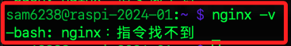

<br>

2. 也可以透過 `which` 指令查詢是否有安裝 `nginx`。

    ```bash
    which nginx
    ```

    _若沒有安裝將不會顯示任何訊息_

    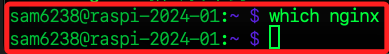

<br>

3. 先進行 `更新＆升級`：確保系統的軟體包管理器和安裝的軟體包處於最新狀態。

    ```bash
    sudo apt update && sudo apt upgrade -y
    ```

<br>

4. 安裝 nginx。

    ```bash
    sudo apt install nginx -y
    ```

<br>

## 檢查端口 

_啟動前檢查預設的 `80` 與 `443` 端口是否佔用_

<br>

1. 使用 netstat 查詢。

    ```bash
    netstat -tuln | grep -E ':80|:443'
    ```

    `:::80` 表示 `IPv6` 的所有地址在端口 `80` 上都被監聽，也就是有一個進程正在監聽 TCP 端口 `80`。

    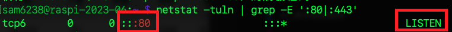

<br>

2. 使用內建的 ss 命令查詢。
    
    ```bash
    ss -tuln | grep -E ':80|:443'
    ```

    `*:80` 表示 `IPv4` 的所有地址在端口 `80` 上都被監聽。
    
    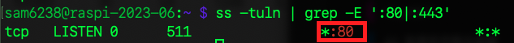

<br>

3. 使用 `lsof` 查詢佔用特定端口 `80` 的應用。
    
    ```bash
    sudo lsof -i :80
    ```

    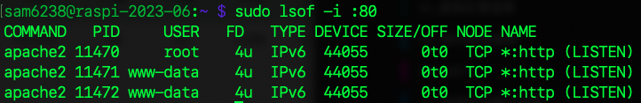

<br>

## 編輯 Ngnix 設定文件

1. 設定文件所在路徑。

    ```bash
    /etc/nginx/sites-available/default
    ```
    _可切換至資料夾並開啟 code，不過這個檔案比較簡單，建議使用 `nano`_
    ```bash
    cd /etc/nginx/sites-available/ && code .
    ```

<br>

2. 編輯設定文件。

    ```bash
    sudo nano /etc/nginx/sites-available/default
    ```

<br>

3. 若要使用 VSCode 編輯設定檔案要先授權，但這裡很容易修改，建議透過 `nano` 即可。

    ```bash
    sudo chown $USER /etc/nginx/sites-available/default
    ```

<br>

4. 因為 `80` 已經佔用，將端口改為 `8080`。

    _預設為 `80`_

    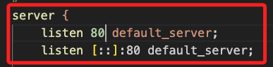

    _修改為_

    ```bash
    listen 8080 default_server;
    listen [::]:8080 default_server;
    ```

    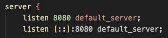

<br>

5. 設定完成，啟動服務。

    ```bash
    sudo systemctl start nginx
    ```

<br>

6. 設定為開機啟動。

    ```bash
    sudo systemctl enable nginx
    ```

    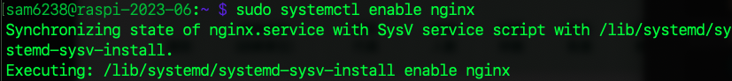

<br>

7. 查看服務狀態。

    ```bash
    sudo systemctl status nginx
    ```

    _正常啟動會顯示為 `active (running)`_

    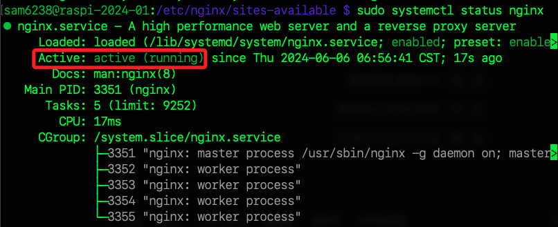

<br>

8. 再度開啟設定檔案，進一步設定網頁所在位置案。

    ```bash
    sudo nano /etc/nginx/sites-available/default
    ```

<br>

9. 找到 `root /var/www/html;` 開頭的區塊，預設的內容如下。

    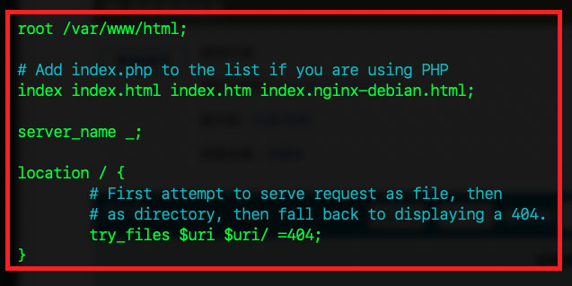

<br>

10. 針對 `路徑` 與 `索引` 規則修訂。

    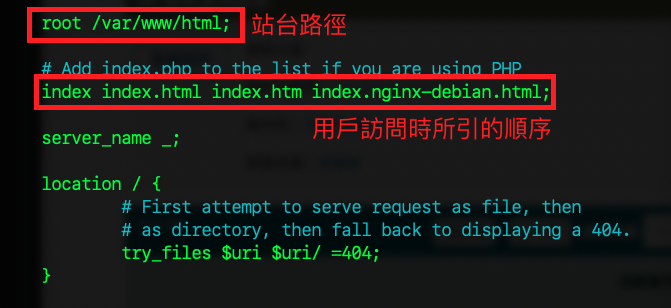

<br>

11. 這裡先修改 `路徑`，但特別注意，這個資料夾尚未建立，修改完成後進行建立，並將站台文件置放在這個資料夾中；除此，其餘部分暫且不修改。

    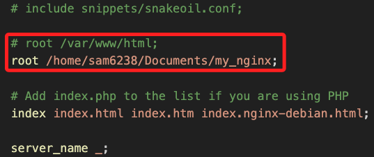

<br>

12. 基於前一個步驟自訂的路徑 `建立資料夾`。

    ```bash
    sudo mkdir /home/sam6238/Documents/my_nginx
    ```

<br>

13. 授權。

    ```bash
    sudo chown -R sam6238:sam6238 /home/sam6238/Documents/my_nginx
    ```

<br>

14. 連線樹莓派後開啟終端機來進入站台資料夾，並使用 VSCode 開啟工作空間。

    ```bash
    cd ~/Documents/my_nginx && code .
    ```

<br>

15. 建立文本並編輯內容（略）。

    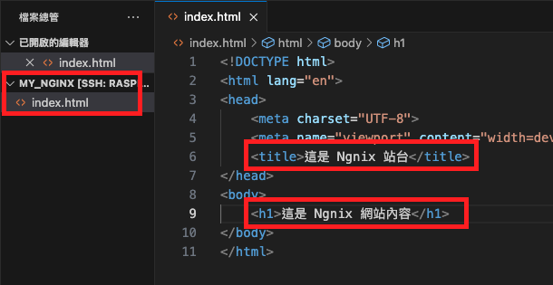

16. 重新啟動。

    ```bash
    sudo systemctl reload nginx
    ```

<br>

## 連線測試

1. 使用 `ifconfig` 指令查詢樹莓派 IP。

    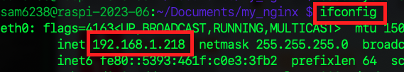

<br>

2. 透過 `樹莓派網址:8080` 在指定端口上訪問網站。

    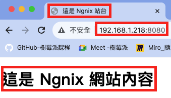

<br>

## 為何不需授權 `www-data` 用戶 ？

1. Nginx 不需要額外授權即可存取內容的主要原因是在安裝的過程中，安裝腳本通常會自動為 Nginx 用戶 `www-data` 設定必要的權限，確保 Nginx 能夠存取其默認的文件根目錄和其他必要的目錄。

<br>

2. 換句話說，我們在前面設定時因為使用了預設的安裝和設定，所以 Nginx 已經有了存取所需的權限。 當然，如果更改了相關預設值，或者有需要特定的權限設置，那再手動調整權限 `chmod` 或 所有權 `chown` 即可。

<br>

___

_END_