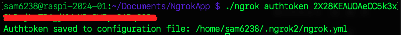
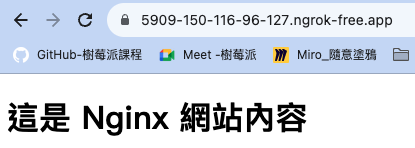

# 安裝＆申請 Ngrok

[官網](https://ngrok.com/) 註冊以及驗證

_步驟很簡單，這裡簡單介紹_

<br>


## 安裝

1. 在樹莓派中進入文件資料夾。

    ```bash
    cd ~/Documents
    ```

<br>

2. 建立存放腳本的資料夾。

    ```bash
    sudo mkdir NgrokApp && cd NgrokApp
    ```

<br>

3. 下載指令。

    ```bash
    sudo wget https://bin.equinox.io/c/4VmDzA7iaHb/ngrok-v3-stable-linux-arm64.tgz
    ```

<br>

4. 解壓縮。

    ```bash
    sudo unzip ngrok-v3-stable-linux-arm64.tgz
    ```

<br>

5. 在終端機起動 Ngrok。

    ```bash
    ./ngrok http <指定端口>
    ```
    如 `8080` 訪問 `Nginx`
    ```bash
    ./ngrok http 8080
    ```

<br>

## 錯誤排除

1. 假如啟動時出現以下訊息代表尚未驗證獲授權。 

    

<br>

2. 假如是訪問看到如下錯誤，也是因為尚無授權資訊。
   
   

<br>

## 註冊

1. 前往 [Ngrok 官網](https://ngrok.com/) 點擊 `Sign up for free`，已有帳戶可點擊 `Login in`。

    

<br>

2. 可使用 Google 帳號。

    

<br>

3. 複製 `Authtoken` 然後保存好即可。

    

<br>

4. 授權，在終端機中執行。

    ```bash
    ./ngrok authtoken <複製下來的 Authtoken>
    ```

<br>

5. 完成時會顯示如下訊息。

    

<br>

6. 假如是依照官網指示安裝的版本，可以適用以下新版指令，在沒有其他參數時，兩者效果一致，這裡不多做說明，同學可以自己嘗試看看。

    ```bash
    ngrok config add-authtoken <複製下來的 Authtoken>
    ```

    

<br>

7. 完成後會顯示儲存授權以及所在路徑。

    

<br>

8. 啟動服務。

    ```bash
    ./ngrok http 8080
    ```

<br>

9. 網頁顯示如下，點擊 `Visit Site` 。

    

<br>

10. 就會看到目前樹莓派的 Nginx 服務器了。

    

<br>

## 將 Ngrok 移動到系統 PATH 中

1. 切換到當前所在的路徑中。

    ```bash
    ls ~/Documents/NgrokApp/ngrok
    ```

<br>

2. 確保具有可執行權限。

    ```bash
    sudo chmod +x ~/Documents/NgrokApp/ngrok
    ```

<br>

3. 將文件移動到系統的 PATH 中。

    ```bash
    sudo mv ~/Documents/NgrokApp/ngrok /usr/local/bin/ngrok
    ```

<br>

4. 確保 `/usr/local/bin` 已經在 PATH 環境變量中。

    ```bash
    echo $PATH
    ```

<br>

5. 如果 `/usr/local/bin` 不在 PATH 中，請添加到配置文件 `.bashrc`。

    ```bash
    echo 'export PATH=$PATH:/usr/local/bin' >> ~/.bashrc
    source ~/.bashrc
    ```

<br>

6. 檢查是否設置完成。

    ```bash
    ngrok --version
    ```

<br>

7. 添加憑證。

    ```bash
    ngrok config add-authtoken <輸入自己的憑證>
    ```

<br>

8. 啟動服務：特別注意，這裡執行的是全局的應用而非當前路徑的腳本，所以不使用 `./`。

    ```bash
    ngrok http 8080
    ```

<br>

___

_END_