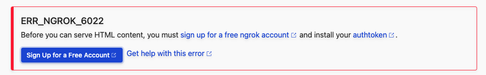
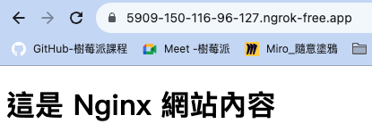

# 安裝＆申請 Ngrok

[官網](https://ngrok.com/) 註冊以及驗證

_步驟很簡單，這裡簡單介紹_

<br>


## 安裝

1. 在樹莓派中進入文件資料夾

   ```bash
   cd ~/Documents
   ```

<br>

2. 建立存放腳本的資料夾

   ```bash
   sudo mkdir NgrokApp && cd NgrokApp
   ```

<br>

3. 下載指令

   ```bash
   sudo wget https://bin.equinox.io/c/4VmDzA7iaHb/ngrok-stable-linux-arm.zip
   ```

<br>

4. 解壓縮

   ```bash
   sudo unzip ngrok-stable-linux-arm.zip
   ```

<br>

5. 在終端機起動 Ngrok
   
    ```bash
    ./ngrok http <指定端口>
    ```
    如 `8080` 訪問 `Nginx`
    ```bash
    ./ngrok http 8080
    ```

<br>

6. 假如這時去訪問，會看到錯誤提示，因為尚無授權資訊。
   
   

<br>


## 註冊

1. 點擊登入

    

<br>

2. 可使用 Google 帳號

    

<br>

3. 複製 `Authtoken` 然後保存好即可

    

<br>

4. 授權，在終端機中執行

    ```bash
    ./ngrok authtoken <複製下來的 Authtoken>
    ```

<br>

5. 假如是依照官網指示安裝的版本，可以適用以下新版指令，在沒有其他參數時，兩者效果一致，這裡不多做說明，同學可以自己嘗試看看。
   
   ```bash
   ngrok config add-authtoken <複製下來的 Authtoken>
   ```

    

<br>

6. 完成後會顯示儲存授權以及所在路徑。

    

<br>

7. 啟動服務
   
   ```bash
   ./ngrok http 8080
   ```

<br>

8. 網頁顯示如下，點擊 `Visit Site` 。
   
   

<br>

9. 就會看到目前樹莓派的 Nginx 服務器了。
    
    

<br>

---

_END_