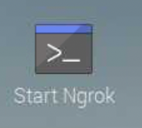
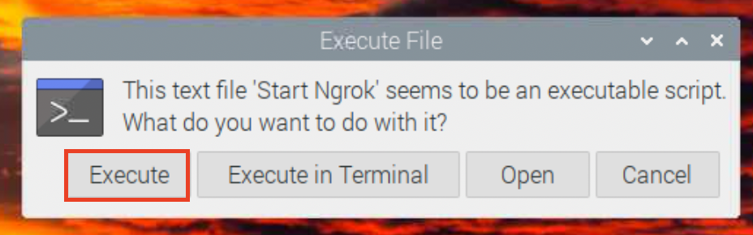
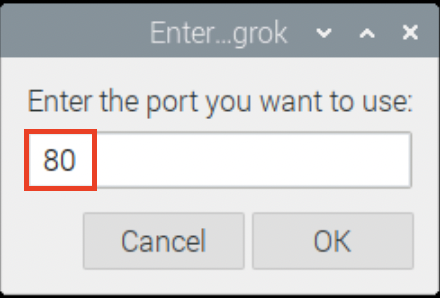
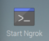
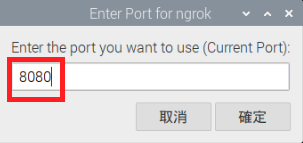
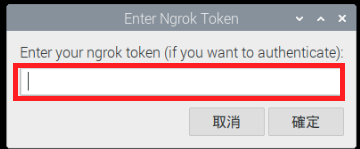
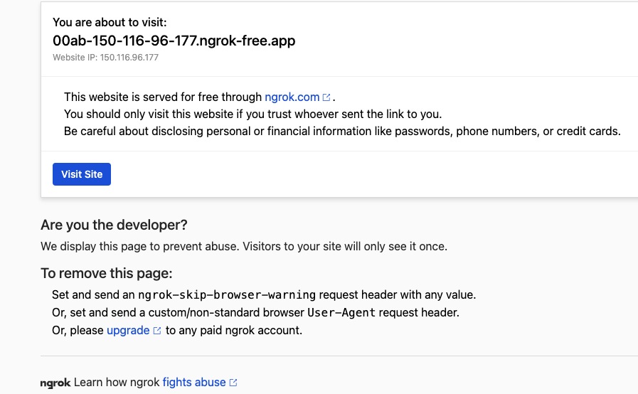
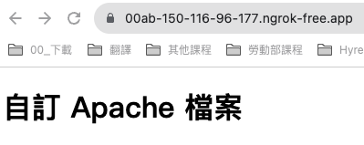

# Ngrok

_實現外網訪問內網_

<br>

## 說明

_Ngrok 本身並不是一種 `伺服器服務`，而是一種 `通道服務`，可透過本地執行 Ngrok 服務取得 Ngrok 公開服務器的通道，讓外部使用者可以透過這個通道訪問本地網站，也就是讓樹莓派變成一個可訪問的網站伺服器。_

<br>

## 安裝 Ngrok

_這個步驟在前面已經做過，可以跳過_

<br>

1. 在樹莓派中進入文件資料夾。

   ```bash
   cd ~/Documents
   ```

<br>

2. 建立存放腳本的資料夾。

   ```bash
   sudo mkdir NgrokApp && cd NgrokApp
   ```

<br>

3. 下載指令。

   ```bash
   sudo wget https://bin.equinox.io/c/4VmDzA7iaHb/ngrok-v3-stable-linux-arm64.tgz
   ```

<br>

4. 解壓縮。

   ```bash
   sudo unzip ngrok-stable-linux-arm.zip
   ```

<br>

## 建立自動化腳本

_使用 zenity 來搭建_

<br>

1. 安裝套件。

   ```bash
   sudo apt install zenity
   ```

<br>

2. 在 `~/Documents/NgrokApp` 資料夾內建立腳本。

   ```bash
   sudo nano start_ngrok.sh
   ```

<br>

3. 編輯內容。

   ```bash
   #!/bin/bash
   # 這個腳本會以指定的端口啟動

   # 詢問要用哪個端口
   PORT=$(zenity --entry --title="Enter Port for ngrok" --text="Enter the port you want to use:")

   # 檢查是否取消
   if [ -z "$PORT" ]; then
       exit 1
   fi

   # 啟動
   ./ngrok http $PORT
   ```

<br>

4. 賦予腳本執行權限。

   ```bash
   sudo chmod +x start_ngrok.sh
   ```

<br>

5. 進入桌面。

   ```bash
   cd ~/Desktop
   ```

<br>

6. 建立腳本。

   ```bash
   sudo nano start_ngrok.desktop
   ```

<br>

7. 編輯內容。

   ```bash
   [Desktop Entry]
   Type=Application
   Name=Start Ngrok
   Comment=Start ngrok for HTTP 80
   Exec=bash -c 'cd ~/Documents/NgrokApp && ./start_ngrok.sh'
   Icon=terminal
   Terminal=true
   ```

<br>

8. 賦予權限。

   ```bash
   sudo chmod +x start_ngrok.desktop
   ```

<br>

9. 在樹莓派桌面點擊運行。

   

<br>

10. 點擊 `Execute`。

      

<br>

11. 輸入指定的端口，接著去訪問網頁看看。

      

<br>

## 優化自動化腳本

_添加輸入 Token 的對話框_

<br>

1. 修改原本的腳本。

   ```bash
   sudo nano ~/Documents/NgrokApp/start_ngrok.sh
   ```
   _技巧提示：在編輯器中以 CTRL+K 可以快速刪除一整行_

<br>

2. 編輯內容。

   ```bash
   #!/bin/bash
   # 這個腳本會提示用戶輸入端口和Ngrok token，然後啟動ngrok

   # 詢問用戶要用哪個端口
   PORT=$(zenity --entry --title="Enter Port for ngrok" --text="Enter the port you want to use (Current Port):")

   # 如果用戶按下取消或不輸入端口，則退出
   if [ -z "$PORT" ]; then
      exit 1
   fi

   # 詢問用戶的Ngrok token
   TOKEN=$(zenity --entry --title="Enter Ngrok Token" --text="Enter your ngrok token (if you want to authenticate):")

   # 如果用戶提供了token，使用它來認證
   if [ ! -z "$TOKEN" ]; then
      ./ngrok authtoken $TOKEN
   fi

   # 使用指定的端口啟動ngrok
   ./ngrok http $PORT
   ```

<br>

3. 雙擊啟動桌面腳本。

   

<br>

4. 點擊 `執行`。

   

<br>

5. 輸入端口。

   

<br>

6. 可輸入 `Authtoken` ，假如已經存過可以按下 `ENTER` 以預設值運行，假如要切換帳號就要輸入該帳號的 `Authtoken` 。

   

<br>

7. 複製這個網址即可。

   

<br>

8. 在任意瀏覽器瀏覽，點擊 `Visit Site`。

   

<br>

9. 就會看到在指定端口的網站，比如說是 `80`，等價於終端機執行以下指令。
   
   ```bash
   ./ngrok http <端口號>
   ```

   

<br>

___

_END_
