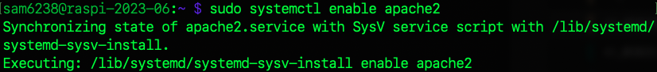
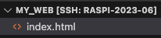
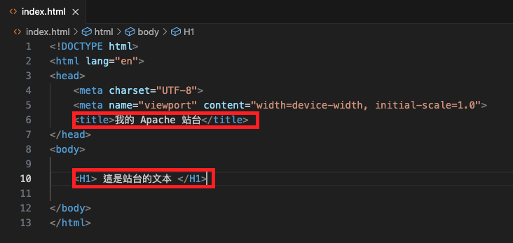
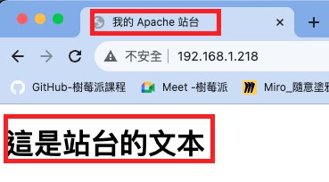

*上課實作*
# Apache 站台實作
<br>

## A. 安裝與檢查

1. 安裝 apache2

    

2. 透過指令查詢 apache2 安裝狀態
   - 使用 `dpkg -l` 命令列出與 `apache2` 相關的套件列表

    ```bash
    dpkg -l | grep apache2
    ```


    

3. 查詢 apache2 安裝的版本

    ```bash
    apache2 -v
    ```

    

4. 查詢 apache2 服務是否啟動

    ```bash
    sudo systemctl status apache2
    ```

    

5. （若未啟動）立即啟動服務

    ```bash
    sudo systemctl start apache2
    ```

6. 設定為開機啟動

    ```bash
    sudo systemctl enable apache2
    ```

    

<br>

## B. 設定文件說明
- Apache 的配置檔案有兩個
   
1. 全局配置設定檔路徑
   
   ```bash
   /etc/apache2/apache2.conf
   ```

2. 個別配置設定檔路徑
   - 用於定義單個網站或應用程式的設定，可以在此配置每個網站的文件根目錄、特定的伺服器名稱、伺服器別名、錯誤頁面等。

    ```bash
    /etc/apache2/sites-available/000-default.conf
    ```

3. 假如要使用 VSCode 直接編輯，可以先進行 `授權`

    ```bash
    sudo chown $USER  /etc/apache2/apache2.conf
    ```

    ```bash
    sudo chown $USER /etc/apache2/sites-available/000-default.conf
    ```

4. 補充說明前項 `文件授權`，因為 VSCode 無法執行 `sudo` 權限，所以必須修改檔案權限或是擁有者來賦予編輯的權限，在只有單人的開發環境中，使用授權或是變更擁有者的效果並無差異。

5. 在多人共用的環境中，因為 `/etc` 文件屬於全域的設定檔案，將檔案擁有者改為特定為有一定的不方便，在終端機中進行編輯可使用 `nano` 因應，而在 VSCode 中可建立特定群組如 `如 apacheadmin`，透過更改文件群組並加入各用戶來配置權限。

    _建立群組並加入文件_
    ```bash
    sudo chgrp apacheadmin /etc/apache2/apache2.conf /etc/apache2/sites-available/000-default.conf
    ```
    _修改群組權限_
    ```bash
    sudo chmod 660 /etc/apache2/apache2.conf /etc/apache2/sites-available/000-default.conf
    ```
   
<br>

## C. 修改設定檔案

1. 修改設定檔案之前，因為設定檔案中會使用到超文本所在資料夾，所以先在指定目錄中建立，這裡舉例建立在 `/home/sam6238/Documents` ，這裡使用絕對路徑。

    ```bash
    sudo mkdir /home/sam6238/Documents/my_web
    ```

2. 修改 `全局` 配置，特別注意 `縮排` 要手動調整跟其他文本一樣，到這裡同學應該發現檔案內容很多，使用 `nano` 編輯不太友善，這也就是為何前面要授權讓我們可以在此使用 VSCode 編輯的原因，假如已經設定好權限，可以使用 VSCode 編輯。

    ```bash
    sudo nano /etc/apache2/apache2.conf
    ```

3. 滑動到程式碼中以下區塊進行添加內容 `# 添加這個`，其餘部分可以不用變動。
    
    ```html
    <Directory />
        Options FollowSymLinks
        AllowOverride None
        Require all granted
    </Directory>
    <Directory /usr/share>
        AllowOverride None
        Require all granted
    </Directory>
    <Directory /var/www/>
        Options Indexes FollowSymLinks
        AllowOverride None
        Require all granted
    </Directory>
    # 添加這個
    <Directory <超文本所在目錄>>
        Options Indexes FollowSymLinks
        AllowOverride None
        Require all granted
    </Directory>        
    ```

4. 超文本所在目錄就是前面自己建立的那個路徑，比如說 `/home/sam6238/Documents/my_web` 。
   
   

5. 修改 `個別` 網站配置

    ```bash
    sudo nano /etc/apache2/sites-available/000-default.conf
    ```

6. 添加內容 `# 添加這個`，其餘部分可以不用變動，註解內容可以拿掉看比較清楚。

    ```html
    <VirtualHost *:80>
        ServerAdmin webmaster@localhost
        DocumentRoot <超文本所在目錄>
        
        # 添加這段
        <Directory <超文本所在目錄>>
            Options Indexes FollowSymLinks
            AllowOverride All
            Require all granted
        </Directory>

        ErrorLog ${APACHE_LOG_DIR}/error.log
        CustomLog ${APACHE_LOG_DIR}/access.log combined
    </VirtualHost>
    ```

<br>

## D. 是否使用預設的設定檔案

_因為我們將使用預設值，所以這裡不用做任何變動，理解即可。_

<br>

1. 禁用（關閉）預設的設定檔 `000-default.conf`
    - `a2dissite` 是 `Apache 2 Disable Site` 的縮寫

    ```bash
    sudo a2dissite 000-default.conf
    ```

2. 啟用指定的設定檔
   
    ```bash
    sudo a2ensite <自訂設定檔案>
    ```

3. 啟用預設檔案
   - 也就是使用預設檔案

    ```bash
    sudo a2ensite 000-default.conf
    ```
<br>

## E. 授權

1. 讓 Apache 用戶有權限訪問服務相關目錄

    ```bash
    sudo chmod -R 755 <Apache 超文本所在目錄>
    ```
    如
    ```bash
    sudo chmod -R 755 /home/sam6238/Documents/my_web
    ```
	
	
2. 確保 Apache 用戶（通常是 www-data）是相關目錄和文件的擁有者

    ```bash
    sudo chown -R www-data:www-data <Apache 超文本所在目錄>
    ```	
    如
    ```bash
    sudo chown -R www-data:www-data  /home/sam6238/Documents/my_web
    ```

3. 要添加超文本，所以先授權自己擁有添加文檔的權限

    ```bash
    sudo chown -R <使用者名稱>:<使用者同名群組名稱> <Apache 超文本所在目錄>
    ```
    如
    ```bash
    sudo chown -R sam6238:sam6238 /home/sam6238/Documents/my_web
    ```


<br>

## F. 建議任意文本來測試

1. 進入超文本目錄，建立一個 `index.html` 檔案。
   ```bash
   sudo touch index.html
   ```
   

2. 開啟 `index.html` 使用 VSCode 透過快速鍵 `!` 建立文本。 
   
   

3. 任意修改
   
   

4. 完成要重新啟動。

    ```bash
    sudo systemctl reload apache2
    ```

5. 在樹莓派上瀏覽 `http://localhost` 或在區網內訪問樹莓派網址。
   
   

<br>

---

_END：以上建立自己的 Apache 站台_