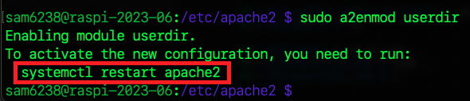
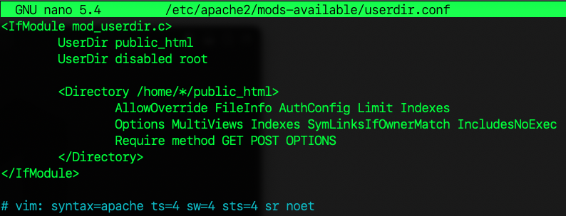

# 使用者目錄

_多人共用的樹莓派環境_

<br>

## 說明

1. Apache 有一個 `userdir` 模組，允許使用者在自己的家目錄中提供網站內容。
2. 每個使用者可以有獨立的 Apache 主機和超文本目錄。
3. 通過使用 Apache 的 `使用者主目錄` 功能來實現。

<br>

## 啟用使用者 userdir 模組

1. 啟用此模組
   
   ```bash
   sudo a2enmod userdir
   ```

2. 提示所有修改皆須重啟站台，這裡等全部完成後再一次啟動即可。

   

3. 編輯 `userdir` 模組設定文件

   ```bash
   sudo nano /etc/apache2/mods-available/userdir.conf
   ```

   _原始內容_

   

   _特別說明_
   無需特別修改這個檔案的內容，若是要禁用某個使用者，可以添加在 `UserDir disabled root` 之後如 `UserDir disabled <特定使用者名稱>`，若要修改預設的目錄名稱則替換 `public_html` 即可，但無實質意義。

<br>

4. 這個文件的預設、典型設定

   - 表示每個使用者可以在自己的家目錄中建立一個名為 `public_html` 的目錄，並在該目錄中放置網站內容。

   ```
   UserDir public_html
   ```

5. 保存更改並重啟 Apache：

   ```bash
   sudo systemctl restart apache2
   ```

<br>

## 開始設定

_完成以上步驟後，每個使用者都可以在自己的家目錄中建立一個 `public_html` 目錄，並在其中放置 HTML 文件或其他網站資料_

1. 建立 `public_html` 目錄

   ```bash
   mkdir ~/public_html
   ```

   
2. 訪問使用者網站

   _使用者個別網站可透過以下 URL 訪問，以 `username` 為例_

   ```
   http://樹莓派網址/~username/
   ```

<br>

## 實務上要注意安全性問題

_使用 `userdir` 模組讓每個使用者可以提供自己的網頁內容進行訪問，但可能因此帶來安全問題，實務上需確保每位使用者皆了解安全性問題，並根據需要調整 Apache 配置以提供適當的權限與保護。_

<br>

---

_END_