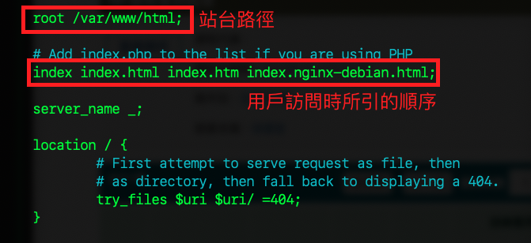

*上課實作*

# Ngnix 架站實作

<br>

## 檢查與更新

1. 透過查詢版本確認是否安裝 nginx

    ```bash
    nginx -v
    ```

2. 透過 `which` 指令查詢是否有安裝 nginx 

    ```bash
    which nginx
    ```


3. 更新系統

    ```bash
    sudo apt update && sudo apt upgrade -y
    ```

4. 安裝 nginx

    ```bash
    sudo apt install nginx -y
    ```

<br>

## 檢查端口 

_啟動前檢查預設的 80 與 443 端口是否佔用_

1. 使用 netstat 查詢

    ```bash
    netstat -tuln | grep -E ':80|:443'
    ```

    `:::80` 表示 `IPv6` 的所有地址在端口 `80` 上都被監聽

    

2. 使用內建的 ss 命令查詢
    
    ```bash
    ss -tuln | grep -E ':80|:443'
    ```

    `*:80` 表示 `IPv4` 的所有地址在端口 `80` 上都被監聽。
    
    


3. 使用 lsof 查詢佔用特定端口 `80` 的應用
    
    ```bash
    sudo lsof -i :80
    ```

    

<br>

## 編輯 Ngnix 設定文件

1. 設定文件所在路徑

    ```bash
    /etc/nginx/sites-available/default
    ```


2. 編輯設定文件

    ```bash
    sudo nano /etc/nginx/sites-available/default
    ```

3. 若要使用 VSCode 編輯設定檔案要先授權，但這裡很容易修改，建議透過 `nano` 即可。

    ```bash
    sudo chown $USER /etc/nginx/sites-available/default
    ```

4. 因為 `80` 已經佔用，將端口改為 `8080`。

    ```ini
    listen 8080 default_server;
    listen [::]:8080 default_server;
    ```

    


5. 設定完成立即啟動

    ```bash
    sudo systemctl start nginx
    ```

6. 設定為開機啟動

    ```bash
    sudo systemctl enable nginx
    ```

    

7. 再度開啟設定檔案，進一步設定網頁所在位置案。

    ```bash
    sudo nano /etc/nginx/sites-available/default
    ```


8. 預設的內容如下

    

9. 針對路徑與索引規則修訂

    

10. 使用自訂路徑，其餘不變無妨。

    ```ini
    sudo mkdir /home/sam6238/Documents/my_nginx
    ```

11. 授權

    ```bash
    sudo chown -R sam6238:sam6238 /home/sam6238/Documents/my_nginx
    ```

12. 建立站台資料夾，使用 VSCode 連線樹莓派後開啟終端機。

    ```bash
    cd ~/Documents/my_nginx && code .
    ```

13. 建立文本並編輯內容（略）

    

14. 重新啟動

    ```bash
    sudo systemctl reload nginx
    ```

<br>

## 連線測試

1. 使用 `ifconfig` 指令查詢樹莓派 IP

    

2. 透過 `樹莓派網址:8080` 在指定端口上訪問網站

    

<br>

---

_END_