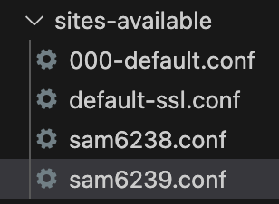
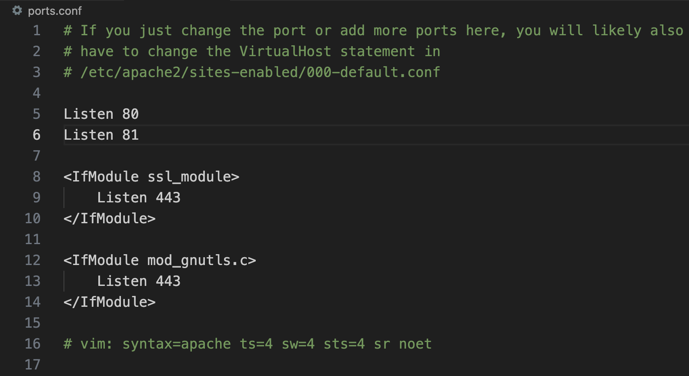

# 多帳號共用 Apache

## 步驟

1. 建立用戶

2. 添加群組

3. 免密碼

4. 更改權限

    ```bash
    sudo chmod -R 777 /etc/apache2 
    ```

5. 添加個人設定檔案

    

    ```bash
    sudo nano /etc/apache2/sites-available/sam6238.conf
    sudo nano /etc/apache2/sites-available/sam6239.conf
    ```

6. 編輯如下

    _sam6238.conf_

    ```ini
    <VirtualHost *:80>
        ServerAdmin webmaster@localhost
        DocumentRoot /home/sam6238/Documents/myweb
        ErrorLog ${APACHE_LOG_DIR}/error.log
        CustomLog ${APACHE_LOG_DIR}/access.log combined
    </VirtualHost>
    ```

    _sam6239.conf_
    ```ini
    <VirtualHost *:81>
        ServerAdmin webmaster@localhost
        DocumentRoot /home/sam6239/Documents/myweb
        <Directory /home/sam6239/Documents/myweb>
            Require all granted
        </Directory>
        ErrorLog ${APACHE_LOG_DIR}/error.log
        CustomLog ${APACHE_LOG_DIR}/access.log combined
    </VirtualHost>
    ```

7. 設定網站權限給 www-data

    ```bash
    sudo chown -R www-data:www-data /home/sam6239/Documents/myweb
    ```


8. 設定目錄權限

    ```bash
    sudo find /home/sam6239/Documents/myweb -type d -exec chmod 755 {} \;
    sudo find /home/sam6239/Documents/myweb -type f -exec chmod 644 {} \;
    ```


9. 停用預設

    ```bash
    sudo a2dissite 000-default.conf
    ```


10. 啟用新的設定

    ```bash
    sudo a2ensite sam6238.conf
    sudo a2ensite sam6239.conf
    ```


11. 設定 `/etc/apache2/ports.conf`

    ```ini
    Listen 80
    Listen 81

    <IfModule ssl_module>
        Listen 443
    </IfModule>

    <IfModule mod_gnutls.c>
        Listen 443
    </IfModule>
    ```

    

12. 重新啟動

    ```bash
    sudo systemctl reload apache2
    ```

13. 用兩個帳號啟動兩個 Ngrok，分別使用 80 與 81 端口。

<br>

---

_END_