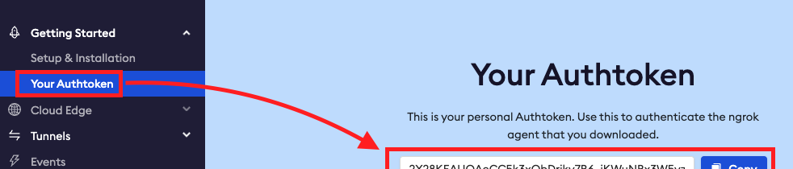
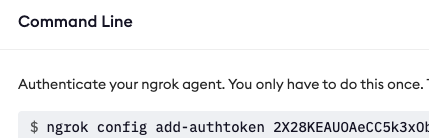
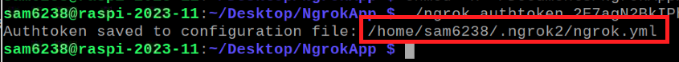

# 申請 Ngrok

[官網](https://ngrok.com/) 註冊以及驗證

_步驟很簡單，這裡簡單介紹_

<br>

1. 點擊登入

    

<br>

2. 可使用 Google 帳號

    

<br>

3. 複製 `Authtoken` 然後保存好即可

    

<br>

4. 授權，在終端機中執行

    ```bash
    ./ngrok authtoken <複製下來的 Authtoken>
    ```

<br>

5. 或依照官網新的授權指令，假如沒有其他參數，兩個指令效果一致。
   
   ```bash
   ngrok config add-authtoken <複製下來的 Authtoken>
   ```

    

<br>

6. 會顯示儲存授權並顯示路徑

    

<br>

7. 在終端機起動 Ngrok
   
    ```bash
    ngrok http <指定端口>
    ```

<br>

---

_END_