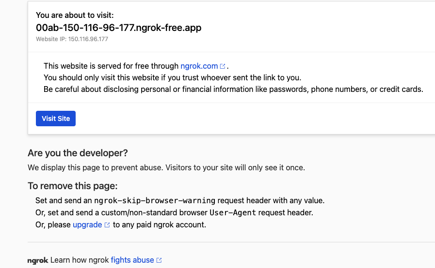

*上課實作*

# Ngrok

_實現外網訪問內網_

<br>

## 說明

_Ngrok 本身並不是一種 `伺服器服務`，而是一種 `通道服務`，可透過本地執行 Ngrok 服務取得 Ngrok 公開服務器的通道，讓外部使用者可以透過這個通道訪問本地網站，也就是讓樹莓派變成一個可訪問的網站伺服器。_

<br>

## 步驟

1. 在樹莓派中進入文件資料夾

   ```bash
   cd ~/Documents
   ```
2. 建立存放腳本的資料夾

   ```bash
   sudo mkdir NgrokApp && cd NgrokApp
   ```
3. 下載指令

   ```bash
   sudo wget https://bin.equinox.io/c/4VmDzA7iaHb/ngrok-stable-linux-arm.zip
   ```
4. 解壓縮

   ```bash
   sudo unzip ngrok-stable-linux-arm.zip
   ```
5. 安裝套件

   ```bash
   sudo apt install zenity
   ```
6. 建立腳本

   ```bash
   sudo nano start_ngrok.sh
   ```
7. 編輯內容

   ```bash
   #!/bin/bash
   # 這個腳本會以指定的端口啟動

   # 詢問要用哪個端口
   PORT=$(zenity --entry --title="Enter Port for ngrok" --text="Enter the port you want to use:")

   # 檢查是否取消
   if [ -z "$PORT" ]; then
       exit 1
   fi

   # 啟動
   ./ngrok http $PORT
   ```
8. 賦予腳本執行權限

   ```bash
   sudo chmod +x start_ngrok.sh
   ```
9. 進入桌面

   ```bash
   cd ~/Desktop
   ```
10. 建立腳本

    ```bash
    sudo nano start_ngrok.desktop
    ```
11. 編輯內容

    ```bash
    [Desktop Entry]
    Type=Application
    Name=Start Ngrok
    Comment=Start ngrok for HTTP 80
    Exec=bash -c 'cd ~/Documents/NgrokApp && ./start_ngrok.sh'
    Icon=terminal
    Terminal=true
    ```
12. 賦予權限

    ```bash
    sudo chmod +x start_ngrok.desktop
    ```
13. 進階版腳本

    ```bash
    sudo nano ~/Documents/NgrokApp/start_ngrok.sh
    ```
14. 編輯內容

    ```bash
    #!/bin/bash
    # 這個腳本會提示用戶輸入端口和Ngrok token，然後啟動ngrok

    # 詢問用戶要用哪個端口
    PORT=$(zenity --entry --title="Enter Port for ngrok" --text="Enter the port you want to use (Current Port):")

    # 如果用戶按下取消或不輸入端口，則退出
    if [ -z "$PORT" ]; then
        exit 1
    fi

    # 詢問用戶的Ngrok token
    TOKEN=$(zenity --entry --title="Enter Ngrok Token" --text="Enter your ngrok token (if you want to authenticate):")

    # 如果用戶提供了token，使用它來認證
    if [ ! -z "$TOKEN" ]; then
        ./ngrok authtoken $TOKEN
    fi

    # 使用指定的端口啟動ngrok
    ./ngrok http $PORT
    ```

<br>

## 完成

1. 雙擊啟動桌面腳本

   
2. 點擊 `執行`

   
3. 輸入端口

   
4. 可輸入 `Authtoken` ，假如已經存過可以按下 `ENTER` 即可，假如要切換帳號就要輸入該帳號的 `Authtoken` 。

   
5. 複製這個網址即可

   
6. 在任意瀏覽器瀏覽，點擊 `Visit Site`

   
7. 就會看到在指定端口的網站，比如說是 `80`，等價於終端機執行以下指令
   
   ```bash
   ./ngrok http 80
   ```

   

<br>

---

_END_
