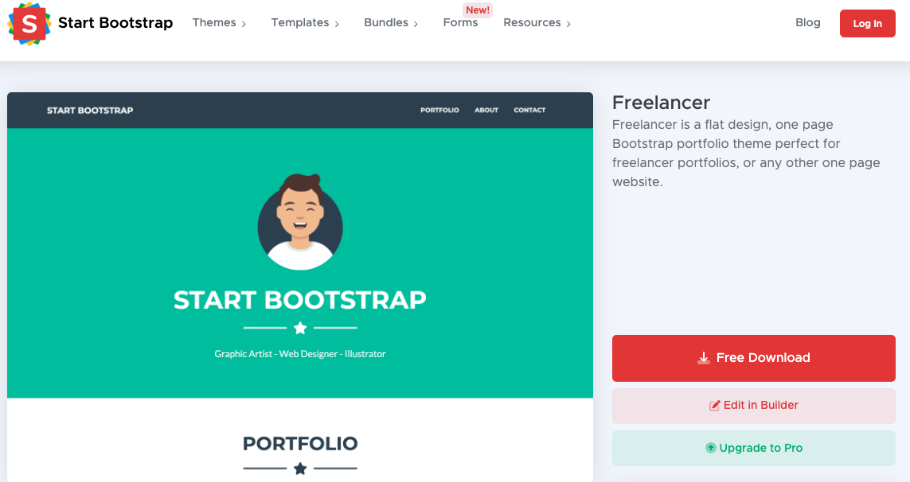
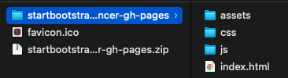
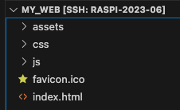
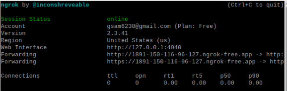

# 部署網站

 

## 步驟
1. 下載一個 Bootstrap [範例](https://startbootstrap.com/theme/freelancer)

    

2. 解壓縮

    

3. 後拖曳複製＆覆蓋原本 Apache 的檔案
    

4. 完成，包還 `.ico`

    

5. 運行 Ngrok 在端口 `80`

    

6. 完成
    
    

 

---

_END_