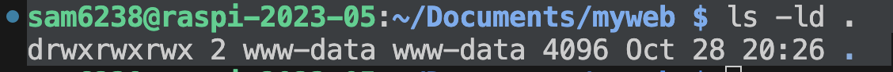

# 部署網站

<br>

## 步驟

1. 下載一個 Bootstrap [範例](https://startbootstrap.com/theme/freelancer)

   

<br>

2. 解壓縮

   

<br>

3. 拖曳複製＆覆蓋原本 Apache 的檔案

   

<br>

4. 假如遇到權限問題，可能是因為原本的資料夾限制了權限如 `www-data`，可透過指令查詢。

   ```bash
   ls -ld
   ```

   

<br>

5. 先進行授權，把自己加入 `www-data` 群組。

   ```bash
   sudo usermod -aG www-data $USER
   ```

<br>

6. 假如有強迫症，可以加入任意 `.ico` 檔案，或是使用假的檔案 `favicon.ico` ，因為等一下會顯示找不到 `.ico `。

   

<br>

7. 運行 Ngrok 在端口 `80`

   

<br>

8. 完成

   

<br>

---

_END_
