_在樹莓派上操作部署_

# Firebase Hosting

<br>

## 說明

_這裡示範在樹莓派上進行 Firebase Hosting 部署，主要著眼於站台資料還可以做直接訪問；若非如此，在電腦上部署即可。_


<br>

## 套件安裝

_須先安裝套件安裝工具_

1. 下載套件安裝工具 Node.js 的 16.x 版

    ```bash
    curl -fsSL https://deb.nodesource.com/setup_16.x | sudo -E bash -
    ```

    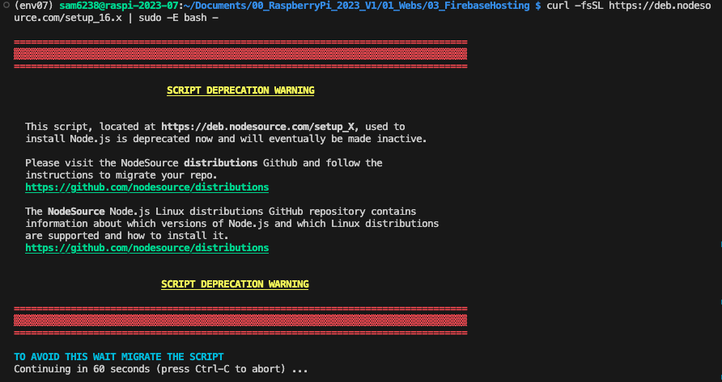

2. 安裝
    
    _node.js_
    ```bash
    sudo apt install -y nodejs
    ```
    
    _firebase-tools_
    ```bash
    sudo npm install -g firebase-tools
    ```

<br>

## 登入帳號

1. 登入 firebase
   
   ```bash
   firebase login
   ```

2. 允許登入
   
   

3. ❗️若在樹莓派上部署， `必須` 是使用樹莓派啟瀏覽器進行驗證。   

    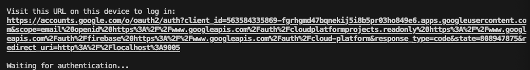

4. 驗證完成後，瀏覽器會顯示如下畫面。
   
   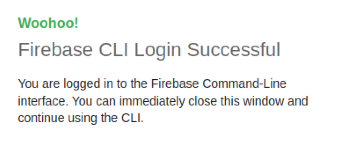

5. 然後終端機也會顯示成功 `Success` 。

    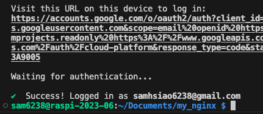

<br>

## 初始化

_這裡切記要選對資料夾_

1. 建立專案資料夾
   
   ```bash
   mkdir my_hosting && cd my_hosting
   ```

2. 初始化
    
    ```bash
    firebase init
    ```

3. 使用 `方向鍵` 移動，然後用 `空白鍵` 選擇 `Hosting: Configure files for Firebase Hosting and (optionally) set up GitHub Action deploys` ，確認好按下 `ENTER` 。
   
   

4. 選擇現有專案或建立專案，這裡示範選擇現有專案
   
   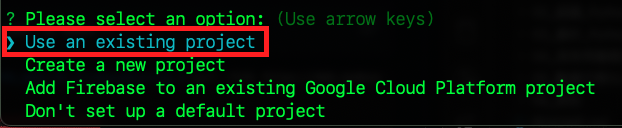

5. 選定後按 `ENTER`
   
   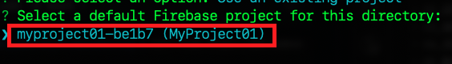

6. 使用預設的 `public` 資料夾來存放站台文本與腳本。
   
   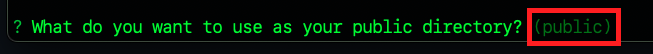

7. 不要 `N` 覆寫 rewrite。
   
   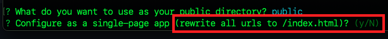

8. 不要 `N` 進行自動化佈署。
   
   

9. 初始化完成。
    
    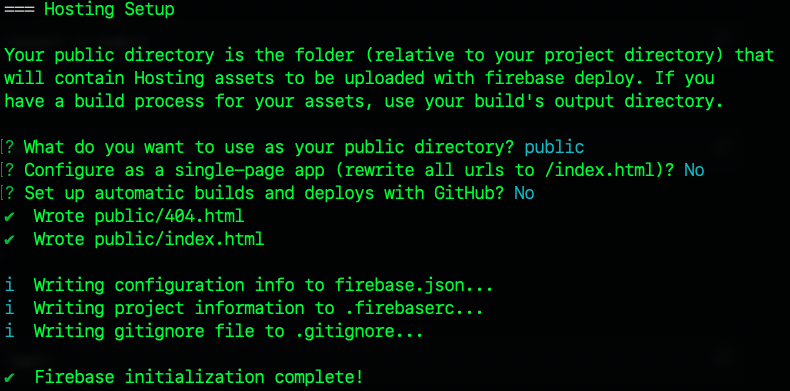

<br>

## 查看預設的部署內容

1. 查看內容與結構

   _預設寫好了 `.gitignore` ，假如要進行原始檔控制，可排除非必要項目。_

   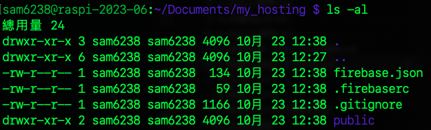

<br>

## 建立站台內容

1. [下載](https://bootstrapmade.com/iportfolio-bootstrap-portfolio-websites-template/download/) 免費模板
   
   

2. 解壓縮後包含以下結構
   
   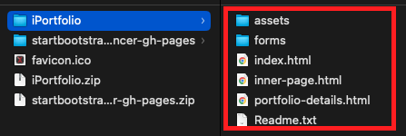

3. 使用 VSCode 開啟比較方便拖曳複製
   
   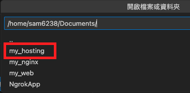

4. 下載的模板要放在 `public` 資料夾之下
   
   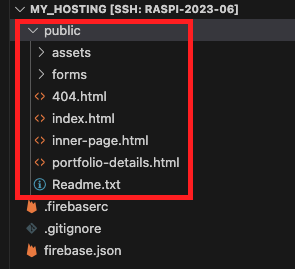

5. 在 VSCode 中可安裝 'Live Serve' 進行網站的預覽
   
   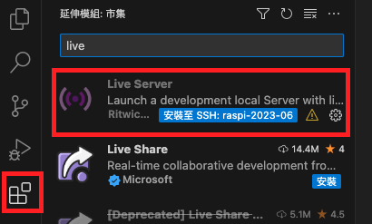

6. 安裝後在 `index.html` 檔案按下右鍵即可預覽 `Open with Live Server`
   
   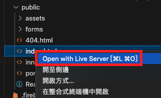

7. 這個插件預設使用的端口是 `5500` ，留意一下避免端口衝突。
   
   

<br>

## 網站部署

1. 在專案的根目錄，使用終端機指令進行部署
   
   ```bash
   firebase deploy
   ```

2. 完成時會顯示一個網站的超連結
   
   

    _🆗 至此完成站台部署_

<br>

## 將 Ngnix 指向這個站台

1. 再度開啟設定檔案，進一步設定網頁所在位置案。

    ```bash
    sudo nano /etc/nginx/sites-available/default
    ```

2. 修改路徑
   
   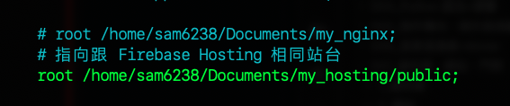

3. 重新啟動

    ```bash
    sudo systemctl reload nginx
    ```  

4. 不要忘記重啟 `Ngrok`
   
   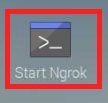

5. 端口是 `8080`
   
   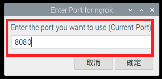

6. 現在所訪問的站台不是 Firebase Hosting 上的內容，而是樹莓派上 Nginx。
   
   

<br>

---

_END_