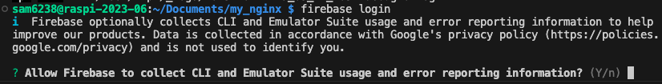

# Firebase Hosting


<br>

## 安裝


1. 下載 Node.js 的 16.x 版

    ```bash
    curl -fsSL https://deb.nodesource.com/setup_16.x | sudo -E bash -
    ```

    

2. 安裝
    
    _node.js_
    ```bash
    sudo apt install -y nodejs
    ```
    
    _firebase-tools_
    ```bash
    sudo npm install -g firebase-tools
    ```

<br>

## 開始部署

1. 登入
   
   ```bash
   firebase login
   ```

2. 允許登入
   
   

3. 複製網址在樹莓派上開啟瀏覽器貼上（一定要）   

    

4. 完成認證
   
   

5. 終端機會顯示成功

    

6. 初始化

    ```bash
    firebase init
    ```

