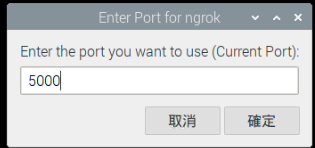

# 在樹莓派部署 Line 聊天機器人

_部署聊天機器人的所有方式中最簡單的一種，沒有之一_

<br>

## 安裝

1. 可參考官方 [API SDKs](https://developers.line.biz/en/docs/messaging-api/line-bot-sdk/) ，或直接參考官網 [Python](https://github.com/line/line-bot-sdk-python) 文件。
   
2. 在樹莓派上安裝 SDK

    ```bash
    pip install line-bot-sdk
    ```


2. 更新版本

    ```bash
    pip install --upgrade line-bot-sdk
    ```

<br>

## 建立 Line Bot

_這裡不重複步驟指引，僅說明 Webhook 設置，其他請參考前週課程講義_

<br>

1. 進入 Line 開發者 [網址](https://developers.line.biz/zh-hant/) 。

2. 可先記下 `Token`、 `Secret` 以及 `user ID` 備用。

3. 使用 [官網腳本](https://github.com/line/line-bot-sdk-python#synopsis)

4. 替換自己的 `Token`、 `Secret`。

    

5. 安裝 `dotenv` 套件來隔離私密資訊。
   
    ```bash
    pip install python-dotenv
    ```

6. 在專案內建立 `.env` 檔案。

    ```bash
    _CHANNEL_ACCESS_TOKEN_ = <貼上 TKOKEN>
    _CHANNEL_SECRET_ = <貼上 SECRET>
    ```

7. 導入

    ```python
    import os
    from dotenv import load_dotenv
    load_dotenv()
    ```

8. 使用

    _建立_
    ```python
    CHANNEL_ACCESS_TOKEN = os.getenv("_CHANNEL_ACCESS_TOKEN_")
    CHANNEL_SECRET = os.getenv("_CHANNEL_SECRET_")
    ```
    _代入_
    ```
    configuration = Configuration(access_token=CHANNEL_ACCESS_TOKEN)
    handler = WebhookHandler(CHANNEL_SECRET)
    ```

9. 在 `5000` 端口啟動 Ngrok
    
    

10. 將 `https` 的 URL 貼到 LineBot 的 Webhook 中
    
    

11. 加上 `/callback` ，特別注意所使用的路由名稱是否正確，有些腳本會使用 `webhook` 。
    
    

12. 以上機器人便部署完成。
    
    

<br>

---

_END_