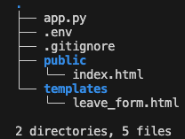
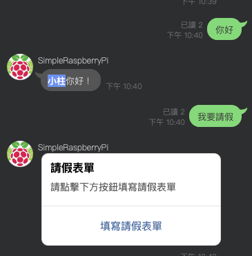
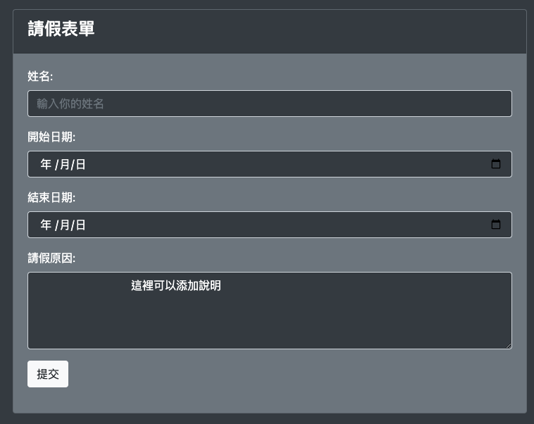
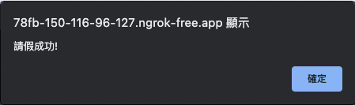
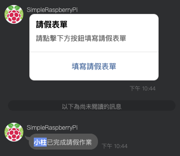
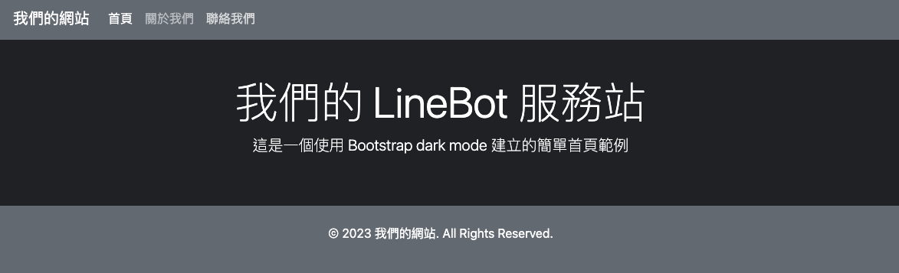
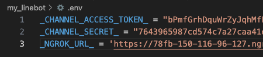
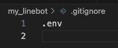

# 完整專案
_可復刻一個試試看_

<br>

## 說明
1. 在這個版本中，使用了 Flask 框架架設一個 LineBot，然後透過 Ngrok 提供一個反向代理的網址作為 LineBot 的 Webhook。
2. 用自動化方式，以 Bash 語言編寫 Shell 腳本，讓使用者在取得 Ngrok 提供的 URL 時更加方便也不易出錯，避免遺漏端口設置，也可提醒切換 Ngrok 的授權。

<br>

## 結構



<br>

## 展示

1. 機器人對話

   
   
2. 假單
   
   

3. 網頁通知
   
   

4. 機器人通知

    

5. 也可以直接訪問首頁
   
   

<br>

## 腳本
_設定文件部分_
1. .env：依照個人取得的文本輸入
   
   

2. .gitignore
    
    

<br>

_主腳本與文本_

### 1. Flask 主程序：app.py

```python
# -*- coding: utf-8 -*-
# 取消版本警告
import warnings
warnings.filterwarnings("ignore", category=DeprecationWarning)

#
from flask import Flask, request, abort, render_template
from flask import jsonify
from flask import send_from_directory
#
from urllib.parse import quote
#
from linebot import (
    LineBotApi, WebhookHandler
)
from linebot.exceptions import (
    InvalidSignatureError
)
from linebot.models import (
    MessageEvent, TextMessage, TextSendMessage,
)
#
from linebot.models import (
    TemplateSendMessage, ButtonsTemplate, URIAction
)

import os
from dotenv import load_dotenv
load_dotenv()

# 常數
CHANNEL_ACCESS_TOKEN = os.getenv("_CHANNEL_ACCESS_TOKEN_")
CHANNEL_SECRET = os.getenv("_CHANNEL_SECRET_")
NGROK_URL = os.getenv("_NGROK_URL_")
# 路由 leave_form
_LEAVE_FORM_URL_ = f'{NGROK_URL}/leave_form'

#
app = Flask(__name__, static_folder="public")
#
line_bot_api = LineBotApi(CHANNEL_ACCESS_TOKEN)
handler = WebhookHandler(CHANNEL_SECRET)

@app.route("/")
def hello():
    return send_from_directory(app.static_folder, 'index.html')

@app.route("/callback", methods=['POST'])
def callback():
    # get X-Line-Signature header value
    signature = request.headers['X-Line-Signature']
    # get request body as text
    body = request.get_data(as_text=True)
    app.logger.info("Request body: " + body)
    # handle webhook body
    try:
        handler.handle(body, signature)
    except InvalidSignatureError:
        abort(400)
    return 'OK'

@handler.add(MessageEvent, message=TextMessage)
def handle_message(event):
    # 判斷訊息類型
    source_type = event.source.type
    # 初始值
    group_id = None
    #
    if source_type == 'group':
        group_id = event.source.group_id
    # 取得發送訊息者的資訊
    user_id = event.source.user_id
    profile = line_bot_api.get_profile(user_id)
    display_name = profile.display_name
    # 取得訊息文本
    text = event.message.text
    if text == "你好":
        reply = TextSendMessage(text=f"{display_name}你好！")
    elif text == "天氣如何":
        reply = TextSendMessage(text="今天天氣很好！")
    elif text == "我要請假":
        #
        encoded_user_id = quote(user_id)
        encoded_display_name = quote(display_name)
        encoded_group_id = quote(group_id) if group_id else "None"
        #
        leave_form_url = f"{_LEAVE_FORM_URL_}?user_id={encoded_user_id}&user_name={encoded_display_name}&group_id={encoded_group_id}"
        #
        reply = TemplateSendMessage(
            alt_text='請假表單',
            template=ButtonsTemplate(
                title='請假表單',
                text='請點擊下方按鈕填寫請假表單',
                actions=[
                    URIAction(
                        label='填寫請假表單',
                        uri=leave_form_url
                    )
                ]
            )
        )
    else:
        reply = TextSendMessage(text="不好意思，我還無法處理這個訊息")
  
    line_bot_api.reply_message(event.reply_token, reply)

# 請假
@app.route("/leave_form")
def leave_form():
    user_id = request.args.get('user_id')
    user_name = request.args.get('user_name')
    # 添加群組
    group_id = request.args.get('group_id')
    #
    return render_template('leave_form.html', line_user_id=user_id, user_name=user_name, group_id=group_id)
# 完成假單提交
@app.route('/submit_leave_form', methods=['POST'])
def submit_leave_form():

    # 處理請假資料
    # 獲得用戶ID 
    user_id = request.form.get('line_user_id')
    # 獲得用戶名稱
    user_name = request.form.get('user_name')
    # 群組 ID
    group_id = request.form.get('group_id')

    # 發送訊息到LINE群組
    # 如果有群組ID，則發送消息到群組；否則發送到單一使用者
    # 如需將請假資訊彙整到其他資料庫，也可在此進行相關程序撰寫
    if group_id and group_id != "None":
        line_bot_api.push_message(group_id, TextSendMessage(text=f'{user_name}已完成請假作業'))
    elif user_id and user_id != "None":
        line_bot_api.push_message(user_id, TextSendMessage(text=f'{user_name}已完成請假作業'))
    else:
        app.logger.error("請注意，邏輯中 group_id ＆ user_id 都是空值")
        return jsonify(status="error", message="Failed to send message due to missing identifiers.")
    return jsonify(status="success")


if __name__ == "__main__":
    app.run(host='0.0.0.0')
```

<br>

### 2. 假單：leave_form.html

```html
<!DOCTYPE html>
<html lang="en">

<head>
    <meta charset="UTF-8">
    <meta http-equiv="X-UA-Compatible" content="IE=edge">
    <meta name="viewport" content="width=device-width, initial-scale=1.0">
    <title>請假表單 - 暗色模式</title>
    <!-- Bootstrap CSS CDN -->
    <link rel="stylesheet" href="https://maxcdn.bootstrapcdn.com/bootstrap/4.5.2/css/bootstrap.min.css">
</head>

<body class="bg-dark text-white">

    <div class="container mt-5">
        <div class="row">
            <div class="col-md-8 offset-md-2">
                <div class="card bg-secondary">
                    <div class="card-header bg-dark text-white">
                        <h4>請假表單</h4>
                    </div>
                    <div class="card-body">
                        <!--表單提交時就會呼叫submitForm函數-->
                        <form action="/submit_leave_form" method="post" onsubmit="return submitForm();">

                            <!-- 加入隱藏的輸入欄位 -->
                            <input type="hidden" name="line_user_id" value="{{ line_user_id }}">
                            <input type="hidden" name="user_name" value="{{ user_name }}">
                            <input type="hidden" name="group_id" value="{{ group_id }}">

                            <div class="form-group">
                                <label for="name">姓名:</label>
                                <input type="text" class="form-control bg-dark text-white" id="name" name="name"
                                    placeholder="輸入你的姓名">
                            </div>
                            <div class="form-group">
                                <label for="startdate">開始日期:</label>
                                <input type="date" class="form-control bg-dark text-white" id="startdate"
                                    name="startdate">
                            </div>
                            <div class="form-group">
                                <label for="enddate">結束日期:</label>
                                <input type="date" class="form-control bg-dark text-white" id="enddate" name="enddate">
                            </div>
                            <div class="form-group">
                                <label for="reason">請假原因:</label>
                                <!--若要觀察以下數據就整段剪下貼到 textarea 內-->
                                <!--User ID: {{ line_user_id }}, User Name: {{ user_name }}, Group ID: {{ group_id }}-->
                                <textarea id="reason" class="form-control bg-dark text-white" name="reason" rows="4"
                                    placeholder="請詳細描述請假原因">
                                這裡可以添加說明
                                </textarea>
                            </div>
                            <div class="form-group">
                                <input type="submit" class="btn btn-light" value="提交"> 
                            </div>
                        </form>
                    </div>
                </div>
            </div>
        </div>
    </div>

    <!-- Bootstrap JS and jQuery -->
    <script src="https://ajax.googleapis.com/ajax/libs/jquery/3.5.1/jquery.min.js"></script>
    <script src="https://cdnjs.cloudflare.com/ajax/libs/popper.js/1.16.0/umd/popper.min.js"></script>
    <script src="https://maxcdn.bootstrapcdn.com/bootstrap/4.5.2/js/bootstrap.min.js"></script>

    <script>
        function submitForm() {
            var data = {
                "line_user_id": $("input[name='line_user_id']").val(),
                "user_name": $("input[name='user_name']").val(),
                "group_id": $("input[name='group_id']").val(),
                "name": $("#name").val(),
                "startdate": $("#startdate").val(),
                "enddate": $("#enddate").val(),
                "reason": $("#reason").val()
            };
            $.ajax({
                type: "POST",
                url: "/submit_leave_form",
                data: data,
                success: function (response) {
                    alert("請假成功!");
                    window.close();
                },
                error: function (jqXHR, textStatus, errorThrown) {
                    if (jqXHR.responseJSON && jqXHR.responseJSON.message) {
                        alert(jqXHR.responseJSON.message);
                    } else {
                        alert("請假失敗!");
                    }
                }
            });
            return false; // 阻止表單的預設提交行為
        }

    </script>
</body>

</html>
```

<br>

### 3. 首頁：index.html

```html
<!DOCTYPE html>
<html lang="zh-TW">

<head>
    <meta charset="UTF-8">
    <meta name="viewport" content="width=device-width, initial-scale=1.0">
    <title>致理樹莓派課程</title>
    <!-- Bootstrap CSS -->
    <link href="https://cdn.jsdelivr.net/npm/bootstrap@5.2.3/dist/css/bootstrap.min.css" rel="stylesheet">
</head>

<body class="bg-dark text-white">

    <!-- Navigation Bar -->
    <nav class="navbar navbar-expand-lg navbar-dark bg-secondary">
        <div class="container">
            <a class="navbar-brand" href="#">我們的網站</a>
            <button class="navbar-toggler" type="button" data-bs-toggle="collapse" data-bs-target="#navbarNav"
                aria-controls="navbarNav" aria-expanded="false" aria-label="Toggle navigation">
                <span class="navbar-toggler-icon"></span>
            </button>
            <div class="collapse navbar-collapse" id="navbarNav">
                <ul class="navbar-nav">
                    <li class="nav-item">
                        <a class="nav-link active" aria-current="page" href="#">首頁</a>
                    </li>
                    <li class="nav-item">
                        <a class="nav-link" href="#">關於我們</a>
                    </li>
                    <li class="nav-item">
                        <a class="nav-link" href="#">聯絡我們</a>
                    </li>
                </ul>
            </div>
        </div>
    </nav>

    <!-- Hero Section -->
    <header class="py-5">
        <div class="container text-center">
            <h1 class="display-4">我們的 LineBot 服務站</h1>
            <p class="lead">這是一個使用 Bootstrap dark mode 建立的簡單首頁範例</p>
        </div>
    </header>

    <!-- Footer -->
    <footer class="bg-secondary text-center py-4">
        <p>&copy; 2023 我們的網站. All Rights Reserved.</p>
    </footer>

    <!-- Bootstrap JS and Popper.js -->
    <script src="https://cdn.jsdelivr.net/npm/bootstrap@5.2.3/dist/js/bootstrap.bundle.min.js"></script>
</body>

</html>
```

<br>

---

_END_