# 安裝 Python

_若要手動安裝，最推薦這個程序，當然還有其他很多方式可以選擇_

<br>

## 安裝前置作業

_查詢當前環境安裝與版本_

1. 使用 `which` 指令

    ```bash
    which python
    ```

    _通常只會顯示在 `/usr/bin` 內的版本_

    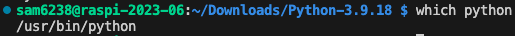

2. 加入參數 `-a` 查詢當前活動的 Python 版本及其來源
   
   ```bash
   which -a python
   ```

    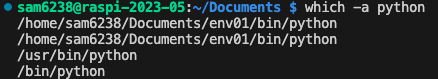

3. 使用 `whereis` 查詢

    ```bash
    whereis python
    ```
    結果
    ```bash
    python: /usr/bin/python /usr/bin/python3.9-config /usr/bin/python3.9 /usr/lib/python2.7 /usr/lib/python3.9 /etc/python3.9 /usr/local/lib/python3.9 /usr/include/python3.9m /usr/include/python3.9 /usr/share/man/man1/python.1.gz
    ```
    _會顯示所有的路徑_

    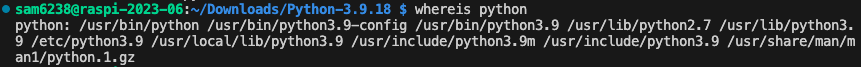

4. 透過 sys 模組查詢

    ```bash
    python -c "import sys; print(sys.prefix)"
    ```
    _會顯示在 `/usr`_

    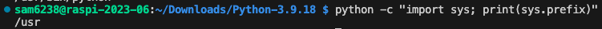

5. 透過 `echo` 查詢路徑配置
   
    ```bash
    echo $PATH
    ```

    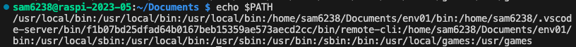

<br>

## 查詢版本

1. 指令查詢
   
   ```bash
   python --version
   ```

   _顯示為 3.9.2_

   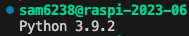


2. 透過開發環境查詢

    ```bash
    python
    ```

    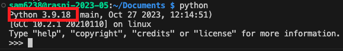

<br>

## 半自動安裝
1. 下載

    ```bash
    wget https://www.python.org/ftp/python/3.9.12/Python-3.9.12.tgz
    ```

2. 解壓縮且進入目錄   

    ```bash
    tar -xf Python-3.9.12.tgz && cd Python-3.9.12
    ```

3. 優化

    ```bash
    ./configure --enable-optimizations
    ```

4. 編譯

    ```bash
    make -j$(nproc)
    ```

5. 安裝

    ```bash
    sudo make altinstall
    ```


<br>

## 手動安裝

1. 從官網的 [Python Source Releases](https://www.python.org/downloads/source/) 下載壓縮檔案
   
   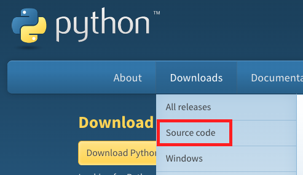

2. 這裡有所有官方推薦的版本，選取後下載到本地的電腦
   
   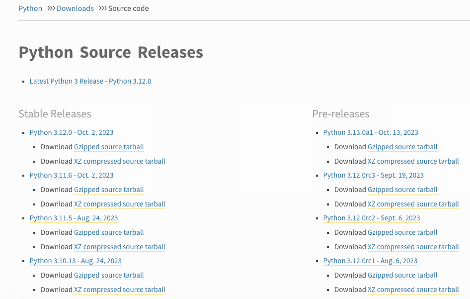

3. 複製到樹莓派的 `Downloads` 資料夾，這裡示範使用 `scp` 指令傳輸

    ```bash
    scp <下載的壓縮檔案.tgz> <樹莓派帳號@樹莓派IP>:<要存放的路徑>
    ```
    如
    ```bash
    scp /Users/samhsiao/Downloads/Python-3.9.18.tgz sam6238@raspi-2023-06:~/Downloads
    ```

4. 在樹莓派上進入壓縮檔案所在路徑，以指令進行解壓縮，務必更改為自己的版本

    ```bash
    tar -xvzf Python-3.9.18.tgz
    ```

5. 切換到解壓縮的資料夾內，務必確認自己版本的路徑

    ```bash
    cd Python-3.9.18
    ```

6. 執行 Python 內建的優化選項腳本來配置 Python 安裝環境

    _這條命令會檢查系統環境並設置適當的選項以優化Python的性能。_

    ```bash
    ./configure --enable-optimizations
    ```

7. 編譯源代碼

    ```bash
    make
    ```
    _可透過參數 `-j` 指定編譯時使用的核心數量，假如是四核心的可以輸入 `4`_
    ```bash
    make -j 4
    ```

8. 過程中還是會出現一些紅色警告，不用理會無妨

    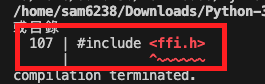

9.  安裝 Python

    ```bash
    sudo make install
    ```

10. 驗證安裝結果

    ```bash
    python --version
    which python
    ```
    _還是原本的_

    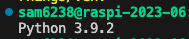

11. 查詢路徑

    _這會是系統預設安裝的版本與路徑_

    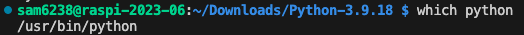
    
    ```bash
    /usr/bin/python
    ```

12. 再以 `whereis` 查詢

    ```bash
    whereis python
    ```
    _其中 `/usr/local/bin/python3.9` 就是用戶自行安裝的版本_

    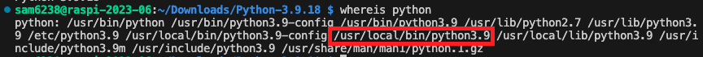

13. 再以此路徑查詢 3.9 的版本

    ```bash
    /usr/local/bin/python3.9 --version
    ```
    或
    ```bash
    /usr/local/bin/python3 --version
    ```    
    _結果會顯示升級安裝的版本 3.9.18_

    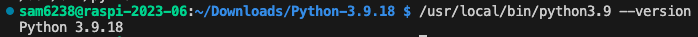

    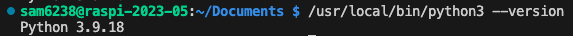

<br>

## 建立虛擬環境

1. 指定用新安裝的 Python 版本建立虛擬環境

    ```bash
    /usr/local/bin/python3 -m venv env3918
    ```

2. 啟動虛擬環境並查詢版本

    ```bash
    source env3918/bin/activate
    ```
    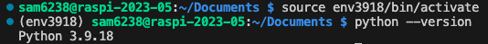

<br>

## 編輯環境參數

_關於環境參數設置已經提過，這裡說明全局設定與當前帳戶設定的差異_

<br>

1. 開啟檔案

    ```bash
    sudo nano ~/.bashrc
    ```

2. 先檢查 `全局變數` 或 `當前用戶變數` 是否寫入環境參數

    _全局的目錄，所有用戶都可以訪問_
    ```bash
    PATH="/usr/local/bin:$PATH"
    ```
    _當前用戶的目錄_
    ```bash
    PATH="$HOME/.local/bin:$PATH"
    ```
    _假如同學上週有安裝 Streamlit，目前的設定值應該如下_

    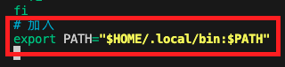

3. 添加全局變數，原本設置保留即可
   
    ```bash
    export PATH="/usr/local/bin:$PATH"
    ```
    _先後順序決定搜尋順序，而不是覆蓋、pop 的概念_
    
    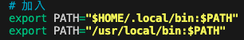


4. 也可以在環境變數中添加別名，讓 `python` 連結指定路徑
   
   ```bash
   alias python="/usr/local/bin/python3.9"
   ```

   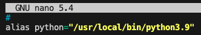

5. 重新載入

    ```bash
    source ~/.bashrc
    ```

6. 再次查詢

    ```bash
    python --version
    ```   
   
   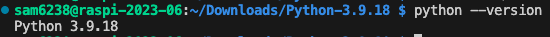

7. 啟動 python 也可以確認
   
   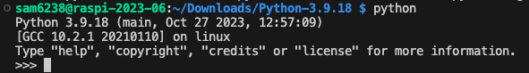


<br>

---

_END_