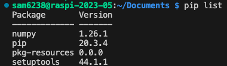
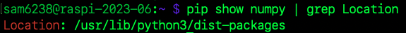
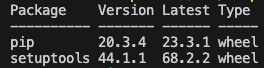

# Python 開發環境與 Linux 相關的指令

_pip_

<br>

1. 安裝 pip

   ```bash
   sudo apt-get install python3-pip
   ```

</br>

2. 使用 pip 安裝套件，版本可省略。

   ```bash
   pip install <套件名稱>==<版本>
   ```

</br>

3. 升級套件
   ```bash
   pip install upgrade <套件名稱>
   ```

</br>

4. 顯示 pip 已安裝套件
   _簡單顯示_

   ```bash
   pip list
   ```

   _詳細_

   ```bash
   pip show <套件名稱>
   ```

   

</br>

5. 尋找 pip 套件安裝的路徑

   ```bash
   pip show <套件名稱> | grep Location
   ```

   

</br>

6. 查詢過時套件

   _已安裝但不是最新版本的套件，可依此進行 `upgrade` 指令_

   ```bash
   pip list --outdated
   ```

   

</br>

7. 安裝套件時，不要安裝依賴項目

   _多專案共用開發環境時可這樣操作避免版本衝突，然後再手動安裝_

   ```bash
   pip install <package-name> --no-deps
   ```

</br>

8. 依據套件管理文件安裝套件

   ```bash
   pip install -r requirements.txt
   ```

</br>

9. 依據當前開發環境的套件生成套件管理文件

   ```bash
   pip freeze > requirements.txt
   ```

</br>

10. 使用本地套件文件進行套件安裝

    ```bash
    pip install ./<本地套件>/
    ```

</br>

---

_END：依狀況發生填入_
