_課後補充_

# Django 架設網站

_使用預設的 Python 建立虛擬環境_

_比如說_

```bash
/usr/bin/python -m venv envDjango
```

_啟動_

```bash
source envDjango/bin/activate
```


<br>

## 說明

1. 參考 [官網](https://www.djangoproject.com/)

2. 這是官網所建議的專案結構

    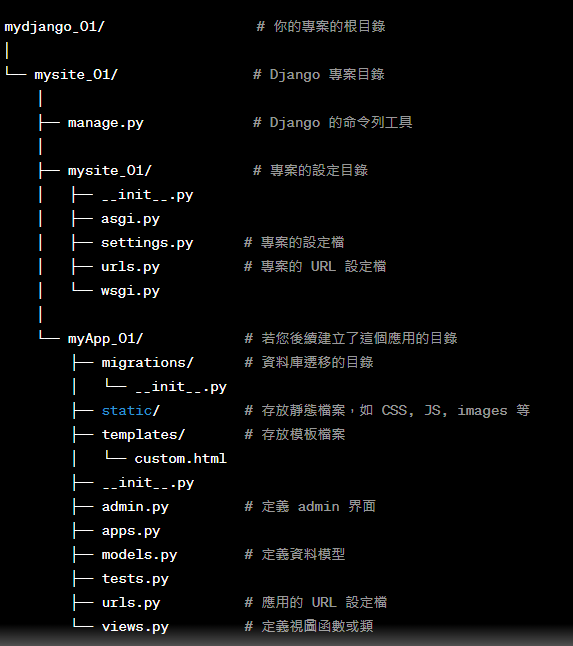

<br>

## 開始

1. 更新
   
    ```bash
    sudo apt update && sudo apt upgrade -y
    ```

2. 安裝

    ```bash
    pip install django
    ```

3. 若按裝時出現 SSL 相關錯誤，可以重新安裝 SSL

    _若完成以下步驟還是出錯，可能要重新編譯 Python，建議使用預設版本_

    ```bash
    sudo apt-get install -y libssl-dev libffi-dev python3-dev
    ```
    _測試是否安裝好_
    ```bash
    python3.9 -c "import ssl; print(ssl.OPENSSL_VERSION)"
    ```
    
    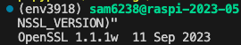

    _然後重新執行安裝指令_

    ```bash
    pip install django
    ```

4. 建立並進入專案資料夾

    ```bash
    mkdir mydjango_01 && cd mydjango_01
    ```

5. 在專案目錄內建立站台 `mysite`，並且進入目錄

    ```bash
    django-admin startproject mysite && cd mysite
    ```

6. 到這裡先暫緩，退到專案根目錄後執行 `tree` 查看一下
   
   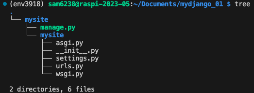

    - 在站台資料夾 `mysite` 之下有一個同名子資料夾，這是用來存放設定文件的資料夾。

7. 進入外層的站台資料夾，以這個範例來說就是 `mysite`。

    ```bash
    cd ~/Documents/mydjango_01/mysite
    ```

8. 在外層站台的資料夾下執行遷移指令

    ```bash   
    python manage.py migrate
    ```

    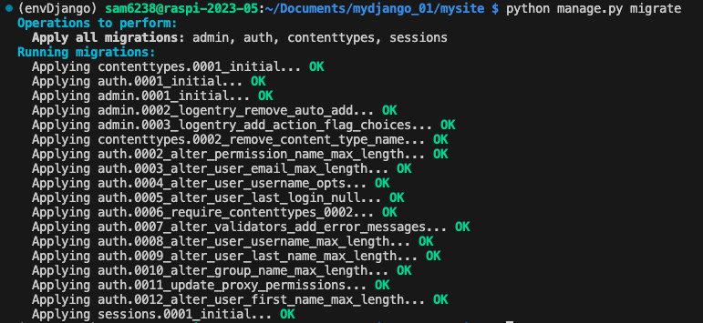


9. 啟動站台

    ```bash   
    python manage.py runserver
    ```

10. 預設使用 `8000` 端口
    
    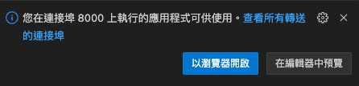

11. 在樹莓派上使用瀏覽器開啟網頁 `localhost:8000`
    
    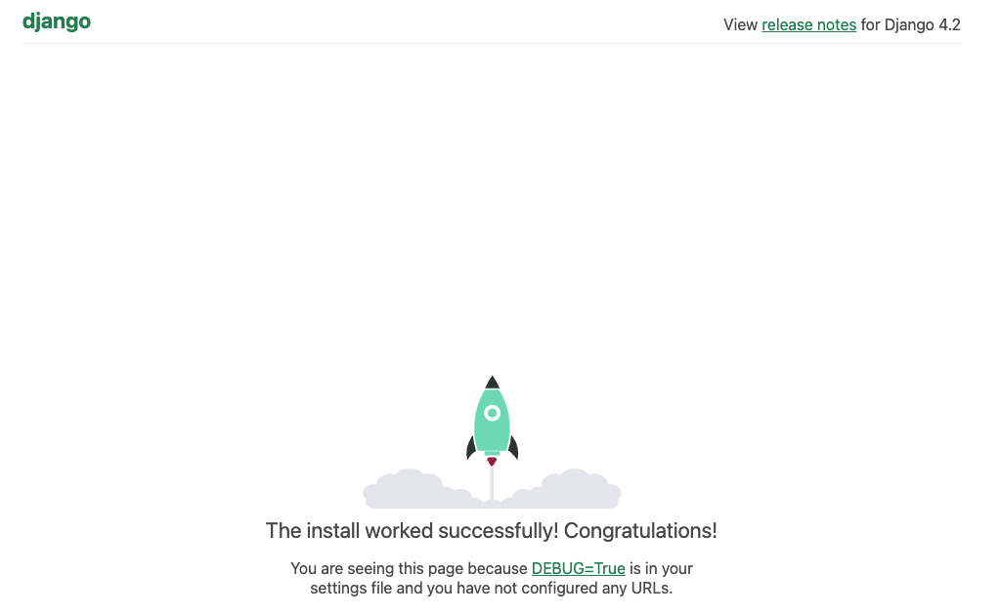

12. 假如要更換其他端口

    ```bash
    python manage.py runserver 8001
    ```

13. 若要從區網訪問，執行命令改為
    
    ```bash
    python manage.py runserver <樹莓派IP>:8000
    ```
    如 ip 是 `192.168.1.134`時

    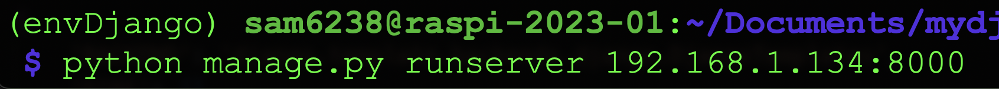

14. 再次啟動應該會看到以下錯誤
    
    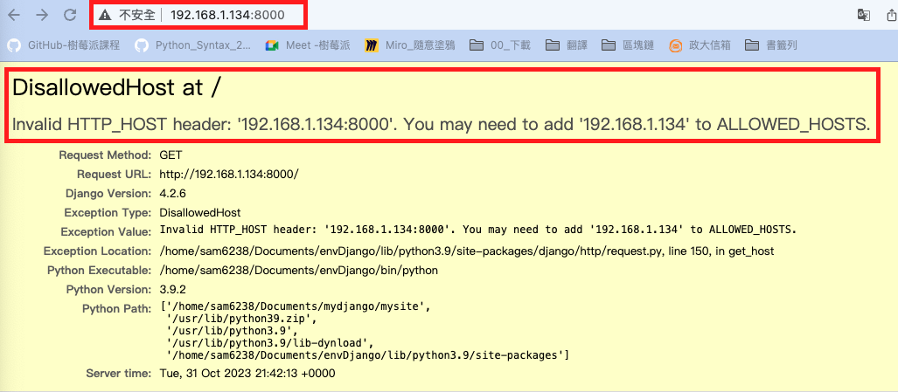

15. 這時要修改站台設定資料夾內的 `settings.py`
    
    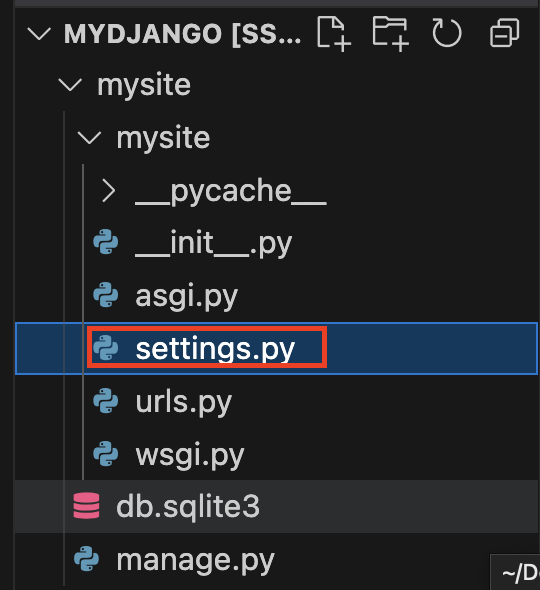

16. 加入 `樹莓派 IP`，這是一個字串，所以要用引號包覆。
    
    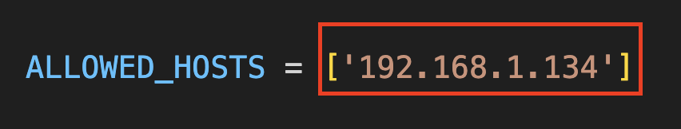
    
17. 無需遷移，重啟站台即可。
    
    ```bash
    python manage.py runserver <樹莓派IP>:8000
    ```

<br>

## 建立網站內容

_先確認已經入站台資料夾_

1. 在站台內建立一個 App

    ```python
    python manage.py startapp <自訂App名稱>
    ```
    如
    ```python
    python manage.py startapp myApp_01
    ```

1. 觀察一下
   
   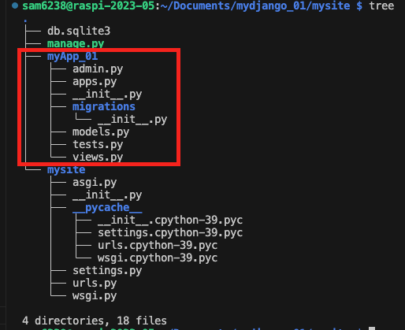

2. 開啟 App 中的 `myApp_01` 裡的 `views.py`
   
   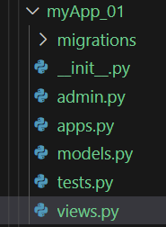

3. 貼上以下程式碼
   
    ```python
    # views.py
    from django.shortcuts import render
    def custom_page(request):
        return render(request, 'custom_page.html')
    # 這就是 index.html
    def home(request):
        return HttpResponse("歡迎來到 Home!")
    ```
    - 這裡建立了一個 `custom_page` 的函數，用來渲染 `custom_page.html` 這個 template。
    - 也就是調用的時候會傳回 `custom_page.html` 這個超文本，下一步會來建立這個超文本。
    - 另外首頁就是上面的 `home`，這裡不另外做 `.html`，稍後步驟會直接用文本設定在 `views.py` 腳本中，如此同學便可用來比對兩者的不同作法。

<br>

5. 延續前一個步驟，這裡要先在 `myApp_01` 內建立一個 `templates` 的模板資料夾

    ```bash
    mkdir templates && cd templates
    ```

6. 接著在 `templates` 資料夾下，建立 `custom_page.html`

    ```bash
    touch custom_page.html
    ```

7. 貼上以下內容

    ```html
    <!DOCTYPE html>
    <html lang="en">
    <head>
        <meta charset="UTF-8">
        <meta name="viewport" content="width=device-width, initial-scale=1.0">
        <title>My Custom Page</title>
    </head>
    <body>
        <h1>歡迎來到我的網站</h1>
        <p>這是我的第一個 Django 網站內容</p>
    </body>
    </html>
    ```

8. 接著進入設定資料夾 `mysite` ，開啟 `urls.py` 設置 URL。

   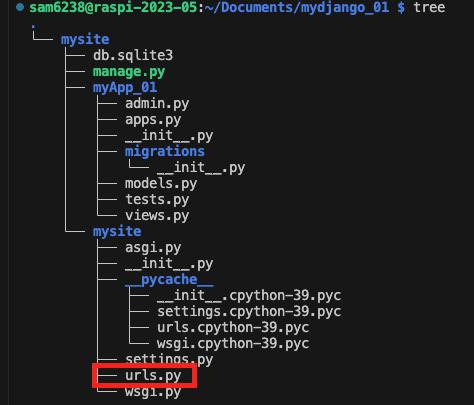

9. 不要修改這個管理介面的路徑設置
    
    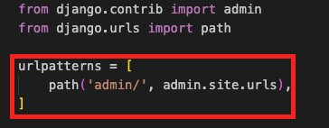

10. 修改路徑設置的列表內容，添加兩個路徑設置

    ```python
    urlpatterns = [
        path('admin/', admin.site.urls),
        path('custom/', views.custom_page, name='custom_page'),
        path('', views.home, name='home'),
    ]
    ```

11. 並將 `views.py` 導入
    
    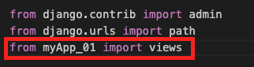


12. 修改好 `urls.py` 之後，還要修改對應的 `views.py` 視圖設定文件。

    _文本_
    ```python
    from django.shortcuts import render
    from django.http import HttpResponse
    # 
    def custom_page(request):
        return render(request, 'custom_page.html')
    def home(request):
        return HttpResponse("歡迎來到我的首頁 Home 🏠")
    ```
    _圖片說明_

    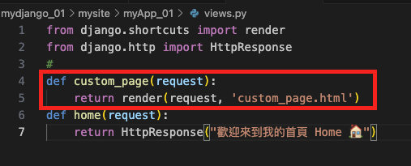

    - 務必確認函數 `custom_page` 所回傳的第二個參數是 `檔案名稱` 的字串。

<br>

13. 另外函數 `home` 就是網站的根路由，當然也是可以比照 `custom_page` 的方式渲染，這裡使用 `HttpResponse` 讓同學對照比較。
    
    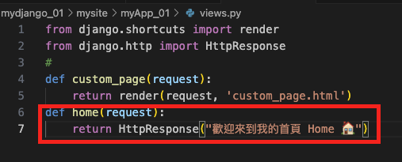

14. 接著去設定資料夾內編輯設定檔案 `settings.py`，找到 `INSTALLED_APPS` 列表，添加前面自訂的應用 `myApp_01` 。
    
    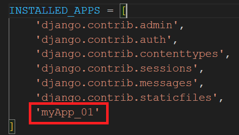

15. 確認啟用模板資料，需到 `TEMPLATES` 列表中開啟 `APP_DIRS` 為 `True` 。
    
    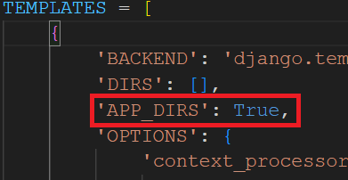

16. 關閉已經啟動的 `8000` 端口應用，重新啟動一次
    
    ```bash
    python manage.py runserver
    ```

17. 開啟站台後，在根路由會看到 `HttpResponse` 設定的內容。
    
    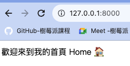

18. 然後 `http://127.0.0.1:8000/custom/` 會看到透過渲染的網頁。
    
    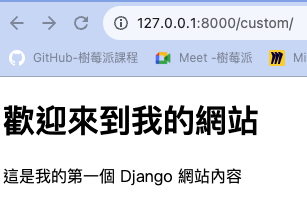

19. 這個內容就是在 `` 所做的。
    
    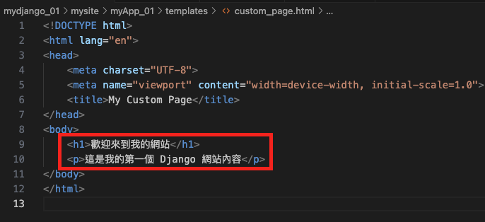

<br>

---

_END_