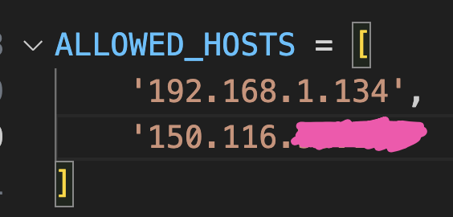

# 建立系統服務

_讓 Django 開機後自動啟動服務_

<br>

## 步驟

1. 先關閉 Django 伺服器。

<br>

2. 創建服務文件

   ```bash
   sudo nano /etc/systemd/system/django.service
   ```

<br>

3. 設定文件內容

   ```ini
   [Unit]
   Description=Django service
   After=network.target

   [Service]
   User=sam6238
   Group=sam6238
   WorkingDirectory=/home/sam6238/Documents/mydjango/mysite
   ExecStart=/home/sam6238/Documents/envDjango/bin/python manage.py runserver 0.0.0.0:8000

   [Install]
   WantedBy=multi-user.target
   ```

<br>

4. 啟動服務

   ```bash
   sudo systemctl start django.service
   ```

<br>

5. 設定開機啟動

   ```bash
   sudo systemctl enable django.service
   ```

<br>

6. 查詢狀態

   ```bash
   sudo systemctl status django.service
   ```

<br>

7. 假如修改了服務文件

   ```bash
   sudo systemctl daemon-reload
   sudo systemctl restart django.service
   ```

<br>

## 若要從外網訪問

1. 設置路由將端口打開。

2. 設定 Django 的 `settings.py`，加入允許的網址。
   
   


---

_END_
