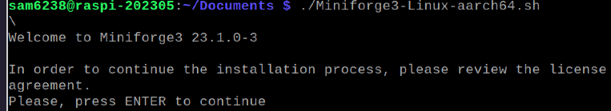
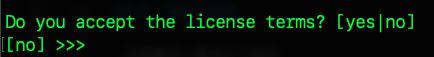
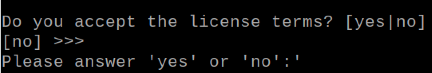
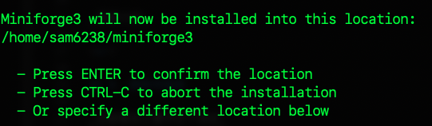
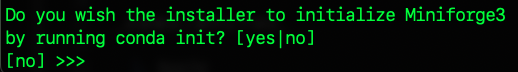
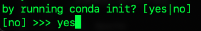
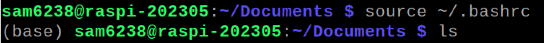

_上課實作_

# 使用 Conda 建立虛擬環境

<br>


1. 進入 Downloads

    ```bash
    cd ~/Downloads
    ```


2. 下載安裝腳本

    ```bash
    wget https://github.com/conda-forge/miniforge/releases/latest/download/Miniforge3-Linux-aarch64.sh
    ```


3. 賦予腳本權限

    ```bash
    chmod +x Miniforge3-Linux-aarch64.sh
    ```


4. 執行腳本

    ```bash
    ./Miniforge3-Linux-aarch64.sh
    ```


5. 會顯示許可協議，要一直按 ENTER

    


6. 假如一直按都沒注意看，一直到這一題，預設答案是 NO ，就得重來了

    


7. 回答 yes 接受合約

    


8. 最後會問是否初始化 yes

    


9. 按下 ENTER 確認這個安裝位置，也可以輸入客製

    


10. 是否希望每次啟動新的 shell 會話時都自動設定 Conda
_如果會經常性使用 Conda 管理虛擬環境可選擇 yes_
_會自動修改 shell 的啟動腳本如 `~/.bashrc`、`~/.zshrc`_

    


11. 選擇 YES

    


12. 初次安裝後重新啟動環境參數

    ```bash
    source ~/.bashrc
    ```

13. 這時就會進入 base ，因為系統預設就會進入

    

14. 可將安裝腳本刪除

    ```bash
    sudo rm -rf Miniforge3-Linux-aarch64.sh
    ```


<br>

---

_END_
