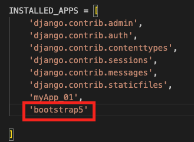
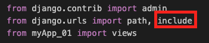
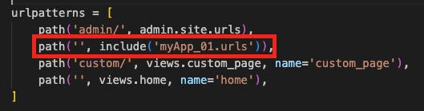
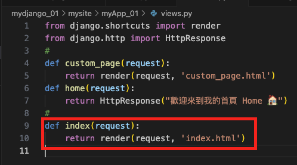
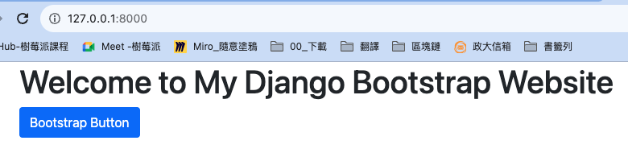

# 結合 Bootstrap

_Django 結合 Bootstrap 是一個挺複雜的程序_

<br>

## 開始

1. 安裝

```bash
pip install django-bootstrap-v5
```

2. 進入 `settings.py`



- 在 `INSTALLED_APPS` 加入 `bootstrap5`


3. 進入 `urls.py`，導入 `include`
   
   ```python
   from django.urls import path, include
   ```
   
   

4. 接著一樣在 `urls.py` 加入一個路由 `myapp.urls`
   
   ```python
   path('', include('myApp_01.urls')),
   ```
   
   
   
5. 進入 `views.py` 添加一個要渲染的網頁函數 `index` ，目標是 `index.html`。

    ```python
    def index(request):
        return render(request, 'index.html')
    ```
   
   
   
   - 特別說明，這裡的 `index.html` 是在 `templates` 裡面的 `index.html`。
  
6. 延續之前步驟，在 `templates` 內建立一個 `index.html`

    ```html
    
    <!DOCTYPE html>
    <html lang="en">
    <head>
        
        <title>My Django Bootstrap Website</title>
    </head>
    <body>
        <div class="container">
            <h1>Welcome to My Django Bootstrap Website</h1>
            <button class="btn btn-primary">Bootstrap Button</button>
        </div>
        
    </body>
    </html>
    ```

7. 在應用 `myApp_01` 下建立一個 `urls.py` 檔案，要特別注意，這時候站台資料夾 `mysite` 跟應用資料夾 `myApp_01` 底下都各有一個 `urls.py`，建立好之後貼上內容。

    ```python
    from django.urls import path
    from . import views
    urlpatterns = [
        path('', views.index, name='index'),
    ]
    ```

8. 重新啟動站台

    ```bash
    python manage.py runserver
    ```

    

<br>

_至此若能完成，下一個步驟即可套用模板_

---

_END_