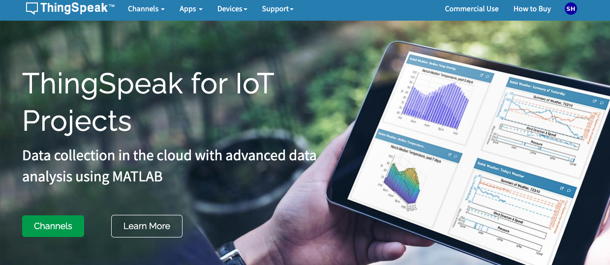

*上課講述*

# ThingSpeak

- [官網](https://thingspeak.com/)

  

   

## 介紹

1. MathWorks 是 MATLAB 與 ThingSpeak 的開發者和所有者。
2. ThingSpeak 與 MATLAB 有深度整合，用戶可以使用 MATLAB 在 ThingSpeak 平台上直接分析和處理 IoT 數據。

 

---
_待續_
