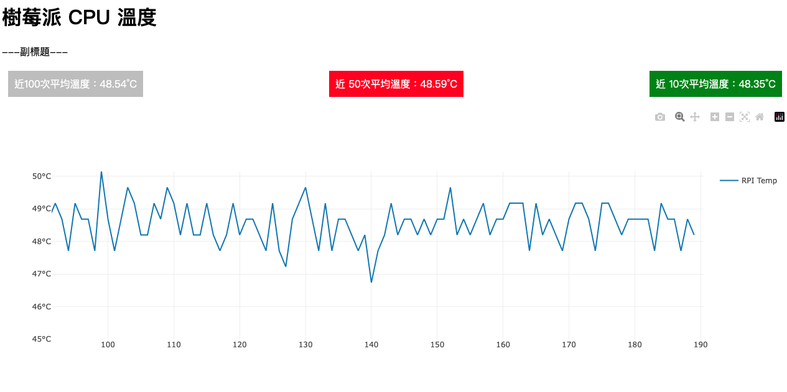

_上課操作_


## 成果圖


<br>

## 步驟

1. 安裝套件

    ```bash
    pip install dash
    ```


2. 程式碼
   
   _以下範例使用了比較高階的資料類型 deque_

    ```python
    # 導入所需模組
    import dash
    from dash import dcc, html
    from dash.dependencies import Input, Output
    import plotly.graph_objs as go
    from collections import deque
    import re, subprocess

    # 定義一個函數用於獲取CPU溫度數據
    def check_CPU_temp():
        # 初始值 None
        temp = None
        
        # 使用 subprocess.run() 執行命令「讀取CPU溫度」
        result = subprocess.run(['cat', '/sys/class/thermal/thermal_zone0/temp'], capture_output=True, text=True)
        
        # 檢查命令返回狀態
        if result.returncode == 0:
            m = re.search(r'-?\d\.?\d*', result.stdout)
            try:
                temp = float(m.group()) / 1000  # 轉換匹配的數字並除以1000
            except ValueError:  # 捕捉數值錯誤
                pass
        return temp

    # X和Y軸將使用固定大小的deque數組隊列來管理
    X = deque(maxlen=100)
    Y = deque(maxlen=100)

    # 將X初始化為一個值0
    X.append(0)
    # 用第一次讀取的CPU溫度初始化Y
    Y.append(check_CPU_temp())

    # 初始化Dash應用程式
    app = dash.Dash(__name__)

    # 定義HTML佈局和dcc組件
    app.layout = html.Div(children=[
        html.H1('樹莓派 CPU 溫度'),       # 主標題
        html.Div('---副標題---'),         # 副標題

        # 更新的父div，內含三個子div
        html.Div(children=[
            html.Div(id='avg-100', children='近100次平均溫度：N/A', style={'padding': '10px', 'backgroundColor': '#EFEFEF'}),  
            html.Div(id='avg-50', children='近 50次平均溫度：N/A', style={'padding': '10px', 'backgroundColor': '#D6D6D6'}),
            html.Div(id='avg-10', children='近 10次平均溫度：N/A', style={'padding': '10px', 'backgroundColor': '#BDBDBD'}),
        ], style={'display': 'flex', 'justifyContent': 'space-between', 'padding': '10px', 'margin': '10px 0'}),  # 使用Flexbox進行橫向排列，移除框線
        
        dcc.Graph(id='live-graph', animate=True),  # 繪圖組件
        dcc.Interval(id="refresh", interval=1 * 1000, n_intervals=0)  # 設定刷新間隔為1秒
    ])

    # 定義一個回調函數，用於更新圖形
    @app.callback(
            [
                Output("live-graph", "figure"),
                Output('avg-100', 'children'),
                Output('avg-50', 'children'),
                Output('avg-10', 'children'),
                Output('avg-100', 'style'),
                Output('avg-50', 'style'),
                Output('avg-10', 'style')
            ], 
            [Input("refresh", "n_intervals")]
    )
    def update(n_intervals):
        X.append(X[-1]+1)               # 更新X軸數據
        Y.append(check_CPU_temp())      # 更新Y軸數據
        data = go.Scatter(
                x=list(X),
                y=list(Y),
                name='RPI Temp',
                showlegend=True,
                mode= 'lines'
        )
        
        # 確保x軸始終顯示100個單位的寬度，但從0開始。
        x_max = max(100, X[-1])
        x_min = x_max - 99

        # 檢查是否是第一筆數據點以調整y軸範圍
        y_min = min(45, min(Y))
        y_max = max(50, max(Y))
        y_axis_range = [y_min, y_max]
        # 計算平均值
        avg_100 = sum(Y) / len(Y)
        avg_50 = sum(list(Y)[-50:]) / min(len(Y), 50)
        avg_10 = sum(list(Y)[-10:]) / min(len(Y), 10)
        #
        avgs = {
            'avg-100': avg_100,
            'avg-50': avg_50,
            'avg-10': avg_10
        }

        sorted_avgs = sorted(avgs.items(), key=lambda x: x[1])
        
        bg_colors = {
            sorted_avgs[0][0]: {'padding': '10px', 'backgroundColor': 'green', 'color': 'white'},
            sorted_avgs[1][0]: {'padding': '10px', 'backgroundColor': '#BDBDBD', 'color': 'white'},
            sorted_avgs[2][0]: {'padding': '10px', 'backgroundColor': 'red', 'color': 'white'}
        }
        #
        return ({'data': [data], 
            'layout': go.Layout(xaxis=dict(range=[x_min, x_max]),
                                yaxis=dict(range=y_axis_range,
                                        tickvals=[i for i in range(int(y_min), int(y_max)+1)],
                                        ticktext=[f"{i}°C" for i in range(int(y_min), int(y_max)+1)]
                                        )
                            )
        },
            f'近100次平均溫度：{avg_100:.2f}°C',
            f'近 50次平均溫度：{avg_50:.2f}°C',
            f'近 10次平均溫度：{avg_10:.2f}°C',
            bg_colors['avg-100'],
            bg_colors['avg-50'],
            bg_colors['avg-10']
        )

    # 主程序，運行伺服器並綁定到外部連接
    if __name__ == "__main__":
        # 預設在 8050
        app.run_server(debug=True, host='0.0.0.0', port='8050')
    ```

<br>

## `subprocess` 說明

1. `subprocess` 是 Python 的內建模，可用於生成新的進程、連接到它們的輸入/輸出/錯誤管道，並獲得它們的返回碼。

2. 該模組旨在取代一些舊的模組和函數，如：`os.system`、`os.spawn*`、`os.popen*`、`popen2.*`和`commands.*`等。


3. `subprocess.run()`，用以建立新進程，從 Python 3.5 起推薦以此作為 `執行外部命令` 的方法，這個指令包裝了一個對話過程，並返回一個 `CompletedProcess`實例，參考以下範例。


    ```python
    import subprocess

    result = subprocess.run(['ls', '-l'], capture_output=True, text=True)
    print(result.stdout)
    ```
<br>

4. `subprocess.Popen()`：提供了更精細的控制，允許管理進程的輸入、輸出管道和錯誤報告。

    ```python
    import subprocess

    process = subprocess.Popen(['ls', '-l'], stdout=subprocess.PIPE, text=True)
    stdout, stderr = process.communicate()
    print(stdout)
    ```

5. 與進程的標準輸入/輸出交互：使用 `Popen` 對象的 `communicate()` 方法可以發送數據給子進程的標準輸入，並讀取標準輸出和標準錯誤。

6. 管理輸出和錯誤：通過設置`stdout`、`stderr`參數，你可以將進程的標準輸出和錯誤重定向到Python程序中的文件對象。

7. 管道和文件重定向：可使用 Python 的文件對象作為 `Popen` 參數，從而將一個進程的輸出作為另一個進程的輸入。

8. 等待進程：`Popen` 對象的 `wait()` 方法會等待子進程完成，`run()`方法在進程結束時返回。

9. 處理錯誤：`subprocess`會在命令執行失敗時拋出`CalledProcessError`異常。


<br>

---

_待續_