# DashApp + Heroku


## 說明

1. Dash 應用本質上是 Flask 應用，所以可被部署到任何支援 Flask 的伺服器或雲端平臺上。
2. 關於 Heroku 的收費方式請自行參考官網說明

<br>

## 安裝 Heroku

參考[官網](https://devcenter.heroku.com/articles/heroku-cli#download-and-install)


## 建置步驟

1. 建立並進入專案目錄

    ```bash
    mkdir DashApp && cd DashApp
    ```
 

2. 在專案內建立虛擬環境

    ```bash
    python -m venv envDash
    ```

3. 初始化 Git

    ```bash
    git init
    ```


4. 建立 `.gitignore`，將 `虛擬環境` 目錄置入，其他依需求加入

    ```txt
    envDash
    .DS_Store
    .env
    ```


5. 啟動虛擬環境

    _Mac_
    ```bash
    source envDash/bin/activate
    ```

    _Win_
    ```bash
    envDash\Scripts\activate
    ```

6. 確認目前套件安裝狀態

    ```bash
    pip list
    ```

    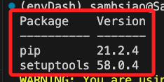

7. 升級套件

    ```bash
    envDash/bin/python -m pip install --upgrade pip
    ```

8. 再次查看

    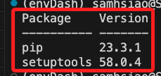

9. 安裝套件

    ```bash
    pip install dash plotly gunicorn
    ```

10. 建立所需文件

    ```bash
    touch app.py requirements.txt Procfile .gitignore
    ```

11. 可透過文件 `runtime.txt` 指定 Python 版本。
    
    ```bash
    touch runtime.txt
    ```

12. 編輯 app.py，這是站台主檔案。

    ```python
    import dash
    import dash_core_components as dcc
    import dash_html_components as html
    app = dash.Dash(__name__)
    # 官網是這樣
    # app = Dash(__name__, external_stylesheets=external_stylesheets)
    server = app.server
    app.layout = html.Div([
        html.H1("Hello Dash!"),
        html.Div("This is my first Dash app."),
        dcc.Graph(
            id='example-graph',
            figure={
                'data': [{'x': [1, 2, 3], 'y': [4, 1, 2], 'type': 'bar', 'name': 'SF'},
                        {'x': [1, 2, 3], 'y': [2, 4, 5], 'type': 'bar', 'name': u'Montréal'}],
                'layout': {'title': 'Dash Data Visualization'}
            }
        )
    ])
    #
    if __name__ == '__main__':
        # app.run_server(debug=True)
        # 依照官網寫法
        app.run(debug=True)
    ```

13. 編輯 `.gitignore`

    ```txt
    # 虛擬環境
    envDash
    # 官網的項目，寫上沒差
    venv
    *.pyc
    .DS_Store
    .env
    ```

14. 編輯 `requirements.txt`，可手動加入所需套件並指定版本

    ```txt
    dash==1.21.0 
    gunicorn==20.1.0
    # _其餘省略_
    ```

15. 可自動化建立 `requirements.txt`。

    _不用擔心自動化會寫很多，因為 Heroku 部署的時候本來就會安裝。_

    ```bash
    pip freeze > requirements.txt
    ```

16. 編輯 `Procfile`

    ```txt
    web: gunicorn app:server
    ```

17. 若要指定 Python 本版，則在 `runtime.txt` 加入，如要用 `3.9.18` 就設定如下。

    ```txt
    python-3.9.18
    ```

18. 每個版本的 stack 支援的版本請在官網查詢

    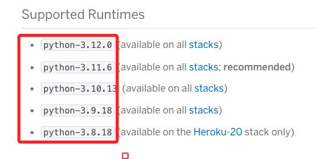

19. 登入 Heroku

    ```bash
    heroku login
    ```
    _登入畫面_

    
    
    _完成登入_

    

    _終端機也會顯示訊息_

    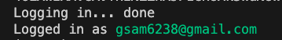


<br>

## 部署步驟

1. 建立專案，本例中使用名稱 `mydash-2023-01`，請自訂。

    ```bash
    heroku create mydash-2023-01
    ```
    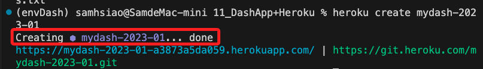

2. 使用既有專案就不用 create，直接連線遠端專案即可。

    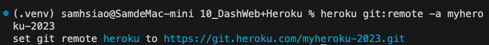

3. 確認目前連線

    ```bash
    git remote -v
    ```
    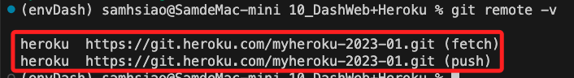

4. 查詢狀態

    ```bash
    git status
    ```
    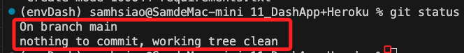

5. 添加修訂，之後若還有修改就從這步驟開始。

    ```bash
    git add .
    git commit -m 'commit'
    git push heroku main
    ```

6. Push 之前先確認分支名稱

    ```bash
    git branch
    ```
    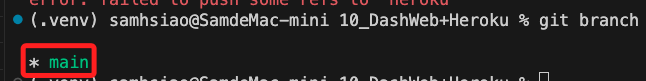

7. 推送。

    ```bash
    git push heroku main
    ```

8. 完成時會提供網址，可以使用網址訪問。

    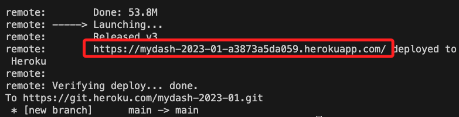

9. 可以透過指令快速啟動

    ```bash
    heroku open -a mydash-2023-01
    ```
    _自動開啟瀏覽器_

    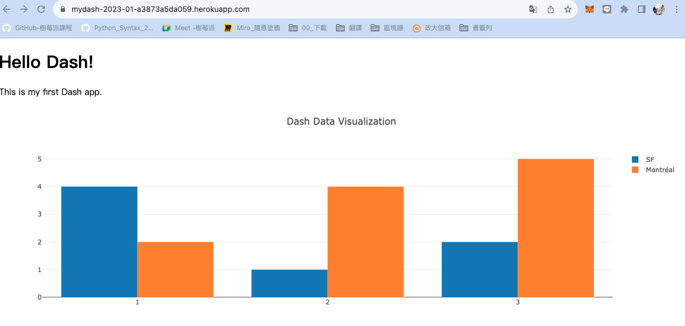

<br>

## 其他

1. 查看當前安裝的 Dash 和 Werkzeug 的版本。

    ```bash
    pip freeze | grep -E "dash|Werkzeug"
    ```
    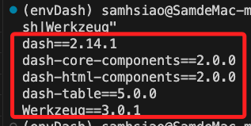

2. 若有錯誤可查看 log。

    ```bash
    heroku logs --tail -a mydash-2023-01
    ```

<br>

---

_END_