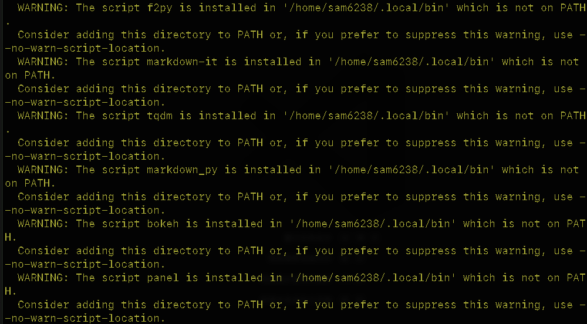
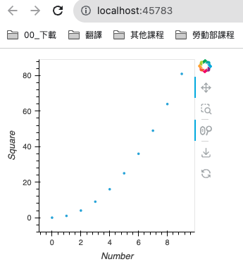

*上課講述*

# Panel by HoloViz

</br>

##  簡介

1. Panel 是由 HoloViz 開發的一個 Python 庫，可以用於創建可交互的數據可視化網頁應用，所以很多時候也跟 `網頁框架` 有所掛鉤。
2. 支持多種圖表庫，如 `Matplotlib` 、 `Plotly` 和 `Bokeh` ，而且可以很容易地集成到 `Jupyter Notebook` 中。
3. `HoloViews` 是一個用於可視化數據的 Python 庫，讓開發者可以更加輕鬆地探索數據而不需要進行大量的編碼工作。
4. `HoloViews` 主要適用於數據科學和數據分析領域，能夠方便地構建複雜的可視化圖表，它和 `Matplotlib` 、 `Bokeh` 等其他可視化庫有良好的集成。

</br>


## 安裝

1. 基本所需套件
```bash
pip install panel
pip install numpy
pip install holoviews
```

2. 如果要使用 `bokeh` 作為繪圖後端，也可以先安裝 `bokeh` 
```bash
pip install bokeh
```

3. 假如要在 Jupyter Notebook 中呈現 Bokeh 圖表的模塊可安裝 `jupyter_bokeh`
```bash
pip install jupyter_bokeh
```
</br>

## 警告排除 & 環境設置

1. 過程中若出現黃色警告，表示有些腳本被安裝在其他路徑，比如說我的警告以及路徑訊息如下。
   ```bash
   /home/sam6238/.local/bin
   ```
   
   
   
2. 編輯
   
   ```bash
	nano ~/.bashrc
   ```

3. 添加在最後
   
   ```bash
	export PATH="$PATH:/home/sam6238/.local/bin"
   ```

4. 載入
   
   ```bash
	source ~/.bashrc
   ```
</br>

## 簡單的範例

1. 腳本
   
   ```python
   import holoviews as hv
   import panel as pn
   hv.extension('bokeh')
   # 定義數據
   data = [(i, i**2) for i in range(10)]
   # 創建一個散點圖
   scatter = hv.Scatter(data, 'Number', 'Square')
   # 創建一個 Panel 物件
   panel = pn.panel(scatter)
   # 在瀏覽器中顯示
   panel.show()
   ```
2. 運行後
   
   

</br>

---
_END：以上完成基礎的環境設置_