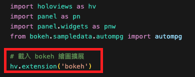
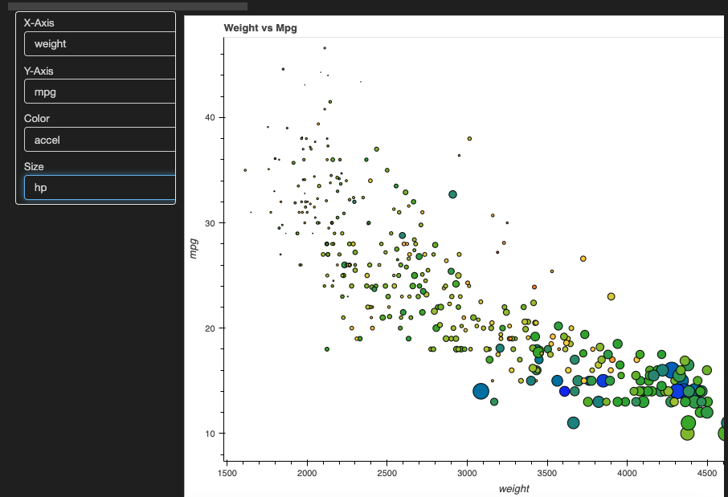

*上課講述*

# HoloViews


- 官網很多很厲害的範例
- [官網](https://holoviews.org/#)
- [官網範例](「https://holoviews.org/gallery/apps/bokeh/crossfilter.html」)

</br>


## 環境設置
1. 安裝
   
   ```bash
    pip install holoviews bokeh
   ```

</br>

## 範例說明
- 來自於官網

1. 參考官網範例
   
   

2. 特別說明官網的範例也時候也是會出錯的，這個範例少了載入繪圖的拓展，要自行載入程式碼中。

   ```python
   hv.extension('bokeh')
   ```
   
   

</br>


3. 輸出
   
   

</br>


4. 腳本
   
   ```python
   """
    基於 Auto MPG 數據集，展示如何組裝一個交叉選擇器應用的範例。
    """
    import holoviews as hv      # 繪圖庫
    import panel as pn          # 製作可互動的儀表板
    import panel.widgets as pnw # 製作小工具
    from bokeh.sampledata.autompg import autompg  # 從 導入 autompg 數據集
    # 載入 bokeh 繪圖擴展
    hv.extension('bokeh')  
    # 複製 autompg 數據集到 df 變量
    df = autompg.copy()  
    # 定義原產地列表
    ORIGINS = ['North America', 'Europe', 'Asia']  
    # 數據清理
    # 根據原產地列表修改 df 的 origin 列
    df.origin = [ORIGINS[x-1] for x in df.origin]  
    # 提取汽車製造商名稱
    # 從 name 列中提取出製造商名稱
    df['mfr'] = [x.split()[0] for x in df.name]  
    # 修正錯誤的製造商名稱
    df.loc[df.mfr=='chevy', 'mfr'] = 'chevrolet'
    df.loc[df.mfr=='chevroelt', 'mfr'] = 'chevrolet'
    df.loc[df.mfr=='maxda', 'mfr'] = 'mazda'
    df.loc[df.mfr=='mercedes-benz', 'mfr'] = 'mercedes'
    df.loc[df.mfr=='toyouta', 'mfr'] = 'toyota'
    df.loc[df.mfr=='vokswagen', 'mfr'] = 'volkswagen'
    df.loc[df.mfr=='vw', 'mfr'] = 'volkswagen'
    # 刪除 name 列
    del df['name']  
    # 對 df 的列進行排序和分類
    columns = sorted(df.columns)
    # 離散型變量
    discrete = [x for x in columns if df[x].dtype == object]
    # 連續型變量  
    continuous = [x for x in columns if x not in discrete]  
    # 可分位數變量
    quantileable = [x for x in continuous if len(df[x].unique()) > 20]  
    # 建立交互式選擇器小工具
    x = pnw.Select(name='X-Axis', value='mpg', options=quantileable)
    y = pnw.Select(name='Y-Axis', value='hp', options=quantileable)
    size = pnw.Select(name='Size', value='None', options=['None'] + quantileable)
    color = pnw.Select(name='Color', value='None', options=['None'] + quantileable)
    # 根據選擇器小工具的值來建立圖表
    @pn.depends(x.param.value, y.param.value, color.param.value, size.param.value)
    def create_figure(x, y, color, size):
        opts = dict(cmap='rainbow', width=800, height=600, line_color='black')
        if color != 'None':
            # 設置顏色選項
            opts['color'] = color  
        if size != 'None':
            # 設置大小選項
            opts['size'] = hv.dim(size).norm()*20  
        # 返回繪製的點圖
        return hv.Points(df, [x, y], label="%s vs %s" % (x.title(), y.title())).opts(**opts)  
    # 建立小工具容器
    widgets = pn.WidgetBox(x, y, color, size, width=200)
    # 將小工具和圖表組合到一行，並設置為可服務
    pn.Row(widgets, create_figure).servable('Cross-selector')
   ```


</br>

---

_END：以上展示官網簡單範例_