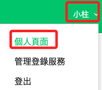
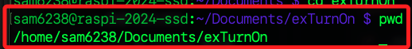

# 建立 LineNotify

_樹莓派啟動時發送 LineNotify 通知_

<br>

## A. 建立 LINE Notify 的 Token

1. 前往 [LINE Notify](https://notify-bot.line.me/en/) 並點擊右上方的登入 `Log in` 完成登入。

   

<br>

2. 登入後，點擊自己的別名展開選單，並點擊點擊 `個人頁面 My page`。

   

<br>

3. 滑動到底部，點擊 `發行權杖` 以建立新的 token。

   

<br>

4. 為 Token `命名`，並點擊選擇一個 `目標群組`，然後點擊 `發行`。

   

<br>

5. 複製權杖，特別注意，這個權杖之後將無法查詢，務必保存好。

   

<br>

6. 建立完成可看到這個權杖就在最上方。

   

<br>

## B. 撰寫腳本

1. 這個腳本所使用的都是預設套件，所以無須安裝。

   ```bash
   requests python-dotenv
   ```

<br>

2. 若未設置虛擬環境，安裝時需加入參數 `--break-system-packages`，但會得到無需重複安裝的提示。

   ```bash
   pip install requests python-dotenv --break-system-packages
   ```

   

<br>

## 設定環境變數

1. 編輯環境設定文件；特別注意，對 `.bashrc` 文件進行編輯時無需使用 `sudo`，因為這是在家目錄下的配置文件，而每個用戶都對自己的 `.bashrc` 文件本就擁有寫入權限。同理，若以 `sudo` 對 `.bashrc` 進行編輯，這代表將以 `根用戶` 的身份進行編輯，並使文件的所有權轉移到根用戶，導致之後普通用戶無法再正常訪問或修改該文件，也就是用戶無法訪問自己的 `.bashrc` 文件。

   ```bash
   nano ~/.bashrc
   ```

<br>

2. 延續前一點說明，如果不慎使用 `sudo` 編輯 `.bashrc` 文件，可使用以下命令來恢復文件的所有權。

   ```bash
   sudo chown <使用者名稱>:<使用者名稱> ~/.bashrc
   ```

<br>

3. 在最後加入一行加入以下設定；這是在全局設定下運行 Python 所需的環境變數。

   ```bash
   # 加入環境參數
   export PATH=$PATH:/home/sam6238/.local/bin
   ```

<br>

4. 儲存後重新載入讓設定生效。

   ```bash
   source ~/.bashrc
   ```

<br>

## 建立專案

1. 進入家目錄的 `Documents` 建立並進專案資料夾，這裡使用的是 `exTurnOn`。

   ```bash
   cd ~/Documents && mkdir exTurnOn && cd exTurnOn
   ```

<br>

2. 建立並編輯 `.env` 文件用以處理敏感資訊，這裡示範先建立、再編輯。

   ```bash
   touch .env && nano .env
   ```

<br>

3. 編輯 `.env`，將權杖寫入。

   ```bash
   _TOKEN=<替換自己的 LineNotify 權杖>
   ```

<br>

4. 建立一個新的 Python 腳本，例如 `send_line_notify.py`，這裡與前面的指令略有不同，可知直接 `nano` 也是可以的。

   ```bash
   nano send_line_notify.py
   ```

<br>

5. 在腳本中貼上以下代碼。

   ```python
   import requests
   import os
   from dotenv import load_dotenv

   # 載入 .env 文件
   load_dotenv()

   def send_line_notify(msg):
      # 用自己的 token 替換
      TOKEN = os.getenv("_TOKEN") 
      LINE_ENDPOINT = "https://notify-api.line.me/api/notify"
      message = msg
      headers = {
         "Authorization": f"Bearer {TOKEN}",
         "Content-Type": "application/x-www-form-urlencoded"
      }
      data = {"message": message}
      response = requests.post(LINE_ENDPOINT, headers=headers, data=data)
      return response.status_code

   if __name__ == "__main__":
      send_line_notify("\n 樹莓派已開機")
   ```

<br>

6. 在終端機內執行一下測試收到通知。

   ```bash
   /usr/bin/python ~/Documents/exTurnOn/send_line_notify.py
   ```

   

<br>

## C. 設置為系統服務

1. 當前還在腳本所在資料夾，先查詢並複製絕對路徑。

   ```bash
   pwd
   ```

   

<br>

2. 切換路徑到系統服務資料夾。

   ```bash
   cd /etc/systemd/system/
   ```

<br>

3. 建立一個新的 `systemd` 服務檔案，例如 `line_notify.service`；特別注意，在這裡就必須使用 `sudo`。

   ```bash
   sudo touch line_notify.service
   ```

<br>

4. 編輯服務檔案。

   ```bash
   sudo nano line_notify.service
   ```

<br>

5. 貼上以下文本，_務必記住_ 替換自己的路徑 `ExecStart`、帳號 `User`。

   ```ini
   [Unit]
   Description=Send LINE Notify on Startup
   After=network-online.target
   Wants=network-online.target

   [Service]
   Type=oneshot
   ExecStartPre=/bin/sleep 10
   ExecStart=/usr/bin/python /home/sam6238/Documents/exTurnOn/send_line_notify.py
   User=sam6238
   TimeoutStartSec=0

   [Install]
   WantedBy=multi-user.target  
   ```

<br>

6. 立即啟動服務，啟動後會發送通知。

   ```bash
   sudo systemctl start line_notify.service
   ```

<br>

7. 設置為開機自動啟用。

   ```bash
   sudo systemctl enable line_notify.service
   ```

   _輸出_

   ```bash
   Created symlink /etc/systemd/system/multi-user.target.wants/line_notify.service → /etc/systemd/system/line_notify.service.
   ```
<br>

8. 假如有修改設定檔案，要重新加載配置並重新啟動。

   ```bash
   # 重新加載
   sudo systemctl daemon-reload
   # 重新啟動
   sudo systemctl restart line_notify.service
   ```

<br>

9. 查看服務狀態，特別注意，這個服務是一個一次性運行的腳本，所以腳本執行後服務就會停止，所以查詢後看到 `inactive` 正是預期中的。

   ```bash
   sudo systemctl status line_notify.service
   ```

<br>

10. 賦予服務執行腳本的權限。

      ```bash
      chmod +x ~/Documents/exTurnOn/send_line_notify.py
      chmod 600 ~/Documents/exTurnOn/.env
      ```

<br>

11. 確保文件擁有者。

      ```bash
      chown sam6238:sam6238 ~/Documents/exTurnOn/send_line_notify.py
      chown sam6238:sam6238 ~/Documents/exTurnOn/.env
      ```

<br>

12. 完成以上步驟後重新開機，因為腳本設置了等候 10 秒才運行腳本，所以開機完成後還要等一下才會收到通知。

      ```bash
      sudo reboot now
      ```

<br>

## 查看日誌

1. 若服務出現錯誤，可透過日誌查看與 `line_notify.service` 相關的所有日誌。

   ```bash
   journalctl -u line_notify.service
   ```

<br>

2. 僅查看相關的最近 `50` 條日誌記錄。

   ```bash
   journalctl -u line_notify.service -n 50
   ```

<br>

3. 實時查看與 `line_notify.service` 相關的最近 `50` 條日誌記錄，並持續跟蹤新的日誌輸出，也就是實時監控服務的運行情況。

   ```bash
   journalctl -u line_notify.service -n 50 -f
   ```

<br>

___

_END：完成_