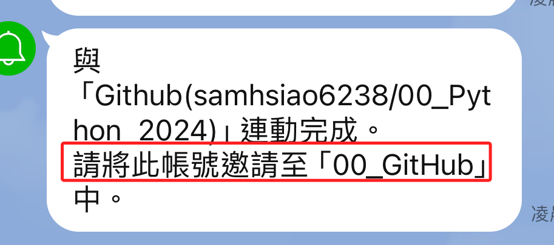

# 連動 Line Notify 與 GitHub 倉庫

_即時發送事件通知_

 

1. 進入 [官網](https://notify-bot.line.me/zh_TW/)。

   

 

2. 滑動到可連動的服務，並選取 GitHub。

   

 

3. 注意一下，這時的網址是在 `notify-bot.line.me` 之內，而非 `GitHub`。這與另一個服務 `IFTTT` 的設置不同， `IFTTT` 是轉入該服務的平台中進行後續步驟的設定。

   

 

4. 授權。

   

 

5. 驗證：務必建立雙重驗證。

   

 

6. 可參考官網 [說明文件](https://docs.github.com/en/webhooks)。

   

 

7. 選擇要接收通知的帳號，在這裡就是自己的 Line ID；並選取連動的 Repo 。

   

 

8. 選擇要接收通知的聊天室。

   

 

9. 同意連動。

   

 

10. 完成連動。

      

 

11. 在該通知尚未加入所選群組之前，舉凡在群組內的成員都會收到需將該通知加入群組的訊息。

      

 

12. 進入 `Line App` 把 `Line Notify` 加入群組中。

      

 

13. 邀請加入。

      

 

14. 同步 Github Repo 時發送通知到群組中。

      

 

___

_END：以上建立簡易的通知_