# 連動 Line Notify 與 GitHub 倉庫

_即時發送事件通知_

 

1. 進入[官網](https://notify-bot.line.me/zh_TW/)。

   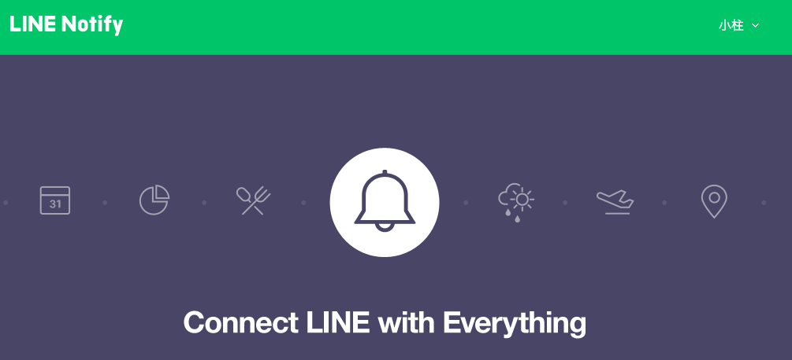

 

2. 滑動到可連動的服務，並選取 GitHub。

   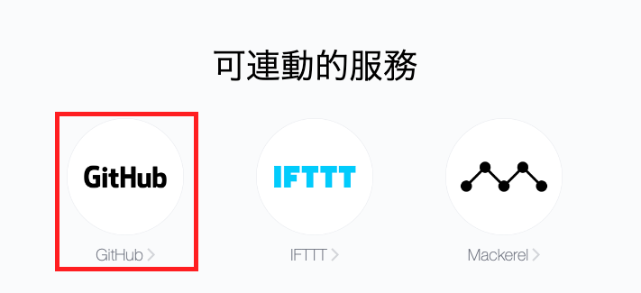

 

3. 注意一下，這時的網址是在 `notify-bot.line.me` 之內，而非 `GitHub`。這不同於 `IFTTT` 是轉入 `IFTTT` 完成設定。

   

 

4. 授權。

   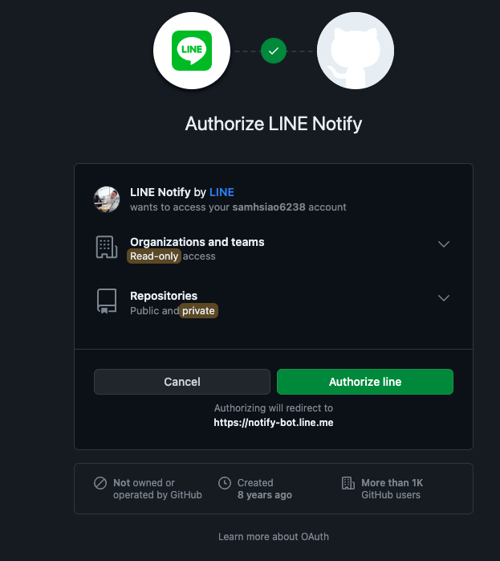

 

5. 驗證：務必建立雙重驗證。

   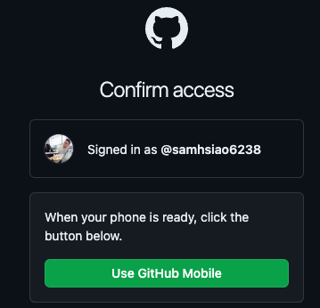

 

6. 可參考官網 [說明文件](https://docs.github.com/en/webhooks)。

   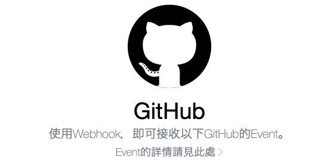

 

7. 選擇要接收通知的帳號，在這裡就是自己的 Line ID；並選取連動的 Repo 。

   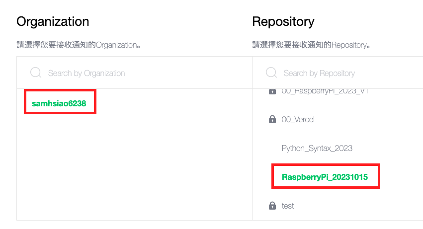

 

8. 選擇要接收通知的聊天室。

   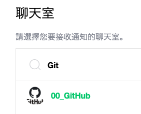

 

9. 同意連動。

   

 

10. 完成連動。

      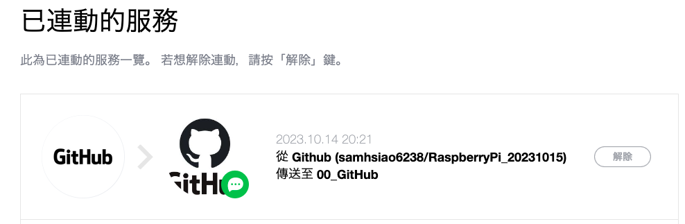

 

11. 把 Line Notify 加入群組，尚未加入的話，舉凡在群組內的成員都會收到 Line Notidfy 通知要將 Line Notify 加入群組。

      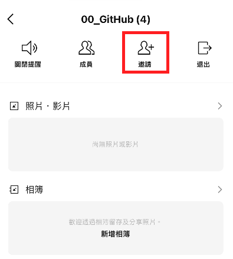

 

12. 邀請加入。

      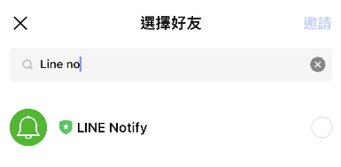

 

13. 同步 Repo 時觸發。

      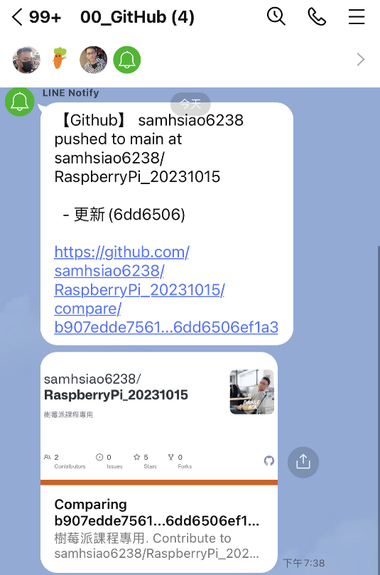

 

___

_END：以上建立簡易的通知_