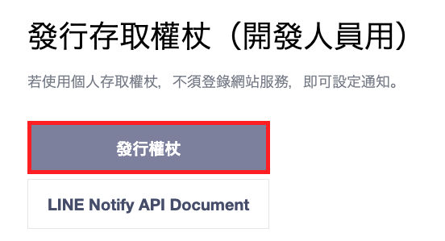
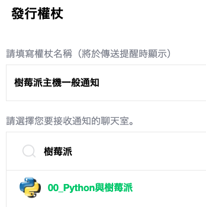
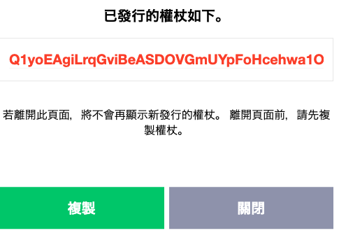

# 建立 LineNotify

- 樹莓派啟動時發送 LineNotify 通知

</br>


## 1. 建立 LINE Notify 的 Token

   - 前往 [LINE Notify](https://notify-bot.line.me/en/) 並點擊右上方的登入 `Log in`。

   - 點擊 "My page"。

        

   - 發行一個新的 token

        

   - 為 Token 命名選擇一個目標群組。

        

   - 複製 `Q1yoEAgiLrqGviBeASDOVGmUYpFoHcehwa1OmNxv2dU`
        
        
        


</br>

## 2. 撰寫腳本

   - 創建一個新的 Python 腳本，例如 `send_line_notify.py`：

     ```python

     ```
2. **設置系統服務**:

   - 創建一個新的 systemd 服務檔案，例如 `line_notify.service`，並放在 `/etc/systemd/system/` 下面。
     ```ini
     [Unit]
     Description=Send LINE Notify on Startup
     After=network.target

     [Service]
     ExecStart=/usr/bin/python3 /path/to/send_line_notify.py
     User=pi

     [Install]
     WantedBy=multi-user.target
     ```

     確保 `/path/to/` 是你 Python 腳本的正確路徑。
3. **啟動並啟用系統服務**:

   ```bash
   sudo systemctl start line_notify.service
   sudo systemctl enable line_notify.service
   ```

完成以上步驟後，每次樹莓派開機時，你都會在 LINE 群組中收到通知。
