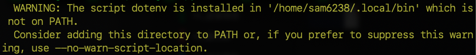

# 建立 LineNotify

- 樹莓派啟動時發送 LineNotify 通知

</br>

## A. 建立 LINE Notify 的 Token

1. 前往 [LINE Notify](https://notify-bot.line.me/en/) 並點擊右上方的登入 `Log in`。

2. 點擊 "My page"。

     

3. 發行一個新的 token

     

4. 為 Token 命名選擇一個目標群組。

     

5. 複製權杖

  
  

</br>

## B. 撰寫腳本

1. 安裝套件
   ```bash
   pip install requests python-dotenv
   ```

2. 安裝時若出現警告
   
   

3. 編輯環境參數

   ```bash
   sudo nano ~/.bashrc
   ```

4. 在最後加入一行

   ```bash
   # 加入環境參數
   export PATH=$PATH:/home/sam6238/.local/bin
   ```

5. 儲存後要記得重新載入

   ```bash
   source ~/.bashrc
   ```

6. 若在虛擬環境下執行安裝的時候務必加上 `python -m` 指定使用解釋器
   ```bash
   python -m pip install requests python-dotenv
   ```

7. 建立 .env 環境參數，字串部分有無引號皆可

   ```bash
   sudo nano .env
   ```
   貼上
   ```bash
   _TOKEN=<替換自己的 LineNotify 權杖>
   ```
   

8. 創建一個新的 Python 腳本，例如 `send_line_notify.py`

   ```bash
   sudo nano send_line_notify.py
   ```
   貼上

     ```python
     import requests
     import os
     from dotenv import load_dotenv

     # 載入 .env 文件
     load_dotenv()

     def send_line_notify(msg):
     # 用自己的 token 替換
     TOKEN = os.getenv("_TOKEN") 
     LINE_ENDPOINT = "https://notify-api.line.me/api/notify"
     message = msg
     headers = {
          "Authorization": f"Bearer {TOKEN}",
          "Content-Type": "application/x-www-form-urlencoded"
     }
     data = {"message": message}
     response = requests.post(LINE_ENDPOINT, headers=headers, data=data)
     return response.status_code

     if __name__ == "__main__":
     send_line_notify("\n 樹莓派已開機")
     ```

9.  在終端機內執行一下測試收到通知
     
     

</br>

## C. 設置系統服務

1. 切換路徑

   ```bash
   cd /etc/systemd/system/
   ```
2. 創建一個新的 systemd 服務檔案，例如 `line_notify.service`，

   ```bash
   sudo touch line_notify.service
   ```

3. 編輯服務檔案

   ```bash
   sudo nano line_notify.service
   ```

4. 先去腳本所在資料夾查詢絕對路徑

   ```bash
   pwd
   ```

5. 內容如下：務必記住替換自己的路徑、帳號
   
```ini
[Unit]
Description=Send LINE Notify on Startup
After=network.target

[Service]
ExecStart=/usr/bin/python /home/sam6238/Documents/send_line_notify.py
User=sam6238

[Install]
WantedBy=multi-user.target   
```


6. 啟動並啟用系統服務

   ```bash
   sudo systemctl start line_notify.service
   sudo systemctl enable line_notify.service
   ```

7. 完成以上步驟後重新開機
   ```bash
   sudo reboot now
   ```

</br>

---

_END：完成_