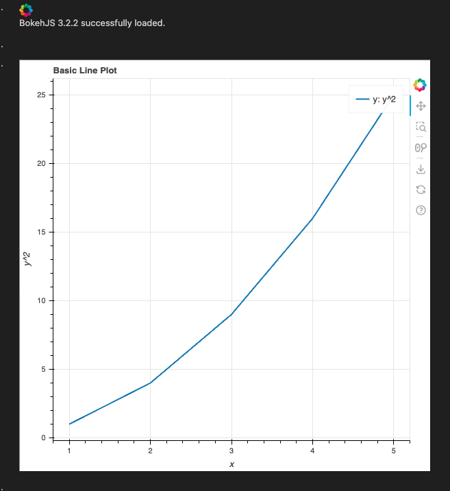

*上課講述*
# Bokeh


- 網頁框架
- [官網主頁](https://docs.bokeh.org/en/latest/index.html)

<br>

## 簡介
1. Bokeh 是一個 Python 互動式視覺化庫，專門用於現代網頁瀏覽器的高性能互動應用。
2. Bokeh 支持多種圖表，包括線圖、柱狀圖、散點圖等，並且能夠集成到 Jupyter notebook 中，也可以嵌入到 Flask 和 Django 等 web 應用框架中。

<br>

## 安裝

1. 套件安裝
   
   ```bash
   pip install bokeh
   ```

<br>

## 範例 

1. 以下範例會展示一個曲線圖
    
    ```python
    from bokeh.plotting import figure, show, output_notebook
    from bokeh.models import ColumnDataSource
    # 在 Jupyter Notebook 中輸出
    output_notebook()
    # 建立數據
    x = list(range(1, 6))
    y = [val ** 2 for val in x]
    # 建立圖形
    p = figure(title="Basic Line Plot", x_axis_label='x', y_axis_label='y^2')
    p.line(x, y, legend_label="y: y^2", line_width=2)
    # 顯示圖形
    show(p)
    ```

2. 輸出圖表
   
   


<br>

---

_END：以上展示一個曲線圖_
