# Firebase Hosting

_Google Cloud 的服務_

<br>

## 說明

_這裡示範在樹莓派上進行將原本的 Apache 站台直接初始化後部署到 Firebase Hosting_

<br>

## 套件安裝

_須先安裝相關套件_

<br>

1. 下載工具 `Node.js`。

   ```bash
   curl -fsSL https://deb.nodesource.com/setup_20.x | sudo bash -
   ```

<br>

2. 安裝 `nodejs`。

   ```bash
   sudo apt install -y nodejs
   ```

<br>

3. 安裝 `firebase-tools`。

   ```bash
   sudo npm install -g firebase-tools
   ```

<br>

4. 查看安裝版本。

   ```bash
   node -v
   npm -v
   ```

<br>

## 登入帳號

1. 登入 firebase。

   ```bash
   firebase login
   ```

<br>

2. 允許登入。

   

<br>

3. 若在樹莓派上部署， `必須` 是 `使用樹莓派啟瀏覽器` 進行驗證。   

   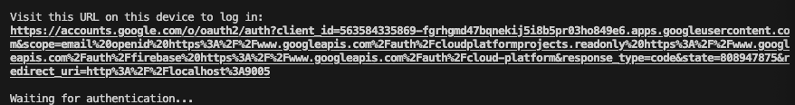

<br>

4. 驗證完成後，瀏覽器會顯示如下畫面。

   

<br>

5. 然後終端機也會顯示成功 `Success` 。

   

<br>

## 初始化

_這裡切記要選對資料夾_

<br>

1. 使用前面步驟所建立的 `Apache` 站台資料夾 `myweb`，或是建立專案資料夾。

   _假如建立新的專案_

   ```bash
   mkdir my_hosting && cd my_hosting
   ```

<br>

2. 在所選定的資料夾 `根目錄內` 進行初始化。

   ```bash
   firebase init
   ```

<br>

3. 使用 `方向鍵` 移動，然後用 `空白鍵` 選擇 `Hosting: Configure files for Firebase Hosting and (optionally) set up GitHub Action deploys` ，確認好按下 `ENTER` 。

   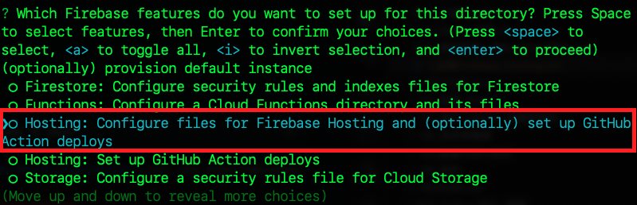

<br>

4. 選擇現有專案或建立專案，這裡示範選擇現有專案。

   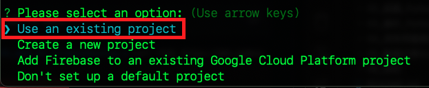

<br>

5. 選定後按 `ENTER`。

   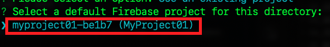

<br>

6. 選擇存放站台文件的資料夾。

   _若是新建站台可使用預設的 `public`，按下 `ENTER` 就是預設_

   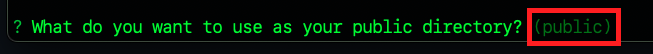

   _若使用 `Apache` 站台，則輸入一點 `.` 代表當前目錄，特別注意，若是把 `public` 刪除後按下 `ENTER` 代表的不是根目錄，而是預設的 `public` 。_

   

<br>

7. 不要 `N` 覆寫 rewrite。

   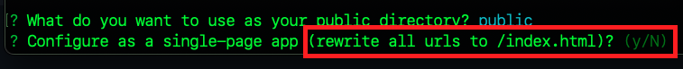

<br>

8.  不要 `N` 進行自動化佈署。

   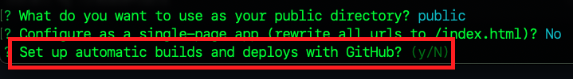

<br>

9.  初始化完成。

   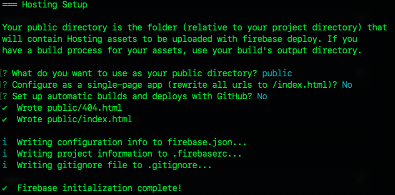

<br>

## 查看完成部署後會添加的設定文件

1. 會添加 `.gitignore` ，假如要進行原始檔控制，可加入排除項目。

   

<br>

2. `firebase.json` 是主要的設定文件。
   
   ```json
   {
      "hosting": {
         "public": ".",
         "ignore": [
            "firebase.json",
            "**/.*",
            "**/node_modules/**"
         ]
      }
   }
   ```

<br>

3. `.firebaserc` 則是紀錄專案的名稱。

   ```json
   {
      "projects": {
         "default": "myproject01-be1b7"
      }
   }
   ```

<br>

4. 隱藏的資料夾 `.firebase` 存放相關快取。

   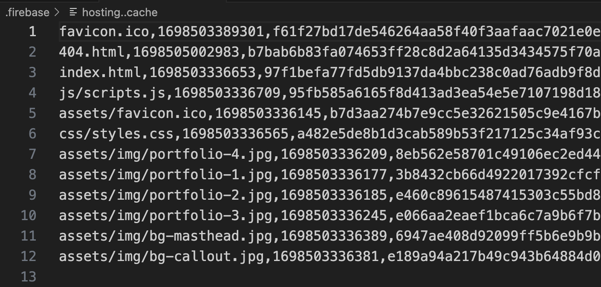

<br>

5. 另外還建立了 `404.html` 文本。

<br>

## 建立站台內容

_假如是新建的站台_

<br>

1. [下載](https://bootstrapmade.com/iportfolio-bootstrap-portfolio-websites-template/download/) 免費模板。

   

<br>

2. 解壓縮後包含以下結構。

   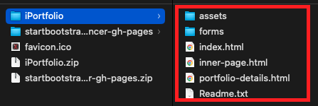

<br>

3. 使用 VSCode 開啟比較方便拖曳複製。

   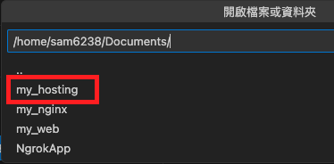

<br>

4. 下載的模板要放在 `public` 資料夾之下。

   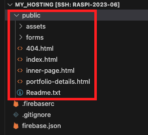

<br>

5. 在 VSCode 中可安裝 'Live Serve' 進行網站的預覽。

   

<br>

6. 安裝後在 `index.html` 檔案按下右鍵即可預覽 `Open with Live Server`。

   

<br>

7. 這個插件預設使用的端口是 `5500` ，留意一下避免端口衝突。

   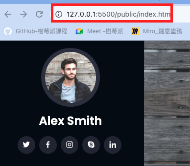

<br>

## 網站部署

1. 在專案的根目錄，使用終端機指令進行部署。

   ```bash
   firebase deploy
   ```

<br>

2. 完成時會顯示一個網站的超連結。

   

   _🆗 至此完成站台部署_

<br>

## 將 Ngnix 指向這個站台

_以上已經將 Firebase Hosting 與 Apache 結合_

<br>

1. 再度開啟設定檔案，進一步設定網頁所在位置案。

   ```bash
   sudo nano /etc/nginx/sites-available/default
   ```

<br>

2. 修改路徑，若是原本的 `Apache` 站台則無 `public` 。

   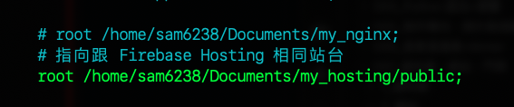

<br>

3. 重新啟動。

   ```bash
   sudo systemctl reload nginx
   ```  

<br>

4. 不要忘記重啟 `Ngrok`。

   

<br>

5. 端口是 `8080`。

   

<br>

6. 現在所訪問的站台不是 Firebase Hosting 上的內容，而是樹莓派上 Nginx。

   

<br>

_完成三個站台的結合，都指向同一個內容_

<br>

___

_END_