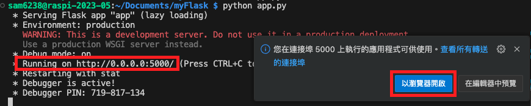

_課後補充_

# Flask 教學

_關於 Flask 在 Vercel 中的部署請參考 `D02` 講義的 `3_Vercel`_

<br>

## 建立 Flask 網頁伺服器

首先，我們需要更新系統套件並安裝 Flask。

<br>

1. 更新系統

   ```bash
   sudo apt update && sudo apt upgrade -y
   ```

<br>

2. 安裝 Flask

   ```bash
   pip install flask
   ```

<br>

3. 建立專案資料夾

   ```bash
   mkdir my_flask_app && cd my_flask_app
   ```

<br>

4. 建立專案主程式 `app.py`

   ```bash
   touch app.py
   ```

<br>

5. 使用 VSCode 開啟 `app.py`

   ```bash
   code app.py
   ```

   _在 `app.py` 中輸入以下代碼_

   ```python
   from flask import Flask

   app = Flask(__name__)

   @app.route('/')
   def home():
       return "Hello, World!"

   if __name__ == '__main__':
       app.run(debug=True, host='0.0.0.0')
   ```

<br>

## 運行與訪問

1. 啟動 Flask 伺服器，此時 Flask 伺服器 `預設`會在本地的 `5000` 端口上運行。

   ```bash
   python app.py
   ```


2. 可使用 `http://0.0.0.0:5000/` 進行訪問，或點擊 `以瀏覽器開啟`

    


3. 在區網內的其他電腦上可通過 `http://<樹莓派IP>:5000/` 來訪問。

   ```bash
   http://192.168.1.135:5000/
   ```


<br>


---

_END_
