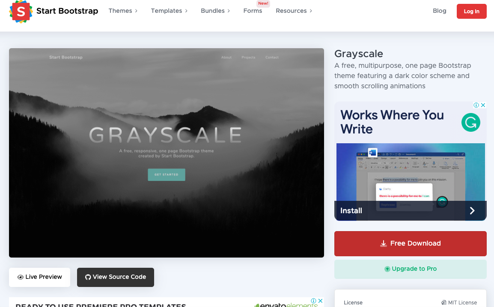
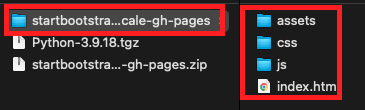
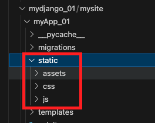
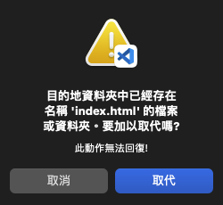
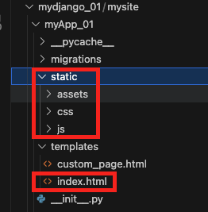
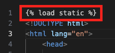
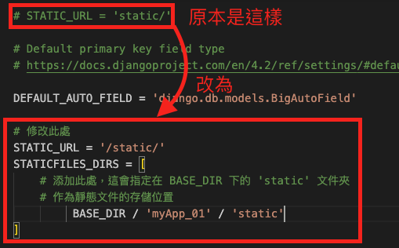
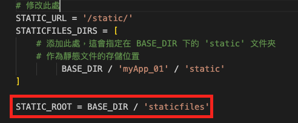
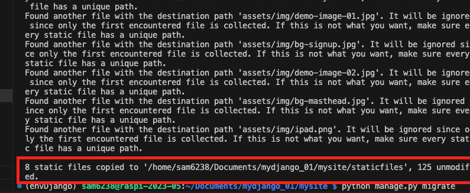
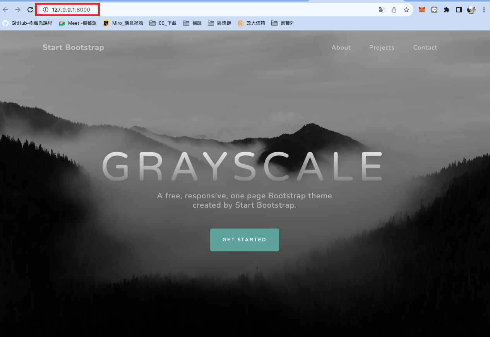

# 套用模板

_這是個不容易的轉換，但一次就可以上手_

<br>

## 開始

1. 下載

   

   _結構_

   

<br>

2. 進入自己 `專案` 中的 `應用` 資料夾下，以我這個範例來說就是 `myApp_01` ，先建立一個子目錄 `static` ，接著把模板的三個資料夾拖曳過來。
   
   

   - 嘮叨提醒，一定要在專案下的應用資料夾內，建立這個 `static` 。
  
<br>

3. 接著把模板的 `index.html` 拖曳到 `templates` ，覆蓋前一個步驟臨時做的原本首頁。
   
   

<br>

4. 這部分至此有改變的就是添加一個 `static` 資料夾、拖曳進入三個子資料夾、 `templates` 的 `index.html` 已經被覆蓋。
   
   

<br>

5. 開啟 `index.html`，在最開頭部分加入 Django 模板語法，讓超文本可以引用靜態文件。

    ```html
    
    ```

    

<br>

6. 接著在 `<head></head>` 區內找到 `icon` 以及 `styles.css` 的設定，替換為以下這兩行

    ```html
    <!--原本的-->
    <!-- <link rel="icon" type="image/x-icon" href="assets/favicon.ico" /> -->
    <!--替換為-->
    <link rel="icon" type="image/x-icon" href="" />
    ```

    ```html
    <!--原本的-->
    <!-- <link href="css/styles.css" rel="stylesheet" /> -->
    <!--替換為-->
    <link href="" rel="stylesheet" />
    ```

<br>

7. 接下來要修改 `<body></body>` 區域內的 `` 以及 `<script></script>` 設定，也是要用 Django 語法來包覆，找到這兩個標籤，然後分別在頭尾用 `` 包覆原本雙引號內的屬性。

    _原本_
    ```html
    <link rel="icon" type="image/x-icon" href="assets/favicon.ico" />
    ```
    _修改為_
    ```html
    <link rel="icon" type="image/x-icon" href="" />
    ```

<br>

8. 再來一個範例。

    _原本_
    ```html
    <script src="js/scripts.js"></script>
    ```
    _修改為_
    ```html
    <script src=""></script>
    ```

<br>

9. 接著進入 `settings.py` 修改預設路徑。

    ```python
    # 修改此處
    STATIC_URL = '/static/'  
    STATICFILES_DIRS = [
        # 添加此處，這會指定在 BASE_DIR 下的 'static' 文件夾
        # 作為靜態文件的儲存位置
            BASE_DIR / 'myApp_01' / 'static'
    ]
    ```
    
    

<br>

10. 同樣在 `settings.py` 中，再添加一個設定，這是指定將靜態文件複製到專案根目錄下的位置。

    ```python
    STATIC_ROOT = BASE_DIR / 'staticfiles'
    ```
    _放在文件最後即可_

    

<br>

11. 接下來要進行轉換，先將伺服器關閉，然後執行轉換。

    ```bash
    python manage.py collectstatic
    ```
    _最後會顯示轉換了哪些內容_

    

<br>

12. 遷移且啟動
    
    ```bash
    python manage.py migrate
    ```
    ```bash
    python manage.py runserver
    ```

<br>

13. 順利完成轉換
    
    

<br>

---

_END_