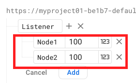
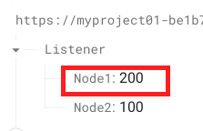
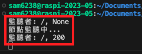
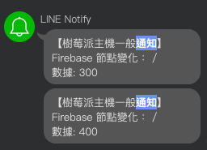
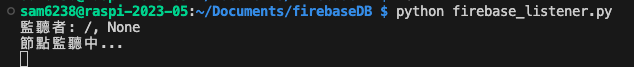
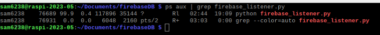

# 監聽 Firebase 即時資料庫

_Firebase Realtime Database_

<br>

## 說明

1. 使用 `firebase-admin` 的 Python 套件來實現。

<br>

2. 在樹莓派 `背景` 執行一個腳本，並 `監聽` Firebase Realtime Database 的某個指定節點。

<br>

3. 可透過手動更新即時資料庫來觀察樹莓派是否確實監聽了資料庫的變動。

<br>

4. 透過監聽機制，可將任何邏輯撰寫在監聽到變動時觸發的程式碼區塊，實現類似發佈與訂閱的機制，而且更輕量也更即時。

<br>

## 開始

1. 在樹莓派安裝必要的套件。

    ```bash
    pip install firebase-admin
    ```

<br>

2. 在 Firebase 資料庫上建立節點 `Listener`，並建立子節點 `Node1`、`Node2`。

    _其他步驟先省略_

    

<br>

3. 建立一個 Python 腳本，如 `firebase_listener.py`。

    ```python
    import firebase_admin
    from firebase_admin import credentials
    from firebase_admin import db

    def listener(event):
        # 監聽到變動的時候在這裡執行邏輯
        # 暫且列印更新的資料
        print('Listener: {}, {}'.format(event.path, event.data))

    if __name__ == '__main__':
        # 初始化 Firebase 應用
        cred = credentials.Certificate('<自己的 credentials.json 檔案')
        firebase_admin.initialize_app(cred, {
            'databaseURL': '<資料庫網址>'
        })

        # 設置監聽器，比如說節點 data
        ref = db.reference('Listener/Node1')
        # 傳入自訂監聽函數
        ref.listen(listener)

        # 保持腳本運行
        print('節點監聽中...')
        while True:
            pass
    ```

<br>

4. 執行腳本驗證一下效果。

    ```python
    python firebase_listener.py
    ```

<br>

5. 手動修改節點數據。

    

<br>

6. 查看監聽狀況。

   

<br>

## 添加 LineNotify 功能

1. 修改腳本 `firebase_lineNotify.py`。

    ```python
    import firebase_admin
    from firebase_admin import credentials
    from firebase_admin import db
    import requests


    def send_line_notify(msg):
        # 用自己的 token 替换，這裡暫且不用 .env
        TOKEN = "Q1yoEAgiLrqGviBeASDOVGmUYpFoHcehwa1OmNxv2dU"
        LINE_ENDPOINT = "https://notify-api.line.me/api/notify"
        message = msg
        headers = {
            "Authorization": f"Bearer {TOKEN}",
            "Content-Type": "application/x-www-form-urlencoded"
        }
        data = {"message": message}
        response = requests.post(LINE_ENDPOINT, headers=headers, data=data)
        return response.status_code

    def listener(event):
        # 監聽到變動的邏輯會在這裡執行
        # 先把數據輸出
        print('Listener: {}, {}'.format(event.path, event.data))
        # 發送 LINE 通知
        send_line_notify('Firebase 節點變化： {}\n數據: {}'.format(event.path, event.data))

    if __name__ == '__main__':
        # 初始化 Firebase
        cred = credentials.Certificate('<自己的 credentials.json 文件>')
        firebase_admin.initialize_app(cred, {
            'databaseURL': '<資料庫網址>'
        })

        # 設置監聽
        ref = db.reference('<要監聽的節點>')
        # 傳入監聽數據
        ref.listen(listener)

        # 運行腳本
        print('節點監聽中...')
        try:
            while True:
                pass
        except KeyboardInterrupt:
            print('停止監聽...')
    ```

<br>

2. 執行腳本後，當節點產生變化，會收到 Line 通知。

    

<br>

## 背景執行

1. 若要在背景執行腳本，可使用 `nohup` 和 `&` 來實現，這會啟動腳本並將其放到背景執行，即使關閉終端機，腳本也會繼續運行。

    ```bash
    nohup python firebase_listener.py &
    ```

    

<br>

2. 關閉時可先透過指令查詢進程。

    ```bash
    ps aux | grep firebase_listener.py
    ```

<br>

3. 結果如下，一個是腳本本身，一個是查詢 grep 的指令進程。

    

<br>

4. 使用 `kill` 終止進程，若關不掉可加上參數 `-9` 強制關閉。

    ```bash
    kill 76689
    ```

<br>

## 其他

1. 接下來可以嘗試把這個腳本設定為開機啟動的服務，或是透過 `cron` 的定時功能設定為開機啟動。

<br>

___

_END_
