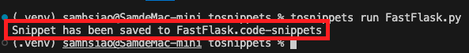

_上課講述_

# Snippets

_自訂快速鍵，這裡以 Flask 網站為例_


## 開始

1. 打開 `命令選擇區 Command Palette`

    

2. 輸入關鍵字搜尋 `Snippets`
   
   

3. 選取 `新增全域程式碼片段檔案`
   
   

4. 輸入`檔案名稱`如 `FastStresamlit`，會開啟一個全名為 `FastStresamlit.code-snippets` 的檔案
   
   

5. 這個檔案在本機電腦上是一個隱藏檔案，路徑如下，要特別注意路徑 `有空格` 。

    ```bash
    /Users/samhsiao/Library/Application Support/Code/User/snippets
    ```

6. 這個設定文件採用的格式是 `JavaScript Object Notation`，用於定義代碼片段，轉換需要一點技巧，以下進一步教學如何撰寫腳本來快速轉換。

<br>

## 建立可安裝腳本

_這是比較進階的技巧_

<br>

1. 先建立並進入一個將用來存放轉換功能腳本的資料夾

    ```bash
    mkdir <自訂資料夾> && cd <自訂資料夾>
    ```
    如
    ```bash
    mkdir tosnippets && cd tosnippets
    ```

2. 在這個資料夾內建立轉換腳本，任意命名即可，如 `tosnippets.py` 。

    ```bash
    touch tosnippets.py
    ```

3. 編輯 `tosnippets.py`

    ```python
    import sys
    import json
    import argparse

    def py_to_snippet(py_file_path, snippet_file_path):
        with open(py_file_path, 'r') as f:
            code_lines = f.readlines()

        file_name = py_file_path.split("/")[-1]
        prefix = '!' + file_name.split(".")[0]

        snippet = {
            prefix: {
                "scope": "python",
                "prefix": prefix,
                "body": code_lines,
                "description": f"{prefix} snippet"
            }
        }

        with open(snippet_file_path, 'w') as f:
            json.dump(snippet, f, indent=4)

    def main():
        parser = argparse.ArgumentParser(description='Convert a Python file to a VS Code snippet.')
        parser.add_argument('command', help='The command to run.')
        parser.add_argument('input_file', help='The input Python file.')
        parser.add_argument('--output', help='The output snippet file. If not provided, defaults to the input file name with a .code-snippets extension.')

        args = parser.parse_args()

        if args.command != 'run':
            print("Unknown command. Use 'tosnippets run <input_file>'")
            sys.exit(1)

        if args.output:
            snippet_file_path = args.output
        else:
            snippet_file_path = args.input_file.replace('.py', '.code-snippets')

        py_to_snippet(args.input_file, snippet_file_path)
        print(f"Snippet has been saved to {snippet_file_path}")

    if __name__ == "__main__":
        main()
    ```

4. 在資料夾內再新增一個 `setup.py` 檔案。

    ```bash
    touch setup.py
    ```

5. 編輯 `setup.py` 內容。

    ```python
    from setuptools import setup

    setup(
        name='tosnippets',
        version='0.1',
        scripts=['tosnippets.py'],
        entry_points={
            'console_scripts': [
                'tosnippets = tosnippets:main',
            ],
        },
    )
    ```

6. 在資料夾內執行安裝指令，這會將 `tosnippets` 安裝為一個可執行的 `全局` 命令。

    ```bash
    pip install .
    ```

7. 可透過 `pip show` 查詢自訂套件安裝資訊
   
   

8. 先新增一個腳本，撰寫簡單的 `Flask` 網站內容，並命名為 `FastFlask.py`，這個檔案名稱中的 `FastFlask` 將被用做 `.code-snippets` 的檔案名稱。

    ```python
    import tkinter as tk

    def on_button_click():
        label.config(text="Hello, Tkinter!")

    app = tk.Tk()
    app.title("Tkinter Example")

    button = tk.Button(app, text="Click Me!", command=on_button_click)
    button.pack(pady=20)

    label = tk.Label(app, text="Welcome to Tkinter!")
    label.pack(pady=20)

    app.mainloop()
    ```

9. 執行轉換命令

    ```bash
    tosnippets run FastFlask.py
    ```

10. 終端機會輸出訊息。
    
    

11. 資料夾內會建立幾個新的文件與文件夾。
    
    

12. 可以看一下這個腳本的內容，這裡特別說明一下換行符號，因為無法判斷腳本內容，所以預設都多隔一行，所以可手動修改這個腳本，或是以快速鍵建立 Flask 文本之後再修改。

    ```json
    {
        "!FastFlask": {
            "scope": "python",
            "prefix": "!FastFlask",
            "body": [
                "import tkinter as tk\n",
                "def on_button_click():\n",
                "    label.config(text=\"Hello, Tkinter!\")\n",
                "\n",
                "app = tk.Tk()\n",
                "app.title(\"Tkinter Example\")\n",
                "\n",
                "button = tk.Button(app, text=\"Click Me!\", command=on_button_click)\n",
                "button.pack(pady=20)\n",
                "\n",
                "label = tk.Label(app, text=\"Welcome to Tkinter!\")\n",
                "label.pack(pady=20)\n",
                "\n",
                "app.mainloop()\n"
            ],
            "description": "!FastFlask snippet"
        }
    }
    ```

13. 使用指令將這個腳本移動到 VSCode 的資料夾內。

    ```bash
    mv FastFlask.code-snippets /Users/samhsiao/Library/Application\ Support/Code/User/snippets
    ```

## 測試

1. 開啟任意 `.py` 檔案，輸入快速鍵關鍵字 `!Fast` 即可出現選單
   
   

2. 會建立一個可執行的 Tkinter 腳本，終端機啟動觀察腳本是否正確。

    ```bash
    python <腳本名稱.py>
    ```

3. 確實建立了一個 Tkinter 視窗應用。
   
   

<br>

---

_END_
