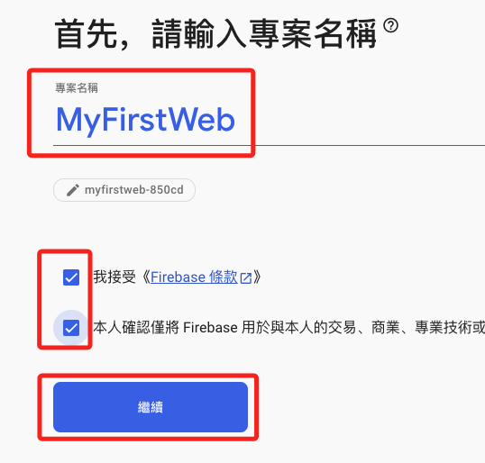
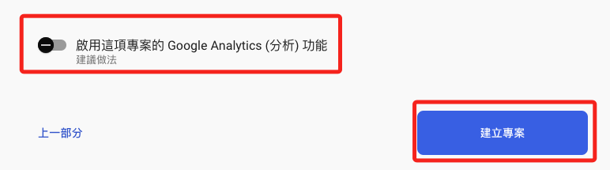
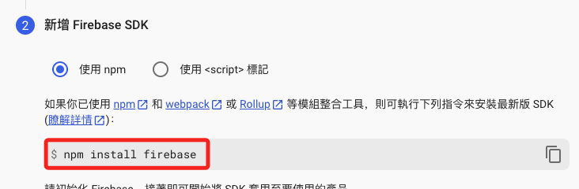
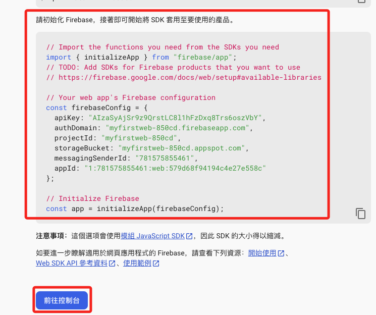
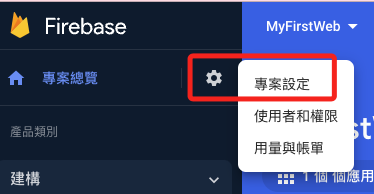
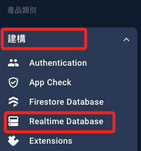
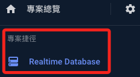
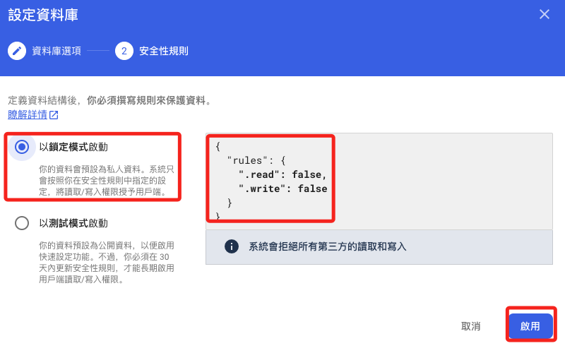
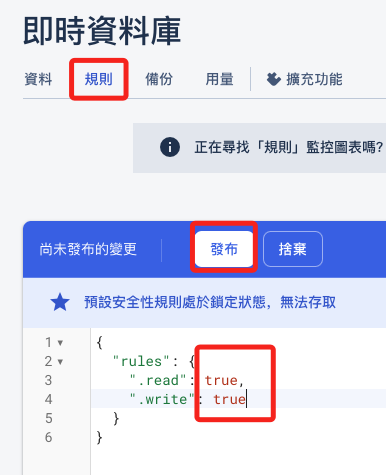
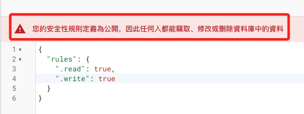

# 前情回顧

## 速覽

1. 登入 Firebase 並建立專案

    

2. 輸入任意名稱、接受條款後繼續
   
   

3. 是否使用分析功能皆可，然後建立專案
   
   

4. 完成後繼續
   
   

5. 主控台中很多功能，這裡先從 `網頁` 開始
   
   

6. 註冊應用程式，可以先不用選擇 `Hosting`。
   
   

7. 安裝開發工具 `Firebase JavaScript SDK`，這跟命令列工具是不同的。
   
   
   
   ```bash
   npm install firebase
   ```

8. 這段是要貼在應用中的 API 資訊，可稍後再來複製，然後往控制台。
   
   

9. 這時便會看到有了一個應用
    
    

10. 點擊專案設定
    
    

11. 往下滑動就可以看到剛剛的資料了，以後可以來這裡重新複製。
    
    

12. 切換到服務帳戶頁籤，選取 Node.js，可以產生新的私密金鑰，點擊便可下載。
    
    

13. 會有一些提醒，點擊產生金鑰完成下載。
    
    
   
14. 在左側建構中選取 Realtime Database
    
    

15. 選取過的服務會自動添加到捷徑中
    
    

16. 選擇建立資料庫
    
    

17. 選擇區域，美國新加坡皆可，然後下一步
    
    

18. 以鎖定模式啟動，之後還會再設定修正，選擇啟用
    
    

19. 切換到規則頁籤，修改兩個權限設定值為 `true`，然後點擊 `發布`
    
    

20. 無需在意完成時的警告，這個階段先這樣設定沒關係。
    
    

<br>

_至此完成初步的設定_

---

_END_