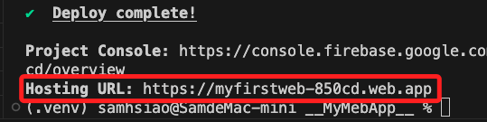

# 部署到 Hosting

_這裡只簡單交代指令，詳細步驟說明參考之前講義_

<br>

## 步驟

1. 登入

    ```bash
    firebase login
    ```

<br>

2. 初始化

    ```bash
    firebase init
    ```

<br>

3. 部署

    ```bash
    firebase deploy
    ```

<br>

4. 完成後，使用配發的網址瀏覽。
   
   

<br>

## 結語

_至此完成網頁端與即時資料庫的連動，未來所有的互動都可以使用資料庫作為中樞，感測器只管發布訊息到節點上，訂閱端僅需監聽節點變化，以資料庫為中樞的資訊流動機制就完成佈基礎置_

<br>

---

_END_