# 寫入節點

_取得樹莓派溫度並寫入資料庫_

<br>

## 步驟

1. 安裝

    ```bash
    pip install firebase-admin
    ```

2. 進入 `Firebase` 專案，點擊 `Build`

    

3. 建立資料庫

    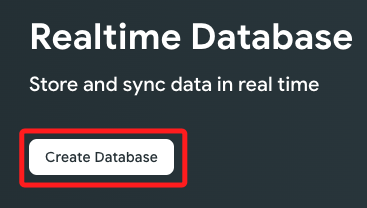

4. 選取位置

    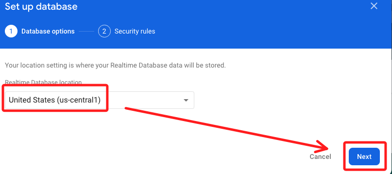

5. 設定模式

    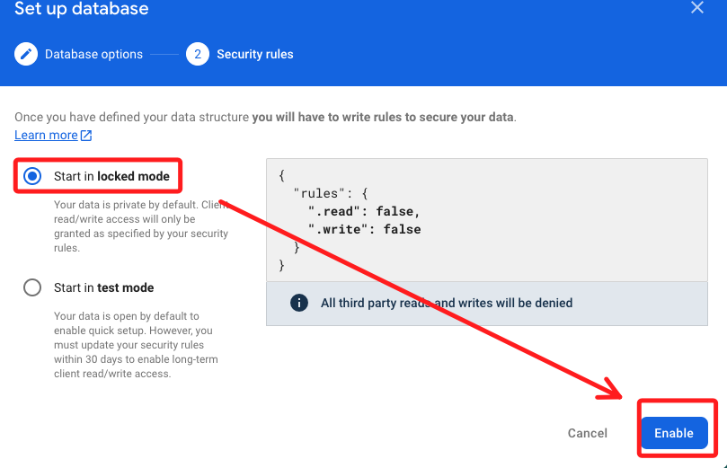

6. 設定權限

    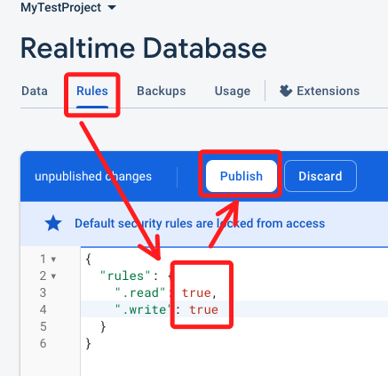

7. 進入專案設定
   
    

8. 下載 `Private Key`

    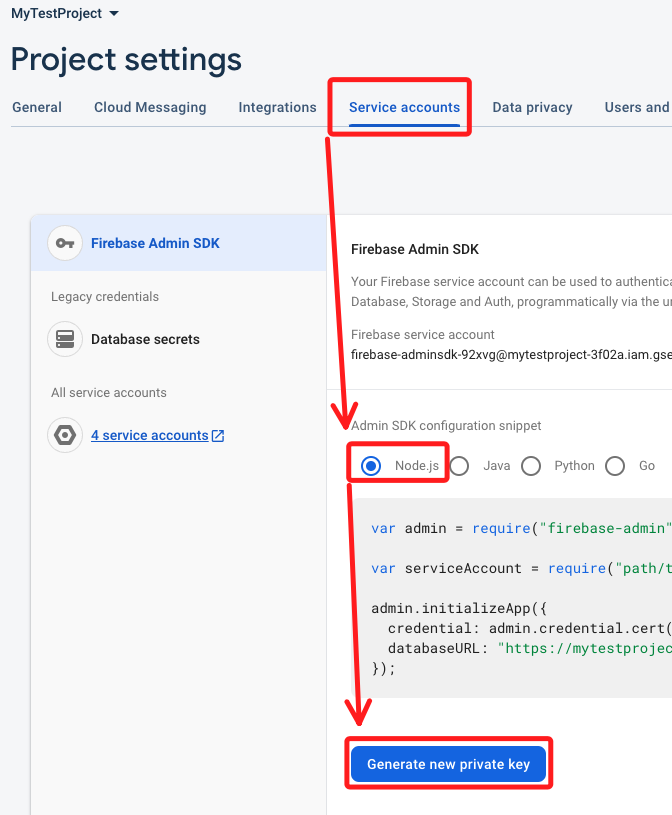

9. 下載

    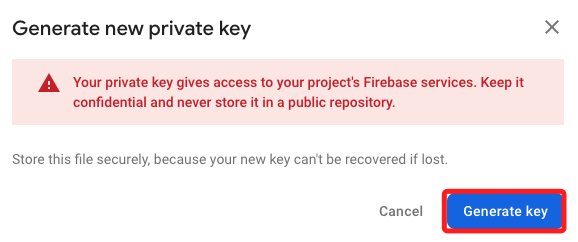

10. 將憑證加入之前，可先寫入 `.gitignore`
    
    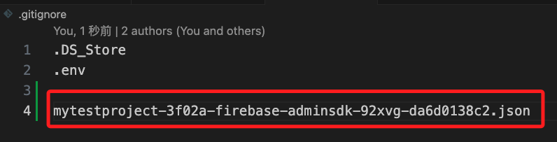

11.  將憑證拖曳到專案中

    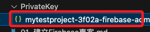

12. 複製資料庫 URL

    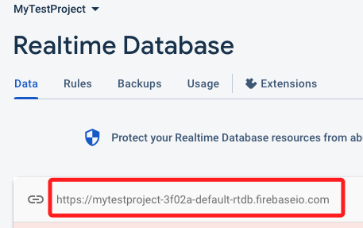


13. 先提示一下專案結構

    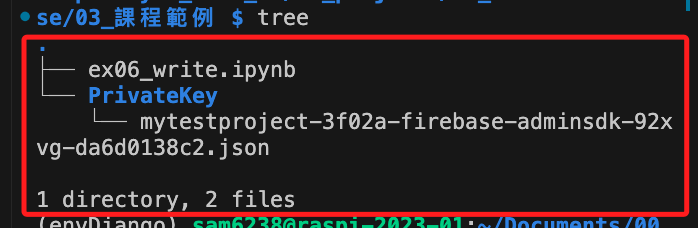

14. 貼上範例

    ```python
    import time
    import subprocess
    import firebase_admin
    from firebase_admin import credentials
    from firebase_admin import db

    # 替換實際私鑰文件路徑
    cred = credentials.Certificate('./PrivateKey/<憑證檔案全名>')

    # 初始化 Firebase Admin，使用資料庫 URL
    firebase_admin.initialize_app(cred, {
        'databaseURL': '資料庫 URL'
    })

    # 樹莓派溫度讀取函數
    def get_pi_temperature():
        # 執行命令並返回溫度
        temp_output = subprocess.check_output(['vcgencmd', 'measure_temp']).decode()
        temp = float(temp_output.split('=')[1].split("'")[0])
        return temp

    # Firebase 中溫度數據的節點
    temp_ref = db.reference('/raspberrypi/temperature')

    # 主循環
    while True:
        # 獲取溫度
        temp = get_pi_temperature()
        print(f"Current temperature is: {temp} C")
        
        # 將溫度寫入 Firebase
        temp_ref.set({
            'timestamp': time.time(),
            'temperature': temp
        })
        
        # 每隔 10 秒鐘檢查一次
        time.sleep(10)
    ```


14. 切記替換兩處資料為自己的憑證與資料庫 URL。

    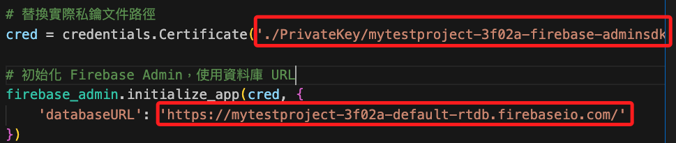

15. 運行腳本之後去資料庫查看
    
    


<br>

---

_END_