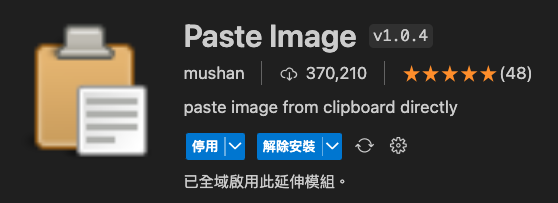

# VSCode 插件

_Paste Image_



<br>

## 說明

這個插件原本預設的用法其實很不好用，但搭配了簡單的設置之後，在編輯 Markdown 文件時，用於管理貼上的圖片檔案特別方便。


<br>

## 步驟

1. 首先完成插件的安裝。

<br>

2. 在 VSCode 的工作區中建立一個 `.vscode` 的資料夾，假如已經存在就不用建立。

    

<br>

3. 在資料夾內添加一個 `settings.json` 的設定文件，假如已經存在就直接使用。

    

<br>

5. 在設定文件中添加以下內容，假如已經存在其他設定，將內容直接加入原本的 `JSON` 文件中，不用最外層的大括號 `{ }` 。

    ```json
    {
        // 其他設定不用動 ...

        // 添加以下設定，所有的設定皆可以自行修改
        // 設定貼上相片的預設路徑，就是當前資料夾內建立一個 images 資料夾用來存放圖檔
        "pasteImage.path": "${currentFileDir}/images/",
        // 圖片前綴
        "pasteImage.namePrefix": "img_",
        // 預設名稱
        "pasteImage.defaultName": "0",
        // 是否跳出確認視窗，用以確認檔案名稱
        "pasteImage.showFilePathConfirmInputBox": true
    }
    ```

<br>

5. 完成以上設置，圖片複製之後，可使用插件的預設組合鍵貼上圖片，Mac 系統是 `option+command+V` ， Windows 系統是 `Alt+Windows+V` ，僅快速鍵名稱不同，而案件的位置是一樣的，也就是`option` 對應的是 `ALT`， `command` 對應的是 `Windows`。

<br>

---

_END：再將 Win 系統的鍵盤名稱補上_