# PythonAnywhere

<br>

## 註冊

1. [官網](https://www.pythonanywhere.com/)

    

2. 建立免費帳號

    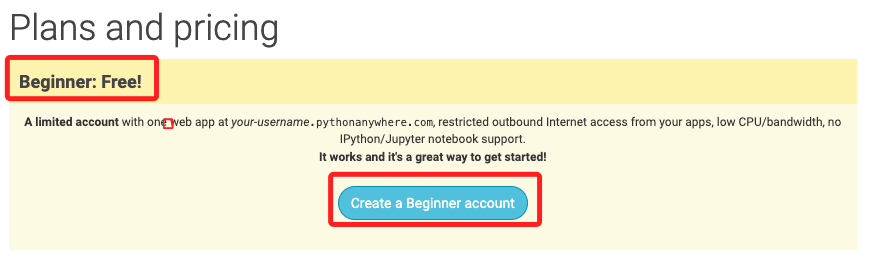

3. 填寫基本資料

    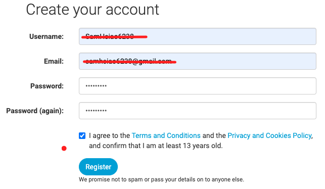

4. 進入看起來有點小複雜的主控台

    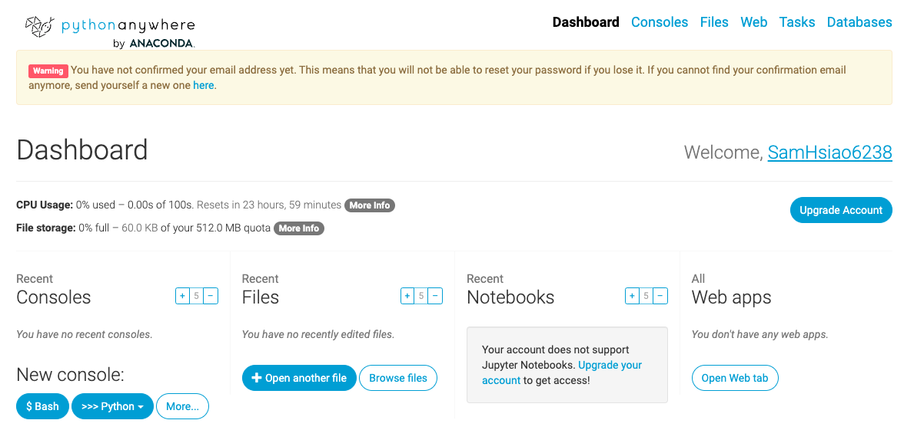

<br>

## 腳本範例

    ```python
    import dash
    from dash import dcc
    from dash import html

    app = dash.Dash(__name__)
    # 官網是這樣
    # app = Dash(__name__, external_stylesheets=external_stylesheets)
    server = app.server
    app.layout = html.Div([
        html.H1("哈囉 Dash!"),
        html.Div("我的第一個 Dash app."),
        dcc.Graph(
            id='example-graph',
            figure={
                'data': [{'x': [1, 2, 3], 'y': [4, 1, 2], 'type': 'bar', 'name': 'SF'},
                        {'x': [1, 2, 3], 'y': [2, 4, 5], 'type': 'bar', 'name': u'Montréal'}],
                'layout': {'title': 'Dash Data 可視化'}
            }
        )
    ])
    #
    if __name__ == '__main__':
        # app.run_server(debug=True)
        # 依照官網寫法
        app.run(debug=True)
    ```

<br>

## 開始部署

1. 檔案

    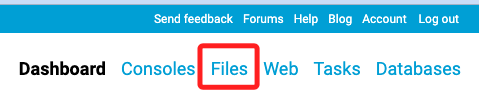

2. 上傳檔案

    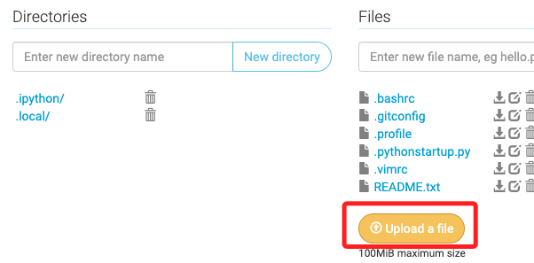

3. 選取本地電腦中的應用腳本

    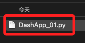

4. 完成時會看到檔案

    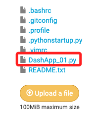

5. 進入主控台

    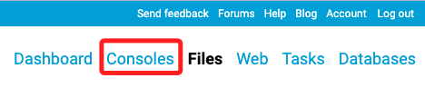

6. 點擊 `Bash`

    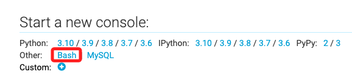

7. 開啟一個新的 `SHELL`

    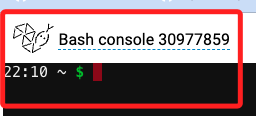

8. 輸入指令建立虛擬環境，記住名稱，稍後還會用到。

    ```bash
    mkvirtualenv mydashenv --python=/usr/bin/python3.8
    ```

    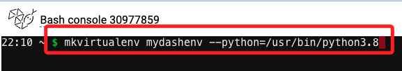

9. 啟動的時候會稍微靜止一段時間不用擔心，完成時顯示如圖。

    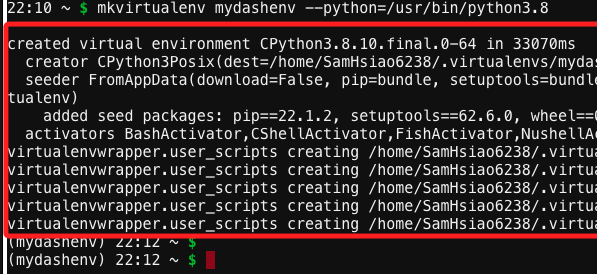

10. 在虛擬機安裝套件，其中 `flask` 應該是會自動安裝，可省。

    _安裝挺耗時_

    ```bash
    pip install dash flask gunicorn
    ```

    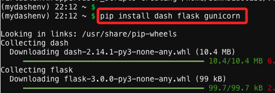

11. 右上方功能選單，選取 `Web`

    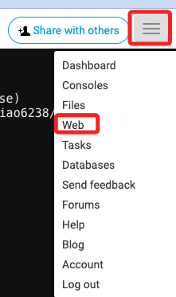

12. 添加應用

    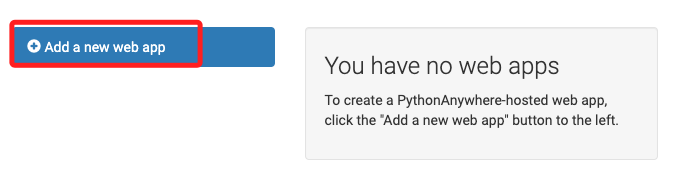

13. 直接選取 `Next`

    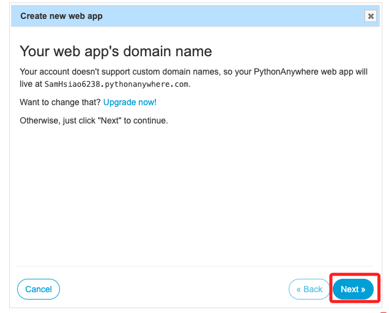

14. 選取手動設定

    

15. 這裡選 `3.8` 或其他相容版本皆可。

    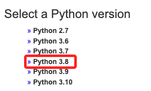

16. 完成就點擊 `Next`

    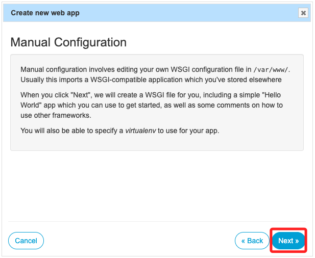

17. 往下滑動到 `Code` 區塊

    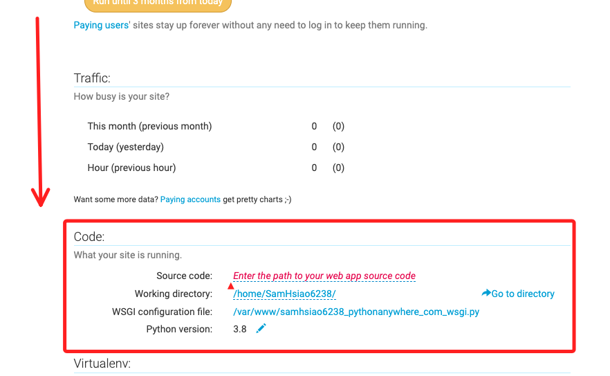

18. 點擊 `Source code` 右方

    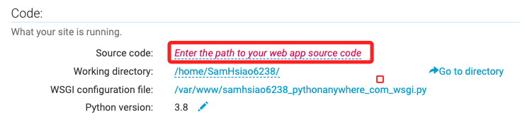

19. 填入路徑然後打勾

    ```bash
    <複製下方工作路徑>/
    ```

    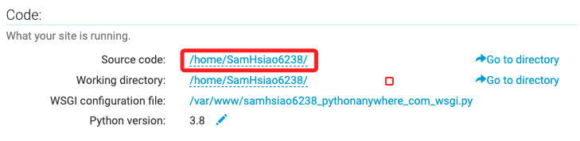

20.  若輸入完整檔案名稱也是可以，但之後會出現提示。

    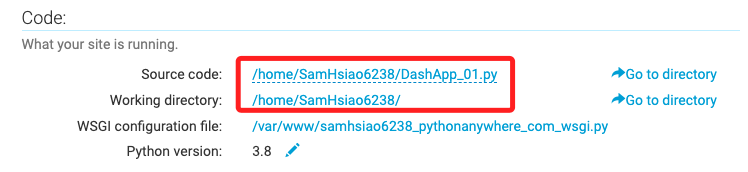

21. 接著設置虛擬環境

    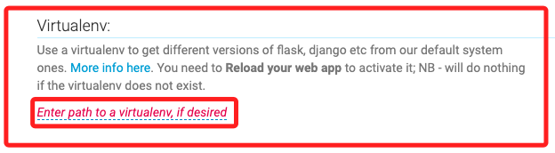

22. 填入

    ```bash
    <工作目錄>/<虛擬環境名稱>/
    ```

    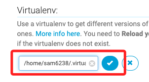

23. 完成時會顯示完整路徑，輸入錯誤的話會提示沒偵測到，所以不用擔心。
    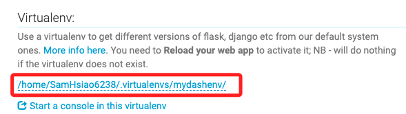
24. 點擊 `Start a console in this virtualenv` 以確認是否可以啟動。

    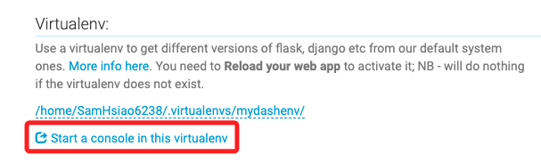

25. 啟動完成

    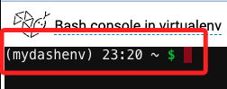

26. 前面提過假如輸入完整路徑會出現提示，但不影響結果。

    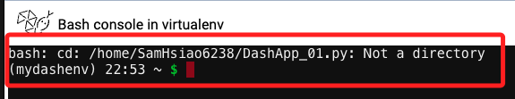

27. 返回上一頁，然後點擊 `WSGI configuration file` 進行編輯。

    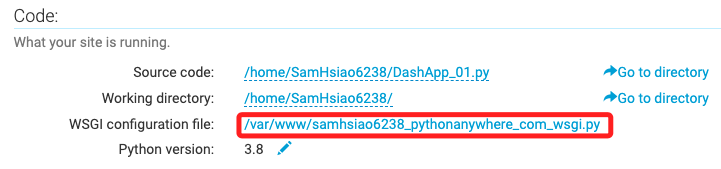

28. 添加內容在最後面

    ```python
    import sys
    sys.path.append('/<工作目錄>/<腳本名稱.py>')

    from <腳本名稱> import app
    application = app.server
    ```

    _如下_
    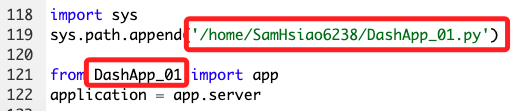

29. 把 `38` 行以下這段全部註解起來。

    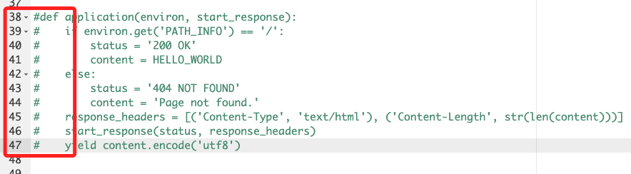

30. 點擊右上角的儲存

    

31. 再回到 `Web`

    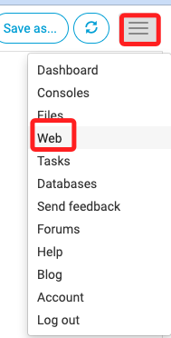

32. 重新載入

    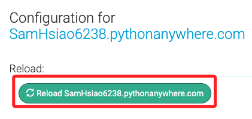

33. 點擊網址訪問

    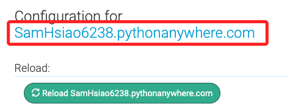

34. 成果

    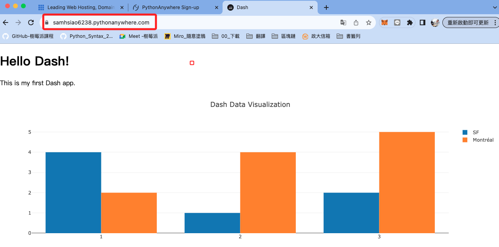


<br>

## 增修檔案

1. 進入 `Files`

    

2. 編輯或上傳新的檔案

    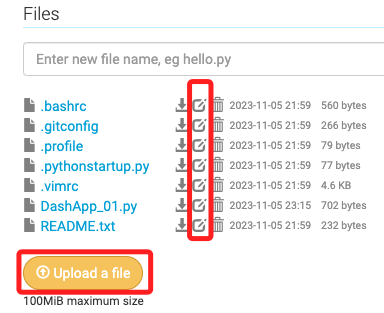

<br>


---

_END_
