# Colab

_每個人操作 GPT 的結果可能都不同，同學僅需參考步驟，完成時再依最後步驟來調整程式碼即可_

<br>

## 設置機器

1. 登入 [Colab](https://colab.research.google.com/?hl=zh-tw) ，點擊左下角的 `＋ 新增筆記本` 。

    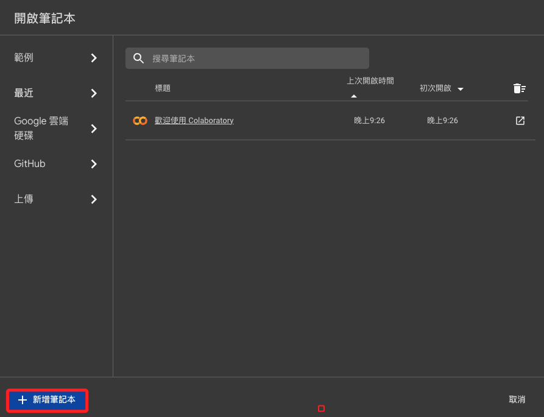

<br>

2. 點擊右上角的 `連線` 。

    

<br>

3. 選擇 `變更執行階段類型`。

    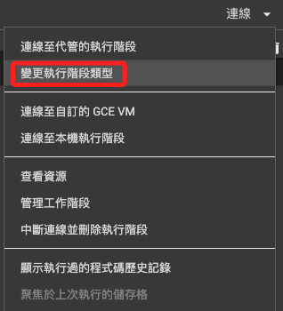

<br>

4. 加速器選取 `T4 GPU` ，然後儲存。

    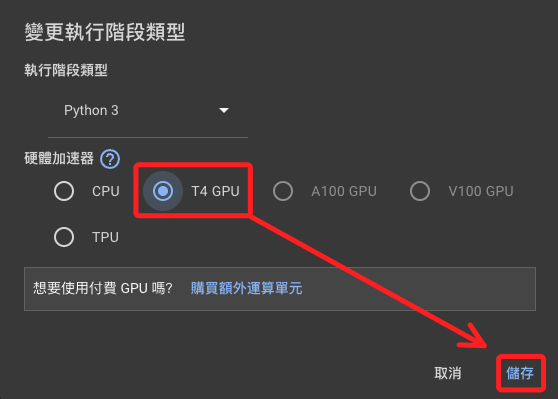

<br>

5. 要再點擊一次 `連線` 。

    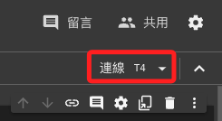

<br>

6. 展開便可查看虛擬機的配置。

    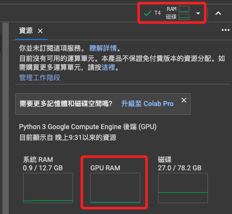

<br>

7. 以介面操作掛載雲端硬碟。

    

<br>

8. 點選 `連線至 Google 雲端硬碟`

    

<br>

9. 選擇帳號

    

<br>

10. 清單內會顯示雲端硬碟

    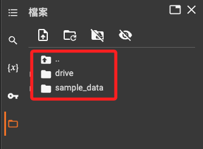

<br>

11. 直接點擊命名

    

<br>

## 嘗試使用 GPT 協助撰寫腳本

1. 發問

    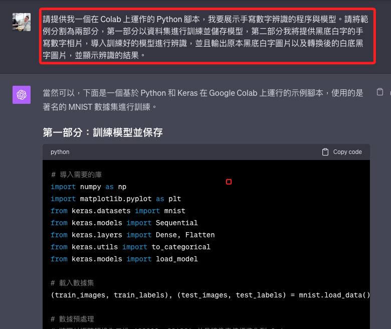

<br>

2. 別急著複製貼上，稍作瀏覽內容。因為即便聰明如 GPT 也是會犯上一些低級錯誤，這裡 GPT 在訓練前已經將圖片進行了 `扁平化`，這將導致模型訓練時的圖片讀取錯誤。

    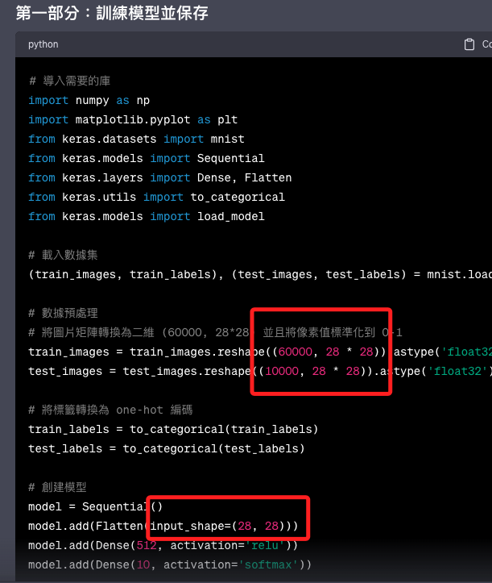


<br>

3. 第一部分程式碼。

    ```python
    # 導入需要的庫
    import numpy as np
    from tensorflow.keras.datasets import mnist
    from tensorflow.keras.models import Sequential
    from tensorflow.keras.layers import Dense, Flatten
    from tensorflow.keras.utils import to_categorical

    # 載入數據集
    (train_images, train_labels), (test_images, test_labels) = mnist.load_data()

    # 數據預處理
    # 將像素值標準化到 0-1
    train_images = train_images.astype('float32') / 255
    test_images = test_images.astype('float32') / 255

    # 擴展圖片維度，以匹配模型的預期輸入
    train_images = np.expand_dims(train_images, axis=-1)
    test_images = np.expand_dims(test_images, axis=-1)

    # 將標籤轉換為 one-hot 編碼
    train_labels = to_categorical(train_labels)
    test_labels = to_categorical(test_labels)

    # 建立模型
    model = Sequential([
    Flatten(input_shape=(28, 28)),
    Dense(512, activation='relu'),
    Dense(10, activation='softmax')
    ])

    # 編譯模型
    model.compile(optimizer='rmsprop',
                loss='categorical_crossentropy',
                metrics=['accuracy'])

    # 訓練模型
    model.fit(train_images, train_labels, epochs=20, batch_size=128)

    # 保存模型
    model.save('mnist_model.h5')
    print("Model saved to mnist_model.h5")
    ```

<br>

4. 完成第一部分後會儲存訓練模型，可進行刷新查看。

    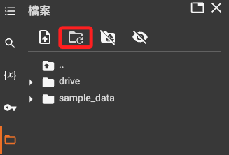

<br>

5. 刷新後便會出現 `.h5` 格式的模型檔案。
   
    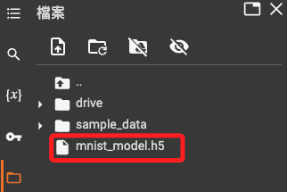

<br>

6. 接著要提供圖片給模型辨識，透過 Google 搜尋並下載。

    

<br>

7. 下載後將圖片拖曳到左側資料夾中。

    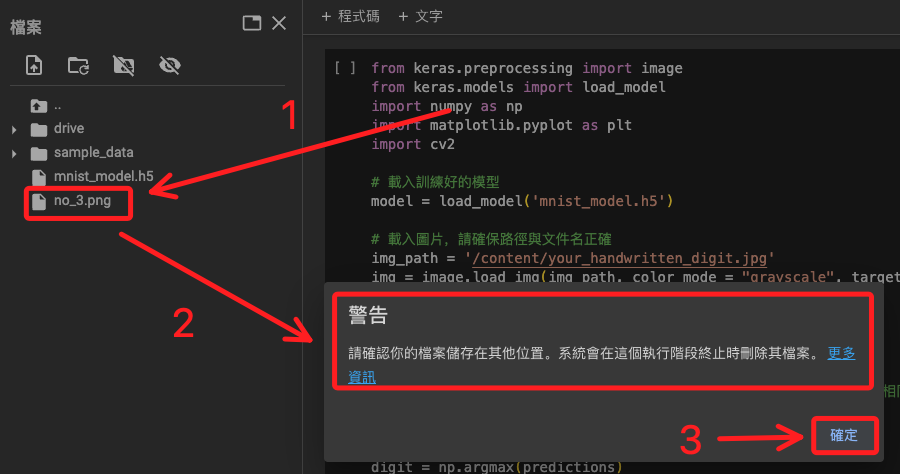

<br>

8. 貼上第二部分程式碼。

    _這裡已經修正好腳本錯誤及圖片與模型路徑，該程序請參考後續說明_

    ```python
    from keras.preprocessing import image
    from keras.models import load_model
    import numpy as np
    import matplotlib.pyplot as plt
    import cv2

    # 載入訓練好的模型
    model = load_model('/content/mnist_model.h5')

    # 載入圖片，請確保路徑與文件名正確
    img_path = '/content/no_3.png'
    img = image.load_img(img_path, color_mode = "grayscale", target_size=(28, 28))

    # 圖片預處理
    img_array = image.img_to_array(img)
    img_array = np.expand_dims(img_array, axis=0)
    img_array = 1 - img_array/255.0  # 轉換為白底黑字
    img_array = img_array.reshape((1, 28 ,28, 1))  # 轉換為與 MNIST 相同的格式

    # 預測
    predictions = model.predict(img_array)
    digit = np.argmax(predictions)

    # 顯示結果
    print("Predicted digit:", digit)

    # 顯示原始黑底白字圖片
    plt.imshow(1 - img_array.reshape(28, 28), cmap='gray')
    plt.title('Original Black Background Image')
    plt.show()

    # 顯示轉換後的白底黑字圖片
    plt.imshow(img_array.reshape(28, 28), cmap='gray')
    plt.title('Converted White Background Image')
    plt.show()
    ```

<br>

9.  在圖片上點擊右側三個小點展開。

    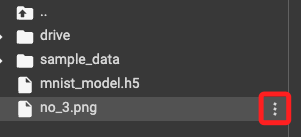

<br>

10. 複製圖片檔案在雲端的路徑。

    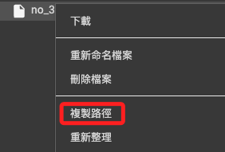

<br>

11. 替換程式碼中路徑的設置。

    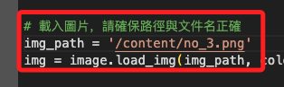

<br>

12. 切記，模型的路徑也要重複一次這個步驟來更改。

    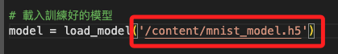

<br>

13. 運行第二區塊程式碼。

    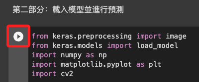

<br>

14. 在第二部分也出現了低級錯誤

    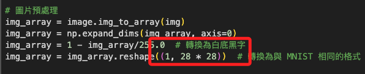

<br>

15. 進行必要修改，確保圖片在預測時具有正確的四維形狀（樣本數，高度，寬度，顏色通道數）

    

<br>

16. 進行預測的結果是 `5`，不過這不代表腳本錯誤，可能原因很多，包含模型訓練量與模型配置等等。

    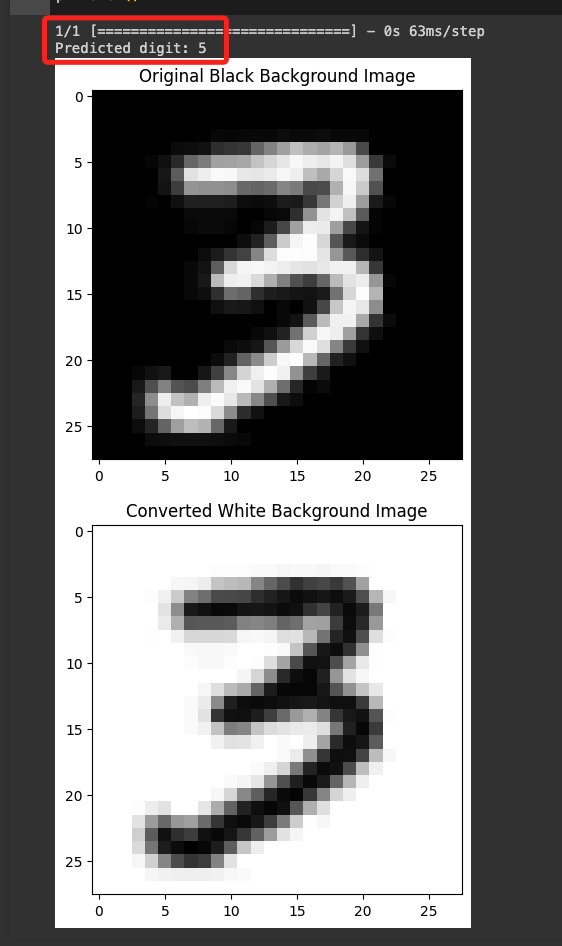

<br>

17. 嘗試調整 `epochs`，在原本的模型架構提高 `epochs` 到 `20` 試試看。

    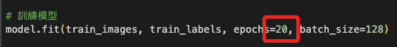

<br>

18. 雖然損失（loss）與準確率（accuracy）表現很好，但結果似乎沒變化，依舊判讀為 `5`。

    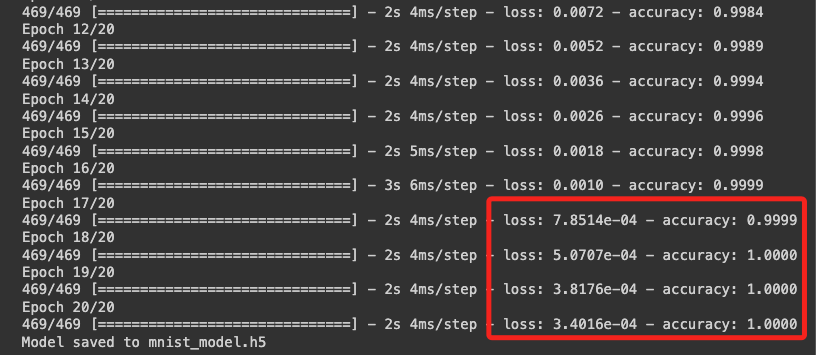


<br>

## 改用 CNN 模型

_不是好壞對比，只是兩種不同模式架構，各有使用優勢。_

_人腦是戰勝不了電腦的，但有了電腦的輔助，人可以輕鬆一點。_

<br>

1. 程式碼

    ```python
    # 導入所需函式庫
    import tensorflow as tf
    from tensorflow.keras.datasets import mnist
    from tensorflow.keras.models import Sequential
    from tensorflow.keras.layers import Dense, Dropout, Flatten
    from tensorflow.keras.layers import Conv2D, MaxPooling2D
    from tensorflow.keras.models import load_model
    from PIL import Image
    import numpy as np

    # 設定參數
    num_classes = 10
    img_rows, img_cols = 28, 28

    # 讀取 MNIST 手寫數字資料集
    (x_train, y_train), (x_test, y_test) = mnist.load_data()

    x_train = x_train.reshape(x_train.shape[0], img_rows, img_cols, 1)
    x_test = x_test.reshape(x_test.shape[0], img_rows, img_cols, 1)
    input_shape = (img_rows, img_cols, 1)

    x_train = x_train.astype('float32')
    x_test = x_test.astype('float32')
    x_train /= 255
    x_test /= 255

    # 將目標變數進行 one-hot 編碼
    y_train = tf.keras.utils.to_categorical(y_train, num_classes)
    y_test = tf.keras.utils.to_categorical(y_test, num_classes)

    # 建立模型
    model = Sequential()
    model.add(Conv2D(32, kernel_size=(3, 3), activation='relu', input_shape=input_shape))
    model.add(Conv2D(64, (3, 3), activation='relu'))
    model.add(MaxPooling2D(pool_size=(2, 2)))
    model.add(Dropout(0.25))
    model.add(Flatten())
    model.add(Dense(128, activation='relu'))
    model.add(Dropout(0.5))
    model.add(Dense(num_classes, activation='softmax'))

    # 編譯模型
    model.compile(loss=tf.keras.losses.categorical_crossentropy, optimizer=tf.keras.optimizers.Adadelta(), metrics=['accuracy'])

    # 訓練模型
    model.fit(x_train, y_train, batch_size=128, epochs=10, validation_data=(x_test, y_test))

    # 儲存模型
    model.save('mnist_model.h5')
    ```
    _第二部分_
    ```python
    # 導入需要的函式庫
    import matplotlib.pyplot as plt
    from PIL import Image

    # 讀取一張手寫數字圖片
    img_path = '/content/no_3.png'
    img = Image.open(img_path).convert('L')

    # 顯示圖片
    plt.imshow(img, cmap='gray')
    plt.show()

    # 將圖片轉換成模型可以接受的格式
    img = img.resize((28,28))
    img = np.array(img).reshape(1, 28, 28, 1).astype('float32') / 255

    # 讓模型進行推論
    prediction = model.predict(img)

    # 顯示預測結果
    print('The model predicted this digit as: ', np.argmax(prediction))
    ```

<br>

2. 結果判讀為 `3` 。

    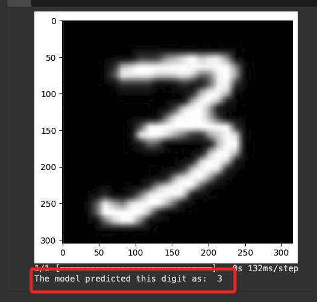

<br>

## 兩個模型的主要差異

_架構和資料預處理的細節_

1. 模型架構
    
    - 第一個模型是一個簡單的全連接網路（Fully Connected Network），也稱為多層感知機（Multilayer Perceptron, MLP），包含兩個密集層（`Dense`層），第一個有512個節點，激活函數使用 `ReLU`；第二個是輸出層，有10個節點，激活函數使用 `softmax`，用於多分類。
    
    - 第二個模型是一個比較複雜的捲積神經網路（Convolutional Neural Network, CNN），包含卷積層（`Conv2D`）、最大池化層（`MaxPooling2D`），還有兩次丟棄層（`Dropout`）用來減少過擬合。CNN 模型通常在影像辨識任務中比 MLP 表現得更好，因為它可以捕捉影像的空間層次結構。

<br>

2. 優化器

    - 第一個模型使用的是`rmsprop`優化器。
    - 第二個模型使用的是`Adadelta`優化器。 不同的最佳化器可能會對模型的收斂速度和最終效能產生影響。

<br>

3. 輸入形狀
    - 第一個模型在建立模型前就將資料展平（`Flatten`），因此其`input_shape`是根據已展平的輸入設定的。
    - 第二個模型使用的是三維資料作為輸入（即保持影像的寬度、高度和色彩通道），這是CNN處理影像資料的標準方式。

<br>

4. 丟棄層（Dropout）
    - 第一個模型沒有使用丟棄層。
    - 第二個模型在卷積層之後和全連接層之前分別使用了丟棄層，以幫助防止過度擬合。

<br>

5. 訓練週期（Epochs）
    - 第一個模型修正前訓練了5個週期，修正後是20個週期。
    - 第二個模型訓練了10個週期。

<br>

## 結論

由於這些差異，特別是因為 CNN 的加入，第二個模型很可能在辨識手寫數字這項任務上具有更高的精確度，因為 CNN 能夠透過捲積層捕捉到影像中的局部特徵，並透過池化層來減少計算量和過擬合的風險，而全連接網路則沒有這些特性。另外，丟棄層的使用有助於提升模型泛化能力，所以儘管第一個模型已經達到了非常高的準確率，但在影像辨識任務中，第二個模型通常會提供更優的結果。

儘管如此，全連接模型依舊有其優點，比如說易於理解、計算量低、資料需求度低等，尤其對於非影像如聲音、文字或時間序列的資料來說，MLP 可能更合適。


<br>

---

_END_