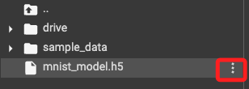
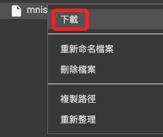
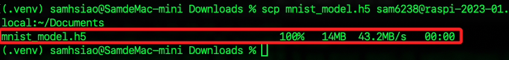
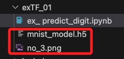
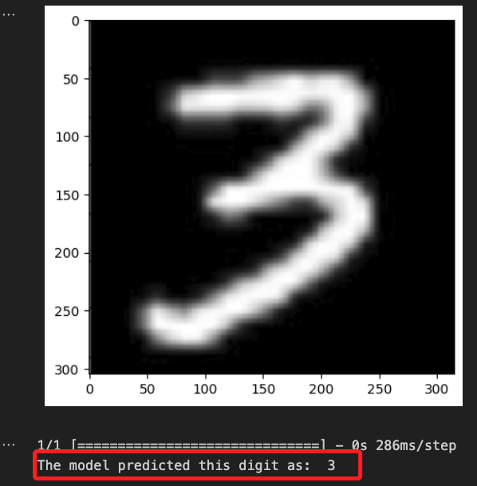

# 在樹莓派運行

_樹莓派的系統與算力可相容並運行 TF 模型_

<br>

## 說明

1. 點擊

    

<br>

2. 下載模型

    

<br>

3. 透過 SSH 將檔案複製到樹莓派
   
    ```bash
    scp mnist_model.h5 sam6238@raspi-2023-01.local:~/Documents
    ```

    

<br>

4. 建立虛擬環境

    ```bash
    python -m venv envTF
    ```

<br>

5. 進入虛擬環境資料夾

    ```bsh
    cd envTF
    ```


<br>

6. 建立並進入專案資料夾

    ```bash
    mkdir exTF_01 && cd exTF_01
    ``` 


<br>

7. 啟動

    ```bash
    source ../bin/activate
    ```

<br>

8. 更新

    ```bash
    sudo apt-get update
    pip install --upgrade pip
    ```

<br>

9. 安裝

    ```bash
    pip install tensorflow matplotlib pillow numpy
    ```

<br>

10. 將模型與圖片拖曳到專案目錄下

    

<br>

11. 建立專案，`.py` 或是 `.ipynb` 皆可，這裡範例檔案命名為 `ex_ predict_digit.ipynb`。

    ```bash
    touch ex_ predict_digit.ipynb
    ```

<br>

12. 程式碼

    ```python
    # 導入需要的函式庫
    import numpy as np
    from tensorflow.keras.models import load_model
    import matplotlib.pyplot as plt
    from PIL import Image

    # 載入訓練好的模型
    model = load_model('mnist_model.h5')

    # 讀取一張手寫數字圖片
    img_path = 'no_3.png'
    # 轉換為灰階模式
    img = Image.open(img_path).convert('L')

    # 顯示圖片
    plt.imshow(img, cmap='gray')
    plt.show()

    # 將圖片轉換成模型可以接受的格式
    img = img.resize((28,28))
    img = np.array(img).reshape(1, 28, 28, 1).astype('float32') / 255

    # 讓模型進行推論
    prediction = model.predict(img)

    # 顯示預測結果
    print('The model predicted this digit as: ', np.argmax(prediction))
    ```

<br>

14. 輸出結果

    


<br>

---

_END_
