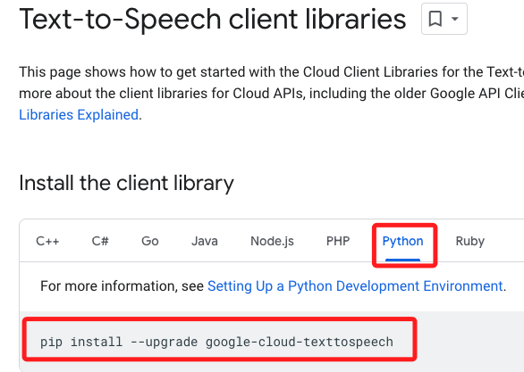
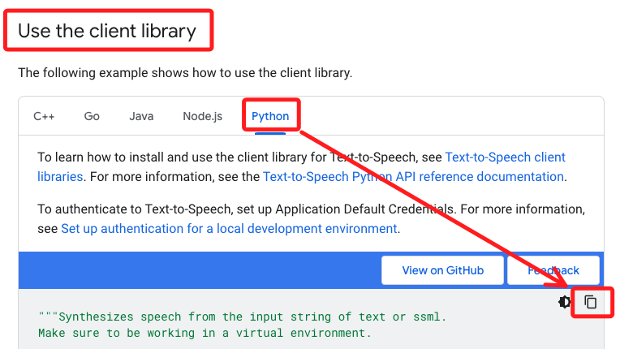

# 文字轉語音

_可直接在 Jupyter NB 中執行，假如樹莓派沒接喇叭，可以在電腦透過 VSCode 點擊音頻檔案播放_

_使用 google cloud 的語音轉換套件 texttospeech_

<br>

## 會使用到的硬體

- _任何音頻輸出工具皆可：喇叭或耳機。_

<br>

## 套件安裝與環境設置

1. 進入 `~/Documents` 建立虛擬環境，此範例命名為 `envVoiceAssistant` 。

    ```bash
    python -m venv envVoiceAssistant
    ```

<br>

2. 啟動虛擬環境，今天應該都會用這個虛擬環境，可考慮寫入 `~/.bashrc` 。

    ```bash
    source ~/Documents/envVoiceAssistant/bin/activate
    ```

<br>

1. 將 `Google Cloud SDK` 的 APT 來源添加到樹莓派的軟件來源列表。

    ```bash
    echo "deb [signed-by=/usr/share/keyrings/cloud.google.gpg] http://packages.cloud.google.com/apt cloud-sdk main" | sudo tee -a /etc/apt/sources.list.d/google-cloud-sdk.list
    ```
   

<br>

4. 將 Google Cloud 的 GPG 公鑰添加到系統的安全鑰匙環中，安裝時便可通過驗證。

    ```bash
    curl https://packages.cloud.google.com/apt/doc/apt-key.gpg | sudo apt-key --keyring /usr/share/keyrings/cloud.google.gpg add -
    ```

<br>

   
5. 更新列表

    ```bash
    sudo apt-get update
    ```

<br>

6. 在系統中安裝 SDK 工具。

    ```bash
    sudo apt-get install google-cloud-sdk
    ```

<br>

7. 安裝 Python 套件。

    ```bash
    pip install google-cloud-texttospeech
    ```

<br>

8. 使用 SDK 需登入 Google 帳號，這部分要在樹莓派上進行。 

    ```bash
    gcloud auth application-default login
    ```

<br>

9. 進入樹莓派開啟瀏覽器。

    


<br>

10. 完成時要複製這段貼到終端機。

    

<br>

11. 這時候會出現一段警告，所以要進行下一步。

    

<br>

12. 接下來要進行 `專案授權`，選定一個 Firebase 專案，並使用專案 的 ID 綁定在樹莓派上。
    
    _這裡我使用的專案 ID 是 `myvoiceasststant`_。
   
    ```bash
    gcloud auth application-default set-quota-project myvoiceasststant
    ```
   
    

<br>

1.   完成時會顯示儲存路徑，可以參考一下。

    


<br>

## 撰寫專案

_範例檔案如下_

1. 在 VSCode 中編輯腳本，使用 .ipynb 或是 .py 皆可。

<br>

2. 參考官方 [文檔](https://cloud.google.com/text-to-speech/docs)，選取 `Text-to-Speech Client Libraries` 。

    

<br>

3. 選取編程的語言，就會有詳細的指引與範例。

    

<br>
    
4. 複製這段程式碼來試試看。

    

<br>

5. 官網範例

    ```python
    from google.cloud import texttospeech

    # Instantiates a client
    client = texttospeech.TextToSpeechClient()

    # Set the text input to be synthesized
    synthesis_input = texttospeech.SynthesisInput(text="Hello, World!")

    # Build the voice request, select the language code ("en-US") and the ssml
    # voice gender ("neutral")
    voice = texttospeech.VoiceSelectionParams(
        language_code="en-US", ssml_gender=texttospeech.SsmlVoiceGender.NEUTRAL
    )

    # Select the type of audio file you want returned
    audio_config = texttospeech.AudioConfig(
        audio_encoding=texttospeech.AudioEncoding.MP3
    )

    # Perform the text-to-speech request on the text input with the selected
    # voice parameters and audio file type
    response = client.synthesize_speech(
        input=synthesis_input, voice=voice, audio_config=audio_config
    )

    # The response's audio_content is binary.
    with open("output.mp3", "wb") as out:
        # Write the response to the output file.
        out.write(response.audio_content)
        print('Audio content written to file "output.mp3"')
    ```

<br>

6. 改寫並封裝程式碼

    ```python
    # 會使用 os 模組透過 system 函數來執行系統指令
    import os
    # 使用 google cloud 的 texttospeech 進行轉換
    from google.cloud import texttospeech

    # 初始化 Google Text-to-Speech client
    tts_client = texttospeech.TextToSpeechClient()

    # 自訂一個轉換函數
    def text_to_speech(text):
        # 
        synthesis_input = texttospeech.SynthesisInput(text=text)

        # 設置語音參數
        voice_params = texttospeech.VoiceSelectionParams(
            language_code='cmn-Hant-TW', # 設定語言
            name='cmn-TW-Wavenet-C',    # 男生
            ssml_gender=texttospeech.SsmlVoiceGender.NEUTRAL)

        # 設置音頻輸出格式
        audio_config = texttospeech.AudioConfig(
            # LINEAR16 是 PCM 格式，適用於樹莓派
            audio_encoding=texttospeech.AudioEncoding.LINEAR16)  

        # 生成語音
        response = tts_client.synthesize_speech(
            input=synthesis_input, 
            voice=voice_params, 
            audio_config=audio_config)

        # 將回復的音頻內容寫入文件
        with open('output.wav', 'wb') as audio_file:
            audio_file.write(response.audio_content)
            print('音頻內容已寫入檔案 "output.wav"')
        # 這個函數會傳出一個檔案
        return 'output.wav'

    def play_audio(file_name):
        # 播放音頻文件
        os.system(f"aplay {file_name}")

    def main():
        # 捕捉過程中可能拋出的錯誤，讓程序可以更優雅
        try:
            # 無窮迴圈
            while True:
                # 使用者輸入
                text = input("請輸入要轉換為語音的文字內容，然後按下Enter：")
                # 去除頭尾空白
                if text.strip() == "":
                    print("請注意，您沒有輸入任何文字。")
                    # 使用 continue 進入下一輪迴圈
                    continue
                
                # 假如有內容就會執行到這裡進行文字轉語音
                print("正在轉換文本到語音...")
                audio_file = text_to_speech(text)
                # 轉換完成進行播放
                print("正在播放語音...")
                play_audio(audio_file)
                # 播放後，使用者可以決定要繼續還是退出
                user_input = input("輸入 'exit' 退出，或按 Enter 繼續：").lower()
                if user_input == 'exit':
                    print("退出程序")
                    break
        except KeyboardInterrupt:
            print("用戶已經中斷程序")
        except Exception as e:
            print(f"程序發生錯誤：{e}")

    if __name__ == "__main__":
        main()
    ```

<br>

## 運行說明

1. 執行腳本，在上方互動對話框輸入文字。

    

2. 輸出框會顯示正在進行的作業，此時會以語音說出所輸入的文字。

    

3. 會添加這個檔案，再次執行會覆蓋。

    

<br>

## 程式碼解析

<br>

1. TextToSpeechClient()

    _Google Cloud Text-to-Speech API 的一部分，它用於將要轉換為語音的文本封裝成一個對象。_

    ```python
    from google.cloud import texttospeech

    # 初始化 Text-to-Speech 客戶端
    tts_client = texttospeech.TextToSpeechClient()

    # 定義要轉換的文本
    text = "你好、我好、大家好！"

    # 創建 SynthesisInput 實例
    synthesis_input = texttospeech.SynthesisInput(text=text)

    # 調用 Text-to-Speech 服務進行語音合成
    response = tts_client.synthesize_speech(
        input=synthesis_input, 
        # 其他參數，如語音選擇和音頻配置
    )
    ```

_實作中說明。_
   
<br>

---

_END_