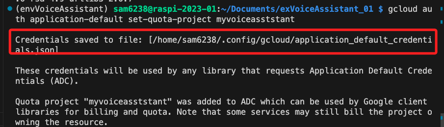

# 文字轉語音

_可直接在 JNB 中執行，假如樹莓派沒接喇叭，可以在電腦透過 VSCode 點擊音頻檔案播放_

<br>

## 會使用到的硬體

- _喇叭_

<br>

## 套件安裝與環境設置

1. 進入 `~/Documents` 建立虛擬環境，此範例命名為 `envVoiceAssistant` 。

    ```bash
    python -m venv envVoiceAssistant
    ```

<br>

2. 啟動虛擬環境，今天應該都會用這個虛擬環境，可考慮寫入 `~/.bashrc` 。

    ```bash
    source ~/Documents/envVoiceAssistant/bin/activate
    ```

<br>

3. 安裝 `Google Cloud SDK` 密鑰和軟件源。

    ```bash
    echo "deb [signed-by=/usr/share/keyrings/cloud.google.gpg] http://packages.cloud.google.com/apt cloud-sdk main" | sudo tee -a /etc/apt/sources.list.d/google-cloud-sdk.list
    ```
   

<br>

4. 導入公鑰

    ```bash
    curl https://packages.cloud.google.com/apt/doc/apt-key.gpg | sudo apt-key --keyring /usr/share/keyrings/cloud.google.gpg add -
    ```

<br>

   
5. 更新列表

    ```bash
    sudo apt-get update
    ```

<br>

6. 安裝

    ```bash
    sudo apt-get install google-cloud-sdk
    ```

<br>

7. 安裝套件。

    ```bash
    pip install google-cloud-texttospeech
    ```

<br>

8. 先登入 

    ```bash
    gcloud auth application-default login
    ```

<br>

9. 需進入樹莓派開啟瀏覽器 

    


<br>

10. 完成時要複製這段貼到終端機

    

<br>

11. 這時候會出現一段警告，所以要進行下一步。

    

<br>

12. 以 Firebase 專案 的 ID 在樹莓派上進行專案的授權，_所以要選定一個專案，`myvoiceasststant` 是我的專案 ID_。
   
    ```bash
    gcloud auth application-default set-quota-project myvoiceasststant
    ```
   
    

<br>

13. 完成時會顯示儲存路徑，可以參考一下。

    

<br>

14. 特別說明，在安裝 Google Cloud SDK 時，安裝腳本會自動添加環境參數到 .bashrc 文件中，若有更改相關專案路徑時，可手動重新設置或重新安裝 SDK。

    _以我個人的 .bashrc 為例_

    ```bash
    # The next line updates PATH for the Google Cloud SDK.
    if [ -f '/home/sam6238/Documents/projects/語音助理/google-cloud-sdk/path.bash.inc' ]; then . '/home/sam6238/Documents/projects/語音助理/google-cloud-sdk/path.bash.inc'; fi

    # The next line enables shell command completion for gcloud.
    if [ -f '/home/sam6238/Documents/projects/語音助理/google-cloud-sdk/completion.bash.inc' ]; then . '/home/sam6238/Documents/projects/語音助理/google-cloud-sdk/completion.bash.inc'; fi
    ```

<br>

## 範例檔案

1. 程式碼

    ```python
    import os
    # 使用 google cloud 的 texttospeech 進行轉換
    from google.cloud import texttospeech

    # 初始化 Google Text-to-Speech client
    tts_client = texttospeech.TextToSpeechClient()

    # 自訂一個轉換函數
    def text_to_speech(text):
        # 
        synthesis_input = texttospeech.SynthesisInput(text=text)

        # 設置語音參數
        voice_params = texttospeech.VoiceSelectionParams(
            language_code='cmn-Hant-TW', # 設定語言
            name='cmn-TW-Wavenet-C',    # 男生
            ssml_gender=texttospeech.SsmlVoiceGender.NEUTRAL)

        # 設置音頻輸出格式
        audio_config = texttospeech.AudioConfig(
            # LINEAR16 是 PCM 格式，適用於樹莓派
            audio_encoding=texttospeech.AudioEncoding.LINEAR16)  

        # 生成語音
        response = tts_client.synthesize_speech(
            input=synthesis_input, 
            voice=voice_params, 
            audio_config=audio_config)

        # 將回復的音頻內容寫入文件
        with open('output.wav', 'wb') as audio_file:
            audio_file.write(response.audio_content)
            print('音頻內容已寫入檔案 "output.wav"')
        # 這個函數會傳出一個檔案
        return 'output.wav'

    def play_audio(file_name):
        # 播放音頻文件
        os.system(f"aplay {file_name}")

    def main():
        try:
            while True:
                text = input("請輸入要轉換為語音的文字內容，然後按下Enter：")
                if text.strip() == "":
                    print("請注意，您沒有輸入任何文字。")
                    continue
                
                print("正在轉換文本到語音...")
                audio_file = text_to_speech(text)
                print("正在播放語音...")
                play_audio(audio_file)
                
                user_input = input("輸入 'exit' 退出，或按 Enter 繼續：").lower()
                if user_input == 'exit':
                    break
        except KeyboardInterrupt:
            print("用戶已經中斷程序")
        except Exception as e:
            print(f"程序發生錯誤：{e}")

    if __name__ == "__main__":
        main()
    ```

<br>

## 運行說明

1. 執行腳本，在上方互動對話框輸入文字。

    

2. 輸出框會顯示正在進行的作業，此時會以語音說出所輸入的文字。

    

3. 會添加這個檔案，再次執行會覆蓋。

    

<br>

## 程式碼解析

<br>

1. TextToSpeechClient()

    _Google Cloud Text-to-Speech API 的一部分，它用於將要轉換為語音的文本封裝成一個對象。_

    ```python
    from google.cloud import texttospeech

    # 初始化 Text-to-Speech 客戶端
    tts_client = texttospeech.TextToSpeechClient()

    # 定義要轉換的文本
    text = "你好、我好、大家好！"

    # 創建 SynthesisInput 實例
    synthesis_input = texttospeech.SynthesisInput(text=text)

    # 調用 Text-to-Speech 服務進行語音合成
    response = tts_client.synthesize_speech(
        input=synthesis_input, 
        # 其他參數，如語音選擇和音頻配置
    )
    ```

<br>

---

_END_