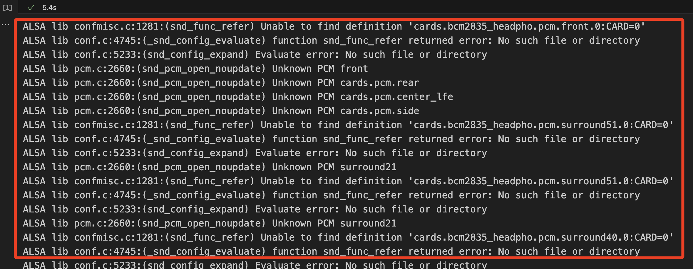

# 模擬實時監聽

_這個範例模擬了實時監聽的語音助理，在邏輯上先將語音經過判別轉為文字，再將文字透過轉換成為音頻進行播放。_

<br>

## 環境設置與說明

1. 更新、安裝套件與工具

   ```bash
   sudo apt-get update
   sudo apt-get install portaudio19-dev
   sudo apt-get install mpg321
   pip install pyaudio gtts
   ```


<br>

### 工具說明

1. portaudio19-dev：這是一個跨平台的音頻I/O庫，用於訪問麥克風和揚聲器等音頻硬件。

<br>

2. mpg321：一個簡易操作音頻播放器，專門用於播放 MPEG 音頻。

<br>

### 套件說明

1. pyaudio：這是 Python 的一個音頻I/O庫，它是 PortAudio 的一個包裝器，用於錄製和播放音頻，另外在這個範例中，wave 模組式用於將從 PyAudio 獲取的原始音頻數據（PCM數據）寫入一個標準的 WAV 文件，可以確保音頻文件的兼容性和高品質。
   
    ```python
    import pyaudio
    import wave

    # 設置音頻參數：格式、通道數、採樣率、每次讀取的數據量、錄音時間、輸出文件名
    FORMAT = pyaudio.paInt16  # 錄音格式（16位PCM）
    CHANNELS = 1  # 通道數（單聲道）
    RATE = 44100  # 採樣率（每秒44100個樣本）
    CHUNK = 1024  # 每次讀取的數據量
    RECORD_SECONDS = 5  # 錄音時長（秒）
    OUTPUT_FILENAME = "recorded_file.wav"  # 輸出的音頻文件名

    # 創建 PyAudio 對象
    audio = pyaudio.PyAudio()

    # 開啟音頻流以進行錄音
    stream = audio.open(format=FORMAT, channels=CHANNELS,
                        rate=RATE, input=True,
                        frames_per_buffer=CHUNK)

    print("錄音中...")

    frames = []  # 用於存儲音頻數據片段

    # 循環讀取音頻數據，直到達到指定的錄音時長
    for i in range(0, int(RATE / CHUNK * RECORD_SECONDS)):
        data = stream.read(CHUNK)
        frames.append(data)

    print("錄音結束")

    # 關閉音頻流並釋放資源
    stream.stop_stream()
    stream.close()
    audio.terminate()

    # 使用 wave 模組保存錄音數據到 WAV 文件
    wf = wave.open(OUTPUT_FILENAME, 'wb')
    wf.setnchannels(CHANNELS)
    wf.setsampwidth(audio.get_sample_size(FORMAT))
    wf.setframerate(RATE)
    wf.writeframes(b''.join(frames))
    wf.close()
    ```

<br>

2. speech_recognition：一個支持多種引擎與 API 的語音識別庫。

   ```python
   # 引入庫
   import speech_recognition as sr

   # 創建一個識別實體
   r = sr.Recognizer()

   # 從音頻文件中或許音頻數據
   with sr.AudioFile('recorded_file.wav') as source:
       audio_data = r.record(source)

   # 使用 Google Web Speech API 進行語音的識別
   # 這個函數會拋出錯誤，所以使用 try-except 進行例外處理
   try:
       # 務必確認指定了正確的語音
       text = r.recognize_google(audio_data, language='cmn-Hans-CN')
       print(f"音頻內容為：{text}")
   except sr.UnknownValueError as e:
       print(f"發生錯誤，無法理解音頻內容：{e}")
   except sr.RequestError as e:
       print(f"無法從 API 完成請求：{e}")
   ```

<br>

3. gtts：Google Text-to-Speech 的縮寫，是一個將文本轉換為語音的 Python 庫，使用了 Google 自然語言的 API，處理後讓音頻更貼近自然語言。

   ```python
   # 引入庫
   from gtts import gTTS

   # 要轉換為語音的文本
   text = "你好，歡迎使用語音辨識系統。"

   # 選擇語言，中文是 zh-TW，英文是 en。
   language = 'zh-TW'

   # 建立一個 gTTS 實體
   speech = gTTS(text=text, lang=language, slow=False)

   # 將轉換結果保存到音頻檔案
   speech.save("hello.mp3")
   ```

<br>

## 語音助理範例

1. 程式碼基本架構

   ```python
   import speech_recognition as sr
   from gtts import gTTS
   import os, sys
   # 初次啟動時的等待
   # import time

   # 在代碼開始就將標準錯誤重導向到/dev/null
   # 注意這並未真實解決問題，之後還是要打開訊息來逐一排除
   # 當前先確保程序可以運行並不受干擾即可
   f = open(os.devnull, 'w')
   sys.stderr = f

   # 初始化 Google 的語音識別器
   recognizer = sr.Recognizer()

   # 第一次啟動可依需要稍作停頓
   # time.sleep(1) 
   # 或是添加歡迎語音
   # ...

   while True:
       # 設定麥克風
       with sr.Microphone() as source:
           print("請說些話！")
           audio = recognizer.listen(source)

       # 使用 Google 的語音識別，將音頻轉換為文字，並指定語言為繁體中文
       try:
           print("Google 語音識別你說了：")
           text = recognizer.recognize_google(audio, language='zh-TW')
           # 將結果列印出來
           print(text)

           # 已經可以捕捉到文本 text，所以可以添加判斷邏輯
           # ...
           # 添加 "結束" 的判斷
           if text == "結束":
              break
           # ...
           # 添加詢問 "天氣" 的判斷
           # ...

           # 再使用 gTTs 將識別到的文字轉換為繁體語音讀出來
           speech = gTTS(text=text, lang='zh-TW', slow=False)
           speech.save("text.mp3")
           os.system("mpg321 text.mp3")

       # 捕捉例外
       except sr.UnknownValueError:
           print("Google 語音識別無法理解音頻")
       except sr.RequestError as e:
           print("無法從Google 語音識別服務請求結果; {0}".format(e))

   # 程式結束
   # ...
   ```

<br>

2. 可透過以下拓展的說明，對程式碼基本架構做更多功能優化。

<br>

3. 若出現 ALSA 配置文件的問題，可進行設定文件的編輯。

    

<br>

## 功能拓展說明

_藉此了解條件判斷語句的應用_

<br>

1. 添加 `歡迎語音`：透過以上的腳本錄製語音並更名為 `start.mp3` 作為歡迎語音。

   ```python
   os.system("mpg321 start.mp3")
   ```

<br>

2. 添加結束條件判斷並播放結束語音：透過以上腳本錄製結束的音頻，更名為 `end.mp3` 。

   ```python
   # 如果語音輸入是 "結束" 則終止程序
   # if text == "結束"
   # 也可以使用更抽象的語意，只要在與劇中出現 "結束" 二字即可 
   if "結束" in text:
       print("結束語音助手...")
       os.system("mpg321 end.mp3")
       break
   ```

<br>

3. 加入文本比對邏輯，添加更多互動性，比如說提到 `天氣如何` 。

   ```python
   # 問到 "天氣如何" 的時候
   # 使用抽象的語句來判斷
   if "天氣如何" in text:
       # 模擬假設的自訂回答
       weather_response = "今天是晴天，温度28度。"
       speech = gTTS(text=weather_response, lang='zh-TW', slow=False)
       speech.save("weather.mp3")
       os.system("mpg321 weather.mp3")
   ```

<br>

4. 可使用多個 `if` 做 `連續條件語句判斷` ，或使用 `if...elif` 做 `擇一條件語句判斷` 。

   ```python
   # 問到 "天氣如何" 的時候
   # 使用抽象的語句來判斷
   if "天氣如何" in text:
       # 模擬假設的自訂回答
       weather_response = "今天是晴天，温度28度。"
       speech = gTTS(text=weather_response, lang='zh-TW', slow=False)
       speech.save("weather.mp3")
       os.system("mpg321 weather.mp3")
   ```

<br>

5. 可使用 `巢狀條件判斷`，在一個條件語句中嵌入另外的條件語句，當提到天氣時，可以判斷是否有城市或區域的資訊。

   ```python
   if "天氣如何" in text:
       # 進一步判斷是否有城市或區域的資訊
       if "台北" in text:
           weather_response = "台北今天的氣候還不錯"
       elif "高雄" in text:
           weather_response = "高雄今天非常炎熱"
       else:
           weather_response = "請問您想知道哪個城市的天氣呢？"
       # 透過 gTTS 轉換文字成為語音
       speech = gTTS(text=weather_response, lang='zh-TW', slow=False)
       # 將語音儲存為音頻檔案
       speech.save("weather_response.mp3")
       # 播放音頻檔案
       os.system("mpg321 weather_response.mp3")
   ```
6. 也可以使用 API 來強化語音助理功能，要實作 `get_weather` 函數。

   ```python
   if "天氣如何" in text:
       # 進一步判斷是否有城市或區域的資訊
       if "台北" in text:
           weather_response = get_weather("Taipei")
       elif "高雄" in text:
           weather_response = get_weather("Kaohsiung")
       else:
           weather_response = "請問您想要查詢哪個城市的天氣呢？"
           # 這裡要讓邏輯保持在迴圈中，如此得到城市資訊後才可以繼續輸出
           # ...

       speech = gTTS(text=weather_response, lang='zh-TW', slow=False)
       speech.save("weather_response.mp3")
       os.system("mpg321 weather_response.mp3")
   ```

   _實作 `get_weather`_

   ```python
   # 利用 OpenWeather API 根據城市名獲取天氣狀況
   # 注意：你需要將 'YOUR_API_KEY' 替換為你的 OpenWeather API 密鑰
   # 調用範例：get_weather('台北市', 'YOUR_API_KEY')，特別注意參數要包含「市」
   # 可透過映射機制來排除各種遺漏字或轉換
   import requests

   def get_weather(city, api_key):
       """參數說明
       city -- 城市名稱（字符串）
       api_key -- OpenWeather API 密鑰（字符串）
       返回:
       如果請求成功，返回一個字符串描述天氣狀況；否則返回錯誤信息。
       """
       base_url = "http://api.openweathermap.org/data/2.5/weather"

       # 構建請求的 URL
       url = f"{base_url}?q={city}&appid={api_key}&lang=zh_tw&units=metric"

       # 向 OpenWeather API 發送 GET 請求
       response = requests.get(url)

       # 檢查請求是否成功
       if response.status_code == 200:
           # 解析 JSON 數據
           weather_data = response.json()

           # 提取天氣信息
           condition = weather_data['weather'][0]['description']
           temperature = weather_data['main']['temp']

           return f"{city}目前的天氣狀況是：{condition}，溫度：{temperature}°C"
       else:
           return f"錯誤：無法從 OpenWeather API 獲取數據，狀態碼：{response.status_code}"
   ```

<br>

7. 使用 `and`、`or` 運算子實現 `組合條件判斷`：可在一個條件語句中結合多個條件。

   ```python
   # 假設要同時滿足在晚上提問且提到天氣的條件才回答
   # 要實作 is_night_time() 才能使用
   if "天氣" in text and is_night_time():
       weather_response = "現在是夜晚，請穿暖一點。"
       speech = gTTS(text=weather_response, lang='zh-TW', slow=False)
       speech.save("night_weather.mp3")
       os.system("mpg321 night_weather.mp3")
   ```

   _實作 `is_night_time()`_

   ```python
   import datetime

   # 判斷當前時間是否為晚上，這裡定義 "晚上" 為晚上6點到早上6點之間。
   def is_night_time():
       # 取得當前時間中的「小時」
       current_hour = datetime.datetime.now().hour
       # 判斷並返回布林值
       return current_hour >= 18 or current_hour < 6

   # 測試函數
   is_night_time()
   ```

<br>

## 可發展方向

1. 自訂義同義詞映射來管理同義詞。
2. 隨機回答：定義一個 `responses.json` 來管理隨機回答的語句。
3. 可使用 `結巴` 進行分詞。
4. 分詞後可管理排除或忽略語句，並將未管理語句自動添加進入 `responses.json`。
5. 自訂詞庫。
6. 串接更多的資訊 API。

<br>

---

_END_
