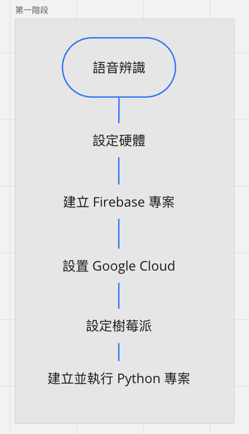
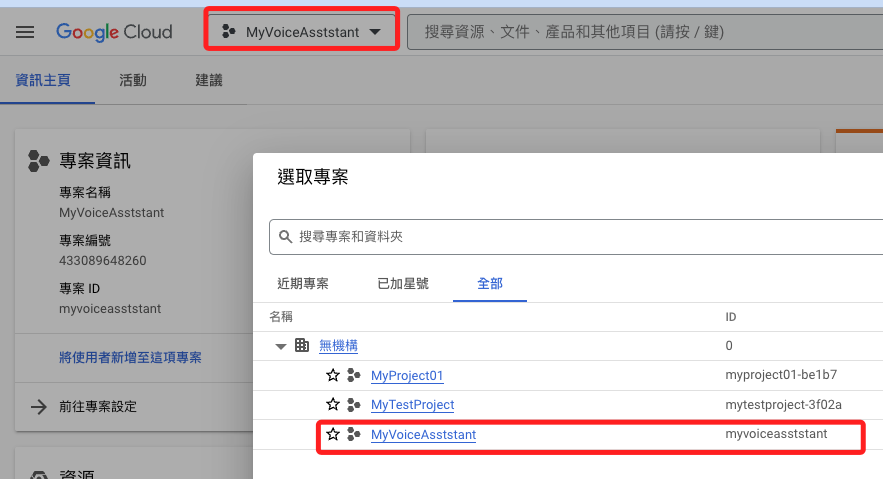
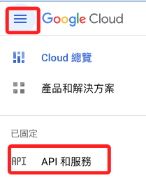
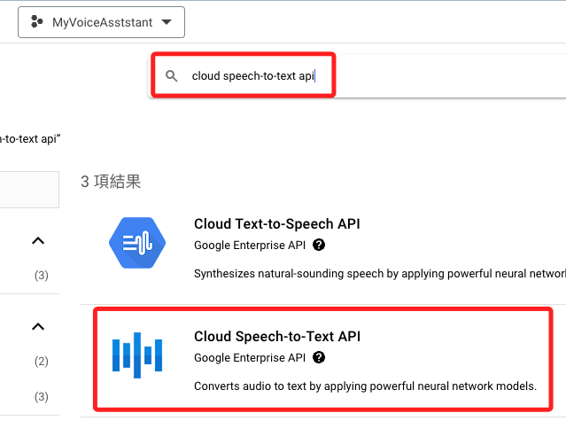
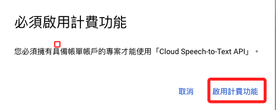
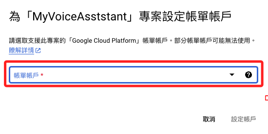
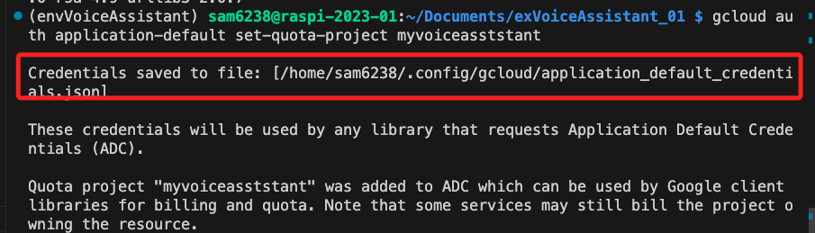

# 語音輸入辨識


_語音輸入透過辨識後轉為文字輸出_



<br>

## 設備

- 麥克風
- 喇叭

<br>

## 建立 Firebase 專案

_必須有專案才能在 Google Cloud 開啟相關功能，建立步驟參考之前課程講義。_

_已經有專案的話無需再添加新專案無妨。_

<br>

## 設置 Google Cloud

1. 進入 [主控台](https://cloud.google.com/?hl=zh-TW)

   

<br>

2. 選取專案

   

<br>

3. 記下 ID 之後授權時需要使用

   

<br>

4. 設定 API

   

<br>

5. 新增

   

<br>

6. 搜尋並添加語音轉文字 `speech-to-text`

   ```txt
   cloud speech-to-text api
   ```

   

<br>

7. 啟用

   

<br>

8. 要啟用計費功能

   

<br>

9. 選取帳號

   

<br>

10. 再次啟用即可

    

<br>

## 進行樹莓派設置

_一個專案授權一次即可，假如前面已經完成，可以跳過_

<br>

1. 以專案 ID 在樹莓派上進行授權

   ```bash
   gcloud auth application-default set-quota-project myvoiceasststant
   ```

<br>

2. 完成時會顯示儲存路徑

   

<br>


---

_END：以上完成 GC 設定_
