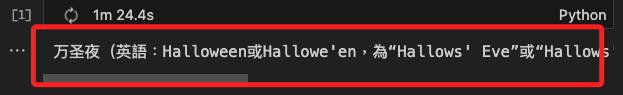

# 維基百科查詢

_以下分兩個範例，分別是文字輸出與語音輸出_

<br>

## 說明

_這個範例是以文字輸入進行查詢，然後透過語音輸出到樹莓派的 USB 喇叭，並介紹兩種播放軟件。_

<br>

## 套件與工具

1. `wikipedia`：維基百科的 Python API。

    _這不是唯一的一個 API，若要查詢文件請務必確認是否為相同 API_

    ```python
    pip install wikipedia
    ```
<br>

2. `gtts`：前面範例已有使用，這裡不再贅述。

    ```bash
    pip install gtts
    ```

<br>

3. `mplayer`：播放軟件一。

    ```bash
    sudo apt install mplayer
    ```
    _播放_
    ```bash
    mplayer <音頻檔案.mp3>
    ```

<br>

4. `mpg321`：播放軟件二。

    ```bash
    sudo apt install mpg321
    ```
    _播放，可加入參數_
    ```bash
    mpg321 --audiodevice hw:4,0 <音頻檔案.mp3>
    ```

<br>

## 範例一

_文字查詢與文字輸出_

<br>

1. 程式碼

    ```python
    # 使用套件 wikipedia
    import wikipedia
    # 在跳脫機制上使用 sys 的 exit() 
    import sys

    # 指定使用繁體中文 zh-tw
    wikipedia.set_lang("zh-tw")
    
    # 自訂一個用來保存查詢結果到文件的函數
    def save_text_to_file(text):
        # 在 open 中使用參數 "a"，表示假如文件已經存在，就在既有文件中進添加（append）
        with open("response.txt", "a", encoding="utf-8") as file:  
            # 每次寫入新的內容後，換行兩次區隔
            file.write(text + "\n\n")            

    # 取得用戶輸入並給予回覆
    def get_input_and_reply():
        # 從使用者取得文字輸入
        input_text = input("請輸入您想查詢的內容: ").strip()  
        
        # 前置判斷：如果使用者輸入 "exit"，則退出程式
        if input_text.lower() == "exit":
            print("再見，歡迎再次使用查詢系統。")
            # 使用 sys 的 exit()跳脫程序，僅使用 exit() 將無法正確退出。
            sys.exit()
        
        # 可以添加其他的前置判斷程序
        # ...
        
        # 因為 wikipedia 可以拋出例外，所以使用例外處理 try-except 語句
        try:
            # 使用維基百科 API 查詢
            response = wikipedia.summary(input_text, sentences=2)
            # 輸出到控制台
            print(response)           
            # 保存文件
            save_text_to_file(response)  
        # 例外處理
        except wikipedia.exceptions.DisambiguationError as e:
            error_msg = f"請具體描述您的查詢，因為有多個可能的結果: \n{e}"
            # 輸出錯誤訊息
            print(error_msg)
            # 調用自訂的函數，將錯誤訊息寫入
            save_text_to_file(error_msg)
            
        except wikipedia.exceptions.PageError:
            error_msg = "找不到相關條目!"
            print(error_msg)
            save_text_to_file(error_msg)
            
        except Exception as e:
            error_msg = f"發生錯誤: {e}"
            print(error_msg)
            save_text_to_file(error_msg)
            
    if __name__ == "__main__":
        # 無限迴圈
        while True:
            # 呼叫主函數
            get_input_and_reply()
    ```

<br>

2. 嘗試運行，查詢 `萬聖節的由來`

    

<br>

3. 打印結果

    

<br>

4. 也會輸出到檔案 `response.txt`

    

<br>

## 範例二

_添加語音輸出_


<br>

1. 程式碼

    ```python
    # API
    import wikipedia
    # 文字轉語音
    from gtts import gTTS
    # 用來取得路徑以執行播放軟件
    import sys, os

    # 設定維基百科的語言為繁體中文
    wikipedia.set_lang("zh-tw")

    # 自訂函數：將回應的內容保存到文件檔案中
    def save_text_to_file(text):
        # 使用 "a" 模式會在檔案的結尾追加內容
        with open("response.txt", "a") as file: 
            # 每次寫入的內容之間有兩個換行符
            file.write(text + "\n\n")           

    # 自訂函數：將文字透過 gTTS 轉為語音，然後保存並且播放。
    def speak_and_save(b):
        # 調用的時候會以字串形式傳入維基百科查詢的結果
        # 將結果先打印到控制台查看
        print(f"Assistant: {b}")            
        # 調用自訂函數，將結果保存到檔案中
        save_text_to_file(b)                
        
        # 轉換文字為語音
        """可使用編碼
        'zh-tw' 繁體中文
        'zh-cn' 簡體中文
        'en' 英文
        """
        # 建立一個轉換語音的實體
        tts = gTTS(text=b, lang='zh-tw')    
        # 指定音訊檔案名稱
        filename = "audio_response.mp3"     
        # 透過實體調用 save 函數，將語音儲存到指定的檔案名稱中
        tts.save(filename)                  
        # 使用 mpg321 播放這個語音檔案
        os.system(f"mpg321 {filename}")     

            
    # 主函數：取得用戶輸入的查詢關鍵字，並給予調用以上自訂函數完成回覆
    def get_input_and_reply():
        # 從使用者取得文字輸入
        input_text = input("請輸入您想查詢的內容：") 
        
        # 如果用戶輸入"exit"，則退出程式
        if input_text.lower() == "exit":
            print("您已選擇退程序，期待下次再相見。")
            # 僅使用 exit() 將無法正確退出
            sys.exit()
        
        # 正式進入查詢，因為 wikipedia.summary() 可以拋出例外，所以使用例外處理
        try:
            # 使用維基百科 API 查詢
            response = wikipedia.summary(input_text, sentences=2)
            # 使用語音回應並保存到檔案
            speak_and_save(response)     
            
        except wikipedia.exceptions.DisambiguationError as e:
            error_msg = f"請具體描述您的查詢，因為有多個可能的結果: \n{e}"
            print(error_msg)
            speak_and_save(error_msg)
            
        except wikipedia.exceptions.PageError:
            error_msg = "找不到相關的條目!"
            print(error_msg)
            speak_and_save(error_msg)
            
        except Exception as e:
            error_msg = f"發生錯誤: {e}"
            print(error_msg)
            speak_and_save(error_msg)
            
    if __name__ == "__main__":
        while True:
            get_input_and_reply()
    ```


<br>

---

_END_